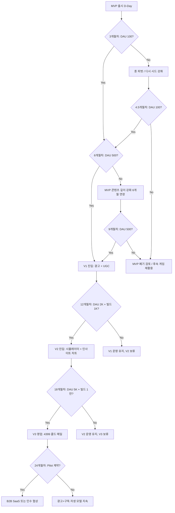

# 02. PM Strategy — Value Proposition + Lean Canvas + SWOT + Pricing + Scenario Planning

> Agent: `pm-strategy`
> 작성일: 2026-05-14 · 입력: `01-discovery.md` · SSOT: `docs/00-context/project-brief.md`
> 목표: 4단계 진화(MVP→V1→V2→V3 B2B) 비즈니스 모델을 정량 가설로 정의하고, 검증 실험과 시나리오 분기점을 명시한다.

---

## Executive Summary

| 항목 | 결론 |
|------|------|
| **Core JTBD** | "갓깨비 키우기 유저로서, 메타가 흔들리거나 신규 쿠폰/진령이 나올 때, 한국어 모바일에 최적화된 단일 페이지에서 신뢰 가능한 정보를 30초 안에 얻고 싶다 — BlueStacks 광고지옥과 디시 노이즈를 피하며." |
| **Beachhead VP** | "검객 메타 추종 유저 (소-중과금, 25-40세 남성, 디시·네이버 카페 활용층)" |
| **Differentiation** | 모바일 first + 정보 신선도 SLA(24h) + 한국 오컬트 무드 + V2의 빌드 시뮬레이터/채용률 차트 |
| **Pricing 전략** | MVP: 무료(노광고) → V1: 광고+선택적 후원 → V2: 프리미엄 구독(₩2,900/월) + 광고 → V3: B2B 라이선스(연 ₩30M-100M) 또는 인수 |
| **시나리오 분기** | 6개월차: DAU 100 미달 시 콘텐츠 톤 피벗 / 12개월차: DAU 1,000 미달 시 V2 인사이트 보류 / 18개월차: DAU 5,000 + 빌드 1만건 미달 시 B2B 영업 보류 |

---

## 1. Value Proposition (JTBD 6-Part Format)

### 1.1 Primary VP (Beachhead — 검객 메타 추종 유저)

**Context (when)**: 갓깨비 키우기를 30분-2시간 플레이하는 평일/주말, 새로운 메타 패치가 나왔거나 999뽑기 분배를 고민할 때

**Struggle (struggling moment)**: 디시 마이너 갤러리는 정보가 흘러내려 검색이 어렵고, BlueStacks/LDPlayer 가이드는 광고 과다 + 업데이트가 늦어 신뢰가 안 가고, 나무위키는 r4판 등 버전 혼선이 있고, 인벤은 갓깨비 전용 페이지가 없다.

**Pushed by (불만족)**: 만료된 쿠폰을 5번 입력했더니 게임 내 알림이 떠서 시간 낭비, "검객 + 홍길동/서해용왕 빌드" 검색했더니 6개월 전 글이 나옴, 결투장에서 매크로 의심 유저를 만났는데 정보가 없음.

**Pulled by (희망 — 새 솔루션 기대치)**: 한 페이지에서 검객 메타 정석 빌드 + 유효 쿠폰 + 신규 진령 채용률을 모바일에서 광고 없이 30초 안에 확인하고 싶다. 빌드를 클릭하면 진령 3개 시너지가 시각적으로 보였으면 좋겠다.

**Anxieties (불안)**: 또 다른 광고 사이트일까? 비공식 사이트인데 게임사가 폐쇄 요청하지 않을까? 운영자가 1인이라 업데이트가 안 되면 어쩌나? 내가 공유한 빌드가 트롤들 놀림감이 되지 않을까?

**Habits (기존 습관 — 전환 비용)**: 디시 마이너 갤러리 모바일 앱 → BlueStacks 가이드 구글 검색 → 카톡 게임 친구에게 물어보기. 이미 디시 가입돼있고 검색 패턴 익숙. 신규 사이트가 이 습관을 깨려면 첫 방문 30초 내 가치 입증 필수.

### 1.2 Secondary VP (V1+ 커뮤니티 — 빌드 공유자)

"내가 만든 검객 + 홍길동/서해용왕/치우 빌드가 효과적이라는 걸 다른 유저에게 인정받고 싶다. 디시에선 글이 흘러가고 욕설로 묻히는데, 검증된 사이트에서 빌드 공유하고 좋아요 받으면 자존감이 충족된다."

### 1.3 Tertiary VP (V3 B2B — 4399/Joy Games 한국 사업부)

"갓깨비 키우기 출시 12개월차에 DAU가 30% 빠지기 시작했다. 우리 자체 KPI는 보지만 '왜 빠지는지' 정성 데이터가 없다. 디시 갤러리는 노이즈가 심해 PM/CS가 직접 읽기 어렵다. 외부에서 누군가 빌드·이탈 시그널·결투장 메타·쿠폰 유효성을 정량 패키지로 제공해주면, 후속 패치 의사결정에 직접 활용하거나 후속작(갓깨비 2/또 다른 키우기 시리즈)에 동일 인사이트 플랫폼을 재활용하고 싶다."

---

## 2. Lean Canvas (9 sections)

```
┌─────────────────────┬─────────────────────┬─────────────────────┬─────────────────────┬─────────────────────┐
│ 1. PROBLEM          │ 4. SOLUTION         │ 3. UVP              │ 9. UNFAIR ADV       │ 2. CUSTOMER SEG     │
│                     │                     │                     │                     │                     │
│ - 정보 산재         │ MVP:                │ "광고 없는 30초     │ - 1인 운영의        │ Beachhead:          │
│   (디시/인벤/Blue   │ - 단일 SSOT 페이지  │  검객 메타 +        │   업데이트 SLA      │ 검객 메타 추종      │
│    Stacks/나무위키) │ - 쿠폰 자동 체커    │  쿠폰 자동 검증     │   24h vs Blue       │ 25-40세 남성        │
│ - 메타 신선도       │ - 모바일 first 다크 │  + 신뢰성"          │   Stacks 72h+       │ 소-중과금           │
│   업데이트 지연     │   + 골드 한국 무드  │                     │ - 4399 그룹과       │                     │
│ - 쿠폰 유효성       │ V1: UGC + 댓글      │ V2+: "유저가        │   공식 협상 가능    │ Expansion:          │
│   불명              │ V2: 빌드 시뮬+차트  │  만든 메타가        │   (한국 게임 IP에   │ - 영매/전사 유저    │
│ - 빌드 비교 도구    │ V3: B2B 패키지      │  공식보다 빠르다"   │   대한 호의적 환경) │ - 빌드 공유 욕구    │
│   부재              │                     │                     │ - 모바일 UX 격차    │   유저              │
│ - 게임사가 정성     │                     │ V3: "정성 데이터    │ - 데이터 누적의     │ - 결투장 PvP 유저   │
│   데이터 없음 (V3)  │                     │  계량화 패키지"     │   네트워크 효과     │ - V3: 4399/Joy      │
│                     │                     │                     │                     │   Games 사업개발팀  │
├─────────────────────┼─────────────────────┼─────────────────────┼─────────────────────┤                     │
│ EXISTING ALT (기존) │ 8. KEY METRICS      │ HIGH-LEVEL CONCEPT  │ 5. CHANNELS         │                     │
│                     │                     │                     │                     │                     │
│ - 디시 마이너 갤    │ MVP: DAU100, LH≥90  │ "갓깨비 GameWith    │ - SEO 롱테일 50개   │                     │
│ - BlueStacks 블로그 │ V1: DAU500, 빌드30  │  + Game8 + 한국     │ - 디시·네이버 카페  │                     │
│ - LDPlayer 블로그   │ V2: DAU2K, 빌드1만  │  오컬트 톤매너"     │   유기적 시드       │                     │
│ - 나무위키 r4판     │      매출 ₩50K/월   │                     │ - 카톡 채널/SNS     │                     │
│ - 인벤 일반 게시판  │ V3: 빌드1만 + 미팅  │ Pull factor:        │ - GA4 + Search      │                     │
│ - 카톡 친구 질문    │      1건/M&A 가설   │ "신뢰 + 30초"       │   Console           │                     │
├─────────────────────┴─────────────────────┴─────────────────────┴─────────────────────┴─────────────────────┤
│ 6. COST STRUCTURE                                                                   7. REVENUE STREAMS       │
│                                                                                                              │
│ MVP: ~$0/월 (Vercel Hobby + Firebase Spark + 도메인 ₩15K/년)                       MVP: $0                  │
│ V1: ~$0-5/월 (Firebase 한도 근접 시 캐싱)                                          V1: 광고 ₩50K-200K/월    │
│ V2: ~$10-30/월 (Firebase Blaze 전환, Cloud Functions, BigQuery 시드)               V2: 광고 +              │
│ V3: ~$50-100/월 (분석 인프라, 데이터 ETL)                                              구독 ₩500K-2M/월     │
│                                                                                       (DAU 1-2K, 2% 전환) │
│ Hidden cost: 운영자 시간 (주 5-15시간)                                            V3: B2B 라이선스         │
│                                                                                       ₩30M-100M/년        │
│                                                                                       또는 인수 ₩300M-1B   │
└─────────────────────────────────────────────────────────────────────────────────────────────────────────────┘
```

### 2.1 Lean Canvas 정량 가설 (각 박스별)

| 박스 | 핵심 가설 | 검증 실험 |
|------|----------|----------|
| **Problem** | 4개 문제 중 "신선도 + 쿠폰 유효성"이 가장 자주 발생하는 페인 | 디시 게시글 100건 샘플링 → 문제 카테고리별 빈도 측정 |
| **Customer Segment** | 검객 메타 추종 유저가 전체 DAU의 ≥30% | Google Play 리뷰 + 디시 게시판에서 직업 언급 비율 측정 |
| **UVP** | "30초 안에" 신뢰 정보 제공 = 검색 → 클릭 → 답 도출까지 30초 | GA4 Session Duration + 이탈률 측정 |
| **Solution** | MVP 5개 솔루션 중 쿠폰 체커가 가장 첫 진입 매개체 | "/coupon" 페이지 단독 트래픽 vs 메인 페이지 비교 |
| **Channels** | SEO 롱테일 50개가 가장 ROI 높은 채널 | 키워드별 노출/클릭 6주간 추적 |
| **Revenue (V1)** | DAU 500시 광고 RPM ₩3,000 (한국 게임 트래픽 추정)으로 월 ₩50K-200K | Google AdSense 실측 1개월 |
| **Cost** | Firebase Spark Plan으로 DAU 1,000까지 무비용 | Firestore read 일 50K 한도 도달 시점 모니터링 |
| **Key Metrics** | Branded Search Share ≥ 40% (12개월차) | Google Search Console 추적 |
| **Unfair Advantage** | 1인 운영의 24h SLA가 BlueStacks(72h+) 대비 지속 우위 | EXP-3 자가 검증 14일 |

---

## 3. SWOT 분석

### 3.1 SWOT Matrix

|      | **HELPFUL** (Strengths/Opportunities) | **HARMFUL** (Weaknesses/Threats) |
|------|----------------------------------------|----------------------------------|
| **Internal** | **Strengths** | **Weaknesses** |
|              | S1. 1인 운영의 빠른 의사결정 + 24h 업데이트 SLA | W1. 1인 운영의 번아웃 리스크 (휴가/병가 시 사이트 정체) |
|              | S2. tene 환경 통제 + Next.js 16/Firebase 기술 숙련도 | W2. UGC 시드 없음 (V1 진입 시 초기 빈 사이트 문제) |
|              | S3. 운영자 본인이 게임 유저(도메인 인사이트) — 가정[검증 필요] | W3. 자본 0 (마케팅 예산 X, 디자이너 외주 X) |
|              | S4. 4단계 진화 청사진 명확 → 데이터 자산 누적 가능 | W4. 게임사와의 사전 협의 채널 부재 |
|              | S5. 무료 인프라 활용 노하우 | W5. 모바일 앱 미보유 (웹 only) |
| **External** | **Opportunities** | **Threats** |
|              | O1. 인벤이 갓깨비 전용 페이지 부재 (6-12개월 선점 윈도우) | T1. 인벤이 갓깨비 페이지 신설 시 SEO 압도 (UV 140만/일) |
|              | O2. 4399 그룹은 후속작·시리즈 다수 → V3 인수 가치 ↑ | T2. Joy Nice Games가 공식 가이드 출시 (확률 중간) |
|              | O3. 갓깨비 글로벌 출시(12개+ 언어) → V2/V3 다국어 확장 | T3. 게임 방치형 라이프사이클 짧음 (6-12개월 인기) |
|              | O4. 한국 방치형 RPG 시장 매출 비중 16% (성장 중) | T4. Firebase 무료 한도 초과 시 비용 충격 |
|              | O5. 디시·네이버 카페가 트롤·노이즈로 진지한 빌드 토론 부재 | T5. 비공식 사이트 법적 압박 (cease & desist) |
|              | O6. Game8 일본 사례 (1인→인수) 벤치마크 존재 | T6. 카카오 게임즈/카카오프렌즈 IP 콜라보 권리 침해 우려 |

### 3.2 SO/WO/ST/WT 전략 (TOWS Matrix)

| 전략 | 내용 | 우선순위 |
|------|------|---------|
| **SO1**: S1+S5 × O1+O5 | 1인 운영 + 무료 인프라 강점으로 인벤·디시의 빈자리 6개월 내 선점 | 🔴 P0 (즉시) |
| **SO2**: S4 × O2+O3 | 데이터 자산 누적 청사진으로 4399 그룹 후속작/글로벌 확장 가치 사전 입증 | 🟡 P1 (V2+) |
| **WO1**: W2 × O5 | 초기 빌드 시드 30개를 운영자가 직접 작성 + 디시 자료 가공 인용 | 🔴 P0 |
| **WO2**: W4 × O2 | V2 진입 시 4399 한국 사업부에 자기소개 메일 발송 (영업 시드) | 🟡 P1 (V2 시작 시점) |
| **ST1**: S3 × T2 | 공식 가이드보다 더 빠른 메타 + 비판적 분석 (공식은 자기 메타 비판 불가) | 🔴 P0 |
| **ST2**: S4 × T3 | 데이터 스키마를 게임-agnostic하게 설계 → 후속 게임(갓깨비2, 또 다른 키우기) 재활용 | 🔴 P0 (스키마 설계 시점) |
| **WT1**: W3 × T5 | 법적 가드레일 (디스클레이머/공식 자산만 핫링크/유료화 시 별도 명시) | 🔴 P0 |
| **WT2**: W1 × T3 | UGC 자동화 + LLM 요약으로 운영 부담 분산 | 🟡 V1+ |

---

## 4. Pricing 전략 (Monetization 4단계)

### 4.1 MVP: 무료 + 노광고 (Trust building)

- **이유**: 첫 6개월은 신뢰 구축 + Branded Search Share 확보. 광고 깔면 BlueStacks와 차별 X.
- **유닛 이코노미**: 매출 0, 비용 0, CAC 0 (SEO 유기 트래픽만)
- **유일한 비용**: 운영자 시간 (주 5-10시간 × 6개월 = 약 130-260시간)

### 4.2 V1: 광고 + 선택적 후원

#### 광고 모델
- **AdSense**: 사이드 1개 + 인-콘텐츠 1개 (모바일 가독성 최우선, 인벤·디시 광고지옥 회피)
- **한국 게임 트래픽 RPM 추정** (출처: AdSense 한국 게임 카테고리 평균):
  - 보수치: ₩2,000-3,000 / 1,000 PV
  - 중간치: ₩3,500-5,000 / 1,000 PV
  - 상위치: ₩6,000-8,000 / 1,000 PV (게임 광고주 풍부 시점)

#### V1 매출 시나리오 (DAU 500 가정)
- DAU 500 × 평균 PV/세션 3 × 30일 = 월 45,000 PV
- 광고 노출률 80% = 36,000 광고 노출
- RPM ₩3,500 → **월 ₩126,000 (≈ $90)**
- 비용: 도메인 ₩15K/년 + 운영 시간 = **순이익 ~₩100K/월** (가용 시간 가치 0 가정)

#### 후원 모델 ([가설 — 검증 필요])
- "투네이션(Toonation)" 또는 "Buy Me a Coffee" 위젯
- 가설: DAU 500 → 월 1-3명이 ₩5,000 후원 → ₩5K-15K/월
- 검증 실험: V1 출시 후 후원 위젯 3개월 운영 → 전환율 측정

### 4.3 V2: 프리미엄 구독 + 광고 + 후원

#### Premium 구독 가설
- **가격**: ₩2,900/월 또는 ₩29,000/년 (월 환산 ₩2,400)
- **벤치마크**: 
  - 한국 OTT 광고 제거 구독 ₩4,900-9,900 → 게임 가이드는 더 낮게
  - GameWith Premium (日, 480엔/월 ≈ ₩4,500) — 광고 제거 + 빌드 저장 강화
- **혜택 가설**:
  - 광고 제거
  - 빌드 무제한 저장 (무료 회원 5개)
  - 빌드 비교 시뮬레이터 고급 기능 (3개+ 빌드 동시 비교)
  - 신규 진령 출시 사전 알림
  - 결투장 트렌드 일간 리포트
- **전환율 가설** ([검증 필요]):
  - 보수치: DAU의 0.5%
  - 중간치: DAU의 2% (Game8/GameWith 사례 기반)
  - 상위치: DAU의 5%

#### V2 매출 시나리오 (DAU 2,000 가정)
| 항목 | 보수치 | 중간치 | 상위치 |
|------|-------|-------|-------|
| Premium 구독자 | 10명 | 40명 | 100명 |
| 구독 매출/월 | ₩29K | ₩116K | ₩290K |
| 광고 매출/월 (DAU 2K × PV3 × 30 = 180K PV × ₩3.5/PV) | ₩630K | ₩630K | ₩630K |
| 후원/월 | ₩20K | ₩50K | ₩100K |
| **총 매출/월** | **₩679K** | **₩796K** | **₩1,020K** |
| 비용 (Firebase Blaze 등) | ₩30K | ₩50K | ₩80K |
| **순이익/월** | **₩649K** | **₩746K** | **₩940K** |

### 4.4 V3: B2B 라이선싱 / 인수 (Endgame)

#### V3 가격 패키지 가설

| 패키지 | 가격 가설 | 대상 | 가치 제안 |
|--------|----------|------|----------|
| **A. 분기 리포트 1회성** | ₩5M-15M / 회 | 4399 한국 사업부 PM, 마케팅 | "Q1 갓깨비 메타·이탈·페인포인트 80p 리포트" |
| **B. 메타 인사이트 SaaS 구독** | ₩3M-10M / 월 | 4399 사업개발팀, 후속작 PD | 실시간 대시보드 + 주간 알림 + API 액세스 |
| **C. API 라이선스 (데이터만)** | ₩30M-100M / 년 | 4399 본사 데이터팀 | 빌드 로그·진령 채용률·결투장 트렌드 raw data |
| **D. 어드민 대시보드 SaaS (whitelabel)** | ₩100M-300M / 년 | 4399 그룹 전체 (갓깨비2 등 후속작 포함) | 동일 플랫폼을 다른 게임에 재활용 |
| **E. 완전 인수 (M&A)** | ₩300M-1.5B (일시) | 4399 본사 또는 카카오 게임즈 | 사이트·도메인·데이터·운영 권한 양도 |

#### 가격 앵커링 근거 ([검증 필요 — 가설 단계])

- **Game8 (日)** 인수 가격은 비공개지만, 2014년 1인→2015년 인수 → 추정 ₩500M-2B (Gunosy 시가총액 기반 역산)
- **Mobile Index INSIGHT** B2B 구독 가격: 보고된 바 ₩300K-1M/월 (한국 모바일 게임 분석 시장)
- **Sensor Tower Enterprise** 가격: $20K-100K/년 (글로벌 평균, 한국 게임사도 구매)
- 결론: V3 패키지 B-C 가격은 시장 비교군 대비 30-50% 낮은 가격 책정 (입찰 시 우위)

#### V3 영업 타이밍 트리거

| 트리거 | 의미 | 영업 액션 |
|-------|------|----------|
| 갓깨비 DAU 30% 하락 (Sensor Tower 데이터 확인) | 게임사가 이탈 원인 분석 필요 시점 | 콜드 메일 + 가상 리포트 첨부 |
| 4399 한국 후속작 발표 | 신작 사전 리서치 필요 | 디시·우리 사이트 정성 데이터 영업 |
| 분기 결산 발표 (4399 IR) | 데이터 기반 인사이트 수요 | 분기 리포트 1회성 제안 |
| 카카오 게임즈 콜라보 종료 시점 | 콜라보 ROI 분석 수요 | 콜라보 효과 리포트 영업 |
| 신규 진령 출시 직후 (48-72h) | 채용률 데이터 가치 최고점 | 실시간 채용률 차트 데모 |

#### V3 4단계 영업 Funnel

```
[Stage 1: Cold Outreach]
  4399 한국 사업부 (kr.4399.com 등) LinkedIn 사업개발 담당자 검색
  → "갓깨비 키우기 분기 메타 인사이트 1page 샘플" PDF 첨부 메일
  → CTR 목표 20% (1주 이내)
        |
        v
[Stage 2: Demo (15분)]
  Google Meet 데모: 실시간 대시보드 화면 공유 + 빌드 채용률 차트
  → 가격은 제시 X, 가치 정성 토론
  → Demo → Pilot 전환 목표 30%
        |
        v
[Stage 3: Pilot (1-3개월)]
  ₩5M-10M에 1분기 리포트 + 주간 대시보드 액세스 (Paid Pilot)
  → 게임사 내부 검토 시간 확보
  → Pilot → 본 계약 전환 목표 50%
        |
        v
[Stage 4: License/Acquire]
  연 라이선스 ₩30M-100M, 또는 인수 ₩300M-1.5B
```

---

## 5. 시나리오 플래닝 (3-tier)

### 5.1 Best Case — "Game8 Korea 시나리오"

| 시점 | 지표 | 액션 |
|------|------|------|
| 3개월차 | DAU 500, "갓깨비 키우기 공략" SEO 1페이지 | V1 진입 결정, 광고 + UGC |
| 6개월차 | DAU 2,000, 빌드 공유 200건, 광고 ₩300K/월 | V2 인사이트 대시보드 개발 |
| 12개월차 | DAU 5,000+, 빌드 1만건, 매출 ₩1M/월 | V3 영업 시작, 4399 콜드 메일 |
| 18개월차 | 4399 또는 카카오 게임즈 인수 제안 | M&A 또는 ₩100M+/년 라이선스 |

### 5.2 Base Case — "광고 자생 시나리오"

| 시점 | 지표 | 액션 |
|------|------|------|
| 3개월차 | DAU 100-200 | MVP 콘텐츠 추가, SEO 보강 |
| 6개월차 | DAU 300-500 | 광고 도입, UGC 시드 직접 작성 |
| 12개월차 | DAU 500-1,000, 매출 ₩100-200K/월 | V2 보류, 콘텐츠 깊이 강화 |
| 18개월차 | DAU 1,000-2,000, 매출 ₩300K/월 | 부업 수준 유지, V3 검토만 |

### 5.3 Worst Case — "조기 폐쇄 시나리오"

| 시점 | 지표 | 액션 |
|------|------|------|
| 3개월차 | DAU 30 미만, 디시 시드 침투 실패 | 콘텐츠 톤 피벗 검토 |
| 6개월차 | DAU 50 미만 또는 Joy Games 공식 가이드 출시 | 후속작·다른 방치형 게임으로 플랫폼 재활용 검토 |
| 9개월차 | 게임 자체 DAU 50% 하락 (Sensor Tower 확인) | 사이트 유지보수 모드, 콘텐츠 보존만 |
| 12개월차 | 게임 인기 종료 | 데이터 자산 백업 + 다른 4399 게임으로 도메인 재활용 |

### 5.4 의사결정 분기점 (6/12/18개월)



---

## 6. 데이터 자산 전략 (V3 백본)

> **핵심 원칙**: MVP부터 모든 사용자 이벤트를 V3 B2B 패키지에 활용 가능한 스키마로 누적한다.

### 6.1 수집 대상 데이터 자산 (MVP-V3 누적)

| 데이터 자산 | MVP 수집 시작 | V1 강화 | V2 활용 | V3 패키지 |
|------------|--------------|---------|---------|-----------|
| **유저 빌드 로그** | 직접 작성 시드 30개 | UGC 빌드 공유 | 채용률 차트 | API 라이선스 |
| **진령 티어 투표** | (수동 큐레이션) | 좋아요/북마크 | 주간 변화 그래프 | 메타 변화 시그널 |
| **쿠폰 유효성 로그** | 자동 만료 체커 | 신고 시스템 | 쿠폰 만료 ETL | 쿠폰 ROI 리포트 |
| **페이지 funnel** | GA4 기본 | 검색 키워드 | 이탈 시그널 | 게임사 이탈 신호 |
| **페인포인트 NLP** | (수집 X) | 댓글 NLP 추출 | 주간 토픽 클러스터 | "왜 안 쓰는지" 분석 |
| **결투장 매크로 신고** | (수집 X) | UGC 신고 | 매크로 의심 패턴 | 봇 감지 시그널 |

### 6.2 데이터 스키마 초안 (PRD §데이터 스키마 명세에서 정식화)

```typescript
// 이벤트 명세 (MVP부터 통일)
interface BuildLogEvent {
  user_id: string;          // Firebase Auth uid (anonymous도 허용)
  class: 'warrior' | 'swordsman' | 'medium';
  jinryeong_3: string[];    // ['hongildong', 'seohae_yongwang', 'chiwoo']
  skill_set: { core: string; active: string; passive: string };
  equipment_grade: number;  // 0-10
  source: 'self_report' | 'screenshot' | 'manual_admin';
  timestamp: number;
}

interface TierVoteEvent {
  jinryeong_id: string;
  vote: 'S' | 'A' | 'B' | 'C' | 'D';
  voter_class: string;
  voter_level_estimate?: number;
  timestamp: number;
}

interface CouponValidityEvent {
  code: string;
  reported_at: number;
  status: 'valid' | 'expired' | 'invalid';
  reporter_count: number;   // 같은 코드 신고 수
}

interface PainPointEvent {
  topic: string;            // NLP 추출 토픽
  sentiment: -1 | 0 | 1;
  frequency: number;        // 주간 발생 수
  week: string;             // ISO week (예: '2026-W19')
  source: 'comment' | 'dc_curation';
}

interface PageFunnelEvent {
  page: string;
  entry_source: string;     // 'organic' | 'dc' | 'naver_cafe' | ...
  dwell_seconds: number;
  scroll_depth_pct: number;
  ad_click: boolean;
  signup: boolean;
  comment: boolean;
}
```

**저장소 설계 가설**:
- MVP: Firestore (실시간 + 무료 한도) + GA4 (이벤트 백업)
- V2: Firestore → BigQuery 일간 export (분석용)
- V3: BigQuery 위에 데이터 마트 + Looker Studio 대시보드 (게임사 whitelabel)

---

## 7. 검증 실험 우선순위 (Strategy Layer)

| EXP | 가설 | 방법 | 기간 | 비용 |
|-----|------|------|------|------|
| S-EXP-1 | V1 광고 RPM ₩3,500 가정이 맞다 | DAU 500 도달 시 AdSense 1개월 실측 | 30일 | 0 |
| S-EXP-2 | 프리미엄 구독 전환율 2% 가능 | V2 진입 시점 ₩2,900/월 베타 출시 → 3개월 측정 | 90일 | 0 |
| S-EXP-3 | 4399 한국 사업부에 영업 메일 응답률 ≥ 10% | V2 후반 LinkedIn 영업 시도 (50건) | 60일 | 0 |
| S-EXP-4 | 데이터 스키마가 V3 가상 리포트 3종을 수용 | 운영자가 가상 리포트 3종 작성 → 스키마 역검증 | 1일 | 0 |
| S-EXP-5 | 인벤이 갓깨비 페이지 만들기 전까지 6개월+ 윈도우 | 인벤 게이머 토론장 갓깨비 글 수 주간 추적 | 6개월 (continuous) | 0 |

---

## Attribution

본 Strategy 분석은 [pm-skills](https://github.com/phuryn/pm-skills) by Pawel Huryn (MIT License)의 Lean Canvas (Ash Maurya) + JTBD 6-Part (Bob Moesta) + TOWS Matrix 프레임워크를 적용했다.

**Sources (실측)**:
- [Sensor Tower 한국 모바일 게임 시장 2024 인사이트](https://sensortower.com/ko/blog/state-of-mobile-games-in-korea-2024-KR)
- [Sensor Tower 버섯커 키우기 매출 보고서](https://sensortower.com/ko/blog/Growing-Mushroom-has-earned-64-million-dollars-in-revenue)
- [Game8 PitchBook Profile](https://pitchbook.com/profiles/company/84333-07)
- [GameWith Wikipedia (jp)](https://ja.wikipedia.org/wiki/GameWith)
- [Inven 2024 사업소개서 PDF](https://ads.inven.co.kr/ad/Docu/INVEN-20240712-BizIntroduction%5BKR%5D.pdf)
- [Joy Nice Games (Pocket Gamer biz)](https://www.pocketgamer.biz/industry/joy-nice-games/)
- [4399 Korea NamuWiki](https://en.namu.wiki/w/4399%20Korea)
- [전자신문 갓깨비 정식출시 (2025-04-18)](https://www.etnews.com/20250418000154)

> 주의: B2B 가격 시나리오 (특히 5.4 §4.4)는 비교군 기반 [가설 — 검증 필요] 단계이며, V2 후반 EXP-5에서 실제 영업 응답률로 검증한다.
