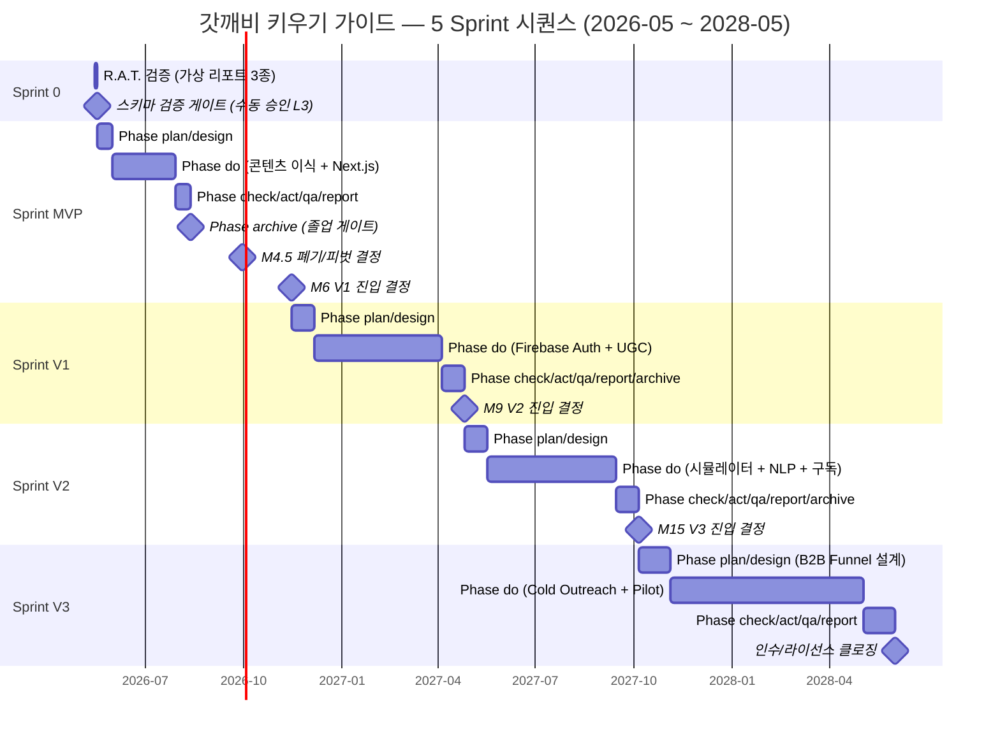
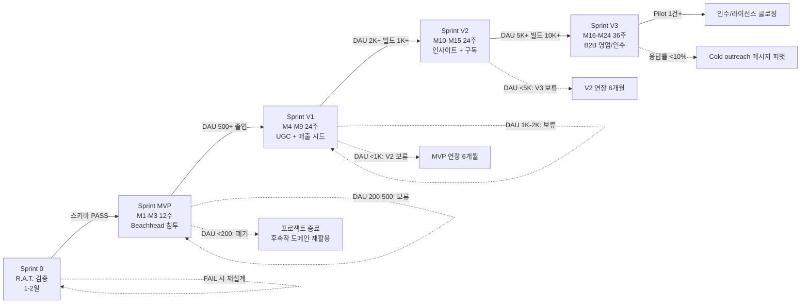
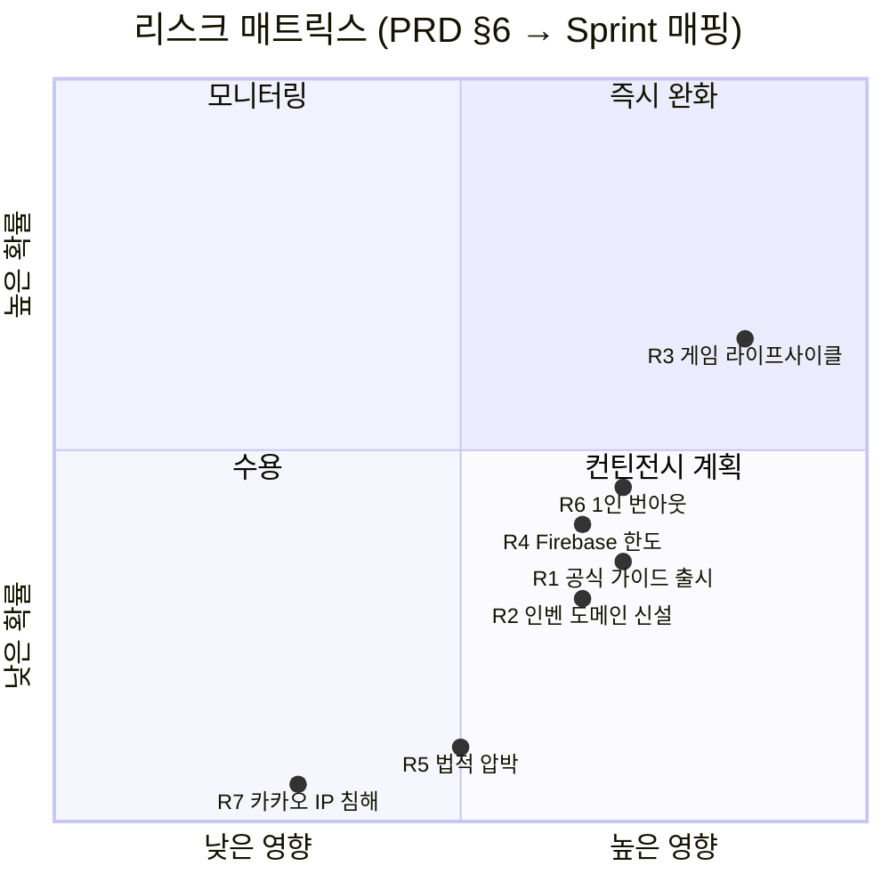
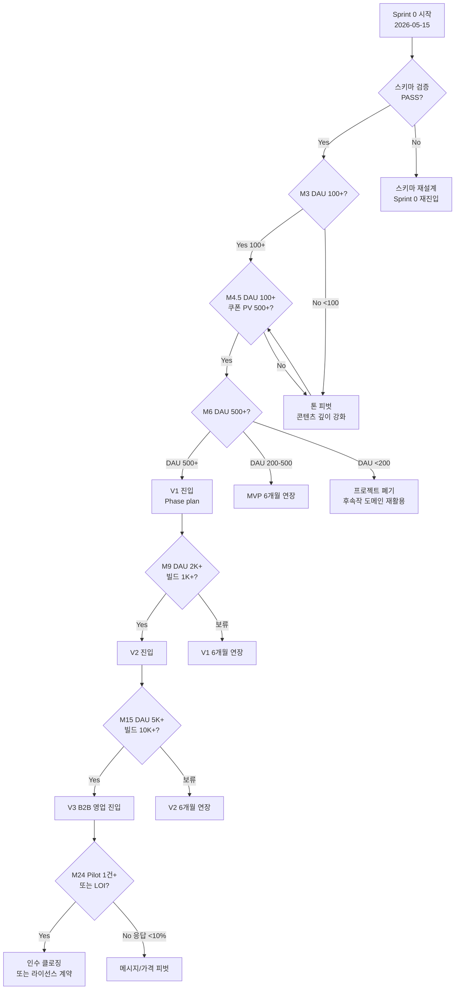

# 갓깨비 키우기 비공식 팬 가이드 — Sprint Master Plan

> **Sprint ID**: `god-kkabi-guide`
> 작성일: 2026-05-14 · 작성자: kay@agentkay.it (Sprint Master Planner 에이전트)
> 운영 주체: 1인 개인 프로젝트 (solo indie project) — 회사/법인 소속 없음
> 입력: `docs/01-pm/00~04` 5종 + `docs/01-pm/05-decisions.md` 4건 + 운영자 추가 제약사항
> 상태: Draft v1.0 — 운영자 검토 대기
> bkit 호환: Sprint Management v2.1.13 (8-phase per Sprint, 4 Auto-Pause Triggers, Trust L3)

---

## §0. Executive Summary

### 0.1 Mission (이 Sprint Master Plan이 달성하려는 것)

**"PM Agent Team 5종 산출물 + 운영자 결정 4건을 단일 실행 가능한 24개월 청사진으로 변환한다. 즉, Sprint 0(R.A.T. 검증) → MVP(SEO·트래픽) → V1(UGC·매출 시드) → V2(인사이트·구독) → V3(B2B 인수·라이선스)의 5개 Sprint 시퀀스로 분해해, 매 Sprint마다 명확한 진입 게이트·졸업 조건·폐기 트리거·예산 한도를 정량으로 묶고, 1인 운영자가 본업 외 시간에 단독으로 실행 가능한 수준의 WBS를 제공한다."**

### 0.2 Anti-Mission (이 Plan이 절대 하지 않는 것)

- ❌ PM 분석을 부풀리거나 재해석 (PM 산출물은 SSOT, 본 Plan은 실행 변환층)
- ❌ 운영자가 결정하지 않은 사항을 가정하기 (예: Trust Level, 도메인 옵션 변경)
- ❌ DAU 1,000 도달 전 비용 발생 인프라 도입 (₩0~$5/월 가드레일)
- ❌ Sprint 0가 100% PASS하지 않은 상태에서 MVP 진입
- ❌ 1인 운영자 주당 작업 시간 한도(주 5-15시간) 초과 산정
- ❌ V3 B2B 영업을 V2 데이터 임계(빌드 10K+ 누적) 도달 전 시작

### 0.3 4-Perspective Value (이 Plan으로 운영자가 얻는 가치)

| 관점 | 가치 |
|------|------|
| **Problem (왜 필요한가)** | PM Agent Team이 만든 124KB 분량의 PRD/Discovery/Strategy/Research를 그대로 실행하려면 운영자가 매번 "오늘 뭐 할까?"부터 시작해야 한다. 본 Plan은 5개 Sprint × 8 Phase = 40개 실행 단위로 분해해 매일 다음 액션이 명확하다. |
| **Solution (어떻게 해결하는가)** | bkit Sprint Management v2.1.13 형식(plan→design→do→check→act→qa→report→archive)을 채택해 PDCA 사이클을 Sprint 컨테이너에 wrap. 각 Sprint는 진입 게이트(KPI 졸업) + 4 Auto-Pause Triggers(품질/반복/예산/타임아웃)로 자동 보호된다. |
| **Function UX Effect (운영자가 체감하는 것)** | (1) Sprint 0 종료 시점에 V3 가능 여부 확정 → 24개월 청사진의 가장 위험한 가정 사전 검증. (2) 매 Sprint 졸업 조건 미달 시 자동 폐기/피벗 트리거 → 1인 운영자의 매몰비용 편향 차단. (3) 각 Sprint마다 운영자 수동 게이트(L3 Trust)에서만 결정 → 자동화는 코드/문서 작성에 한정. |
| **Core Value (이 Plan의 한 문장 가치)** | "1인 본업 외 시간 + ₩0 예산이라는 가장 가혹한 제약 아래, 24개월 후 ₩300M-1.5B 인수 가능성에 도달하기 위한 가장 합리적인 5단계 매핑." |

### 0.4 핵심 일정 요약 (Gantt 다이어그램)



### 0.5 Sprint별 한 줄 정의 (Executive Summary 핵심)

| Sprint | 기간 | 한 줄 결론 | 졸업 조건 |
|--------|------|-----------|----------|
| **Sprint 0** | 1-2일 | "MVP→V3 데이터 스키마가 단일 마이그레이션으로 V3 B2B 패키지 3종 수용 가능한지 R.A.T. 검증" | 가상 리포트 3종 × 6 Firestore 컬렉션 100% 매핑 |
| **Sprint MVP** | M1-M3 (12주) | "원본 HTML 9섹션을 Next.js 16 App Router로 이식 + 모바일 first + 검객 Beachhead + 쿠폰체커" | DAU 100+, Lighthouse ≥90, SERP "갓깨비 키우기 공략" 상위 30위 |
| **Sprint V1** | M4-M9 (24주) | "Firebase Auth + UGC 댓글/빌드 공유 + 광고 매출 + Pain Point 수집" | DAU 500+, 빌드 100+, 댓글 500+, 매출 ₩100K+/월 |
| **Sprint V2** | M10-M15 (24주) | "빌드 시뮬레이터 + 진령 채용률 차트 + Pain NLP + 프리미엄 구독" | DAU 2K+, 빌드 1K+, 매출 ₩700K-1M/월, 다국어(JP/EN) |
| **Sprint V3** | M16-M24 (36주) | "4399/Joy Games B2B 영업 → Pilot ₩5M-10M → License ₩30M-100M/년 또는 인수 ₩300M-1.5B" | Pilot 계약 1건+ 또는 인수 LOI 1건+ |

---

## §1. Context Anchor (5-Key + OUT-OF-SCOPE)

| Key | Value |
|-----|-------|
| **WHY** | 한국 방치형 RPG 시장 ₩9,300억/년 (16% 비중, 2024) + 갓깨비 키우기(다운로드 500K+, 평점 4.8) 가이드 인프라 부재 + 인벤 전용 페이지 부재 6-12개월 선점 윈도우. 동일 모회사(4399/Joy Games)의 버섯커 키우기 한국 매출 ₩850억 사례 → 후속작 잠재력. **Endgame 목표는 V3 B2B 인수 ₩300M-1.5B.** |
| **WHO** | **Beachhead (MVP)**: 검객 메타 추종 25-40세 남성 소-중과금 유저(P1 "검투호"). **Expansion (V1+)**: P2 빌드 공유자, P3 정보수집형. **V3 고객**: JOY MOBILE NETWORK PTE. LTD. (싱가폴 법인 본사) / Joy Net Games (iOS 한국 개발자명) / Joy Nice Games (Android 한국 표기) / 4399 (모회사, 중국) — 사업개발·마케팅·운영팀. |
| **RISK** | (Top 4) ① Joy Games 공식 가이드 출시(중확률 30-40%) ② 인벤 갓깨비 전용 도메인 신설(중확률 30%) ③ 방치형 RPG 6-12개월 라이프사이클(고확률 60%) ④ Firebase 무료 한도 초과(중확률 40%, DAU 2K+ 시점). 자세한 매트릭스는 §6. |
| **SUCCESS** | MVP M3: DAU 100+, Lighthouse ≥90 / V1 M9: DAU 500+, 빌드 100+, 매출 ₩100K+/월 / V2 M15: DAU 2K+, 빌드 1K+, 매출 ₩700K+/월 / V3 M24: Pilot 1건+, 인수 LOI 1건+ 또는 라이선스 ₩30M+/년 |
| **SCOPE (MVP)** | **In**: 정적 SSOT 페이지 9섹션 / 모바일 first + 다크/골드 한국 오컬트 무드 / 쿠폰 자동 체커(클릭 복사 + D-day) / 직업 진단 3-5문항 / 진령 11종 카드 + 검객 메타 빌드 / GA4 + Firestore 스키마 사전 설계(Sprint 0 검증 완료) / SEO 롱테일 50개 키워드 / 콘텐츠 정책 문서(D2 하이브리드 70/30) / 도메인 + Vercel 배포(D1 게임-specific) / tene 시크릿 |
| **SCOPE (V1)** | **In**: Firebase Auth(Google/Kakao) / 댓글(Firestore comments) / 빌드 공유(직업+진령3+스킬셋+장비) / 좋아요·신고·운영자 모더레이션 / 광고(AdSense 또는 Carbon Ads) / Pain Point 수집(NLP는 V2) |
| **SCOPE (V2)** | **In**: 빌드 시뮬레이터(진령 3선택 시너지 시각화) / 진령 채용률 차트(주간) / 결투장 빌드 트렌드 / 쿠폰 유효성 자동 검증(커뮤니티 제보 + 운영자 확인) / Pain Point NLP 클러스터링 / 프리미엄 구독 ₩4,900/월 / 다국어 JP/EN |
| **SCOPE (V3)** | **In**: B2B funnel 자료(Sprint 0 가상 리포트 → 실데이터 리포트) / API 라이선스(REST + GraphQL) / 어드민 대시보드 SaaS / 인수 제안 패키지 / Cold outreach LinkedIn 50건+ / 가격 앵커링 자료(Game8/GameWith/Mihoyo) |
| **OUT OF SCOPE (영구)** | 모바일 네이티브 앱(PWA로 대체) / 게임 자체 데이터 수집(공식 API 부재) / 다른 게임 가이드 동시 운영(후속작 마이그레이션은 V1+ 검토) / 운영자 1인 외 추가 채용 / 외부 투자 유치 (인수는 V3 종료 시점) |

---

## §2. Features (5개 Sprint별 핵심 Feature 매트릭스)

| Sprint | Feature ID | 우선순위 | 상태 | 의존성 | 한 줄 설명 |
|--------|-----------|---------|------|--------|----------|
| Sprint 0 | F0.1 가상 리포트 3종 | P0 (Critical) | Pending | (없음) | V3 B2B 패키지 가상 PDF 3종 작성 (R.A.T.) |
| Sprint 0 | F0.2 스키마 검증 매핑 | P0 (Critical) | Pending | F0.1 | 각 리포트 데이터 필드 ↔ Firestore 6 컬렉션 매핑표 |
| Sprint MVP | F1.1 콘텐츠 9섹션 이식 | P0 | Pending | Sprint 0 PASS | 원본 HTML → Next.js 16 App Router |
| Sprint MVP | F1.2 디자인 시스템 | P0 | Pending | F1.1 | 다크 베이스 + 골드/퍼플/시안 + Noto Sans KR |
| Sprint MVP | F1.3 쿠폰 자동 체커 | P0 | Pending | F1.1, F1.2 | 운영자 입력 + 클릭 복사 + D-day |
| Sprint MVP | F1.4 직업 진단 | P1 | Pending | F1.2 | 3-5문항 → 검객/전사/영매 추천 |
| Sprint MVP | F1.5 진령 11종 카드 + 검객 메타 빌드 | P0 | Pending | F1.2 | Beachhead 핵심 페이지 |
| Sprint MVP | F1.6 GA4 + Firestore 스키마 | P0 | Pending | Sprint 0 PASS | V3 호환 12개 GA4 이벤트 + 6 컬렉션 |
| Sprint MVP | F1.7 SEO 롱테일 50개 | P0 | Pending | F1.1~F1.5 | 메타 태그 + sitemap.xml + robots.txt |
| Sprint MVP | F1.8 콘텐츠 정책 문서 | P1 | Pending | (없음) | D2 하이브리드 70/30 디스클레이머 |
| Sprint MVP | F1.9 도메인 + Vercel 배포 | P0 | Pending | F1.1~F1.7 | D1 게임-specific 도메인 + tene 시크릿 |
| Sprint V1 | F2.1 Firebase Auth (Google/Kakao) | P0 | Blocked | MVP 졸업 | 회원가입·로그인·동의 절차 |
| Sprint V1 | F2.2 댓글 시스템 (Firestore) | P0 | Blocked | F2.1 | 빌드/가이드 페이지 댓글 + 신고 |
| Sprint V1 | F2.3 빌드 공유 (직업+진령3+스킬+장비) | P0 | Blocked | F2.1 | UGC 빌드 작성 폼 + 영구 URL |
| Sprint V1 | F2.4 좋아요·북마크·신고 | P1 | Blocked | F2.2, F2.3 | denormalized counter |
| Sprint V1 | F2.5 운영자 모더레이션 도구 | P0 | Blocked | F2.2 | 신고 처리 + 욕설 필터 |
| Sprint V1 | F2.6 광고 (AdSense) | P1 | Blocked | DAU 500+ | 1-2개 슬롯 + 모바일 가독성 |
| Sprint V1 | F2.7 Pain Point 수집 | P2 | Blocked | F2.2 | NLP는 V2, 일단 raw 텍스트 누적 |
| Sprint V2 | F3.1 빌드 시뮬레이터 | P0 | Blocked | V1 졸업 | 진령 3선택 → 시너지 시각화 |
| Sprint V2 | F3.2 진령 채용률 차트 | P0 | Blocked | F3.1 | 주간 추이 그래프 |
| Sprint V2 | F3.3 결투장 빌드 트렌드 | P1 | Blocked | F3.1 | PvP 메타 시각화 |
| Sprint V2 | F3.4 쿠폰 유효성 자동 검증 | P1 | Blocked | F2.2 | 커뮤니티 제보 + 운영자 확인 |
| Sprint V2 | F3.5 Pain Point NLP 클러스터링 | P1 | Blocked | F2.7 | 댓글 감정 분석 + 토픽 추출 |
| Sprint V2 | F3.6 프리미엄 구독 결제 | P0 | Blocked | F3.1, F3.2 | Stripe 또는 토스페이먼츠 ₩4,900/월 |
| Sprint V2 | F3.7 다국어 (JP/EN) | P2 | Blocked | F3.1~F3.6 | i18n + 후반 진입 |
| Sprint V3 | F4.1 B2B funnel 자료 | P0 | Blocked | V2 졸업 | 분기 메타 리포트 (실데이터) |
| Sprint V3 | F4.2 API 라이선스 패키지 | P0 | Blocked | V2 졸업 | REST + GraphQL + 인증 |
| Sprint V3 | F4.3 어드민 대시보드 SaaS | P1 | Blocked | F4.2 | 게임사 전용 whitelabel |
| Sprint V3 | F4.4 인수 제안 패키지 | P0 | Blocked | DAU 5K+, 빌드 10K+ | 회사 가치평가 + 데이터 자산 평가 |
| Sprint V3 | F4.5 Cold Outreach | P0 | Blocked | F4.1 | LinkedIn 50건 + 보도자료 |
| Sprint V3 | F4.6 가격 앵커링 자료 | P1 | Blocked | F4.4 | Game8/GameWith/Mihoyo 사례 정리 |

---

## §3. Sprint Phase Roadmap (각 Sprint별 8 Phase)

> bkit Sprint Management v2.1.13 표준 8-phase 형식. Sprint 0만 예외적으로 단축 사이클(plan→do→check→archive)을 적용.

### 3.1 Sprint 0 — 단축 4 Phase (1-2일)

```
Phase 1: plan      → R.A.T. 가설 명문화 + 가상 리포트 3종 outline (0.25일)
Phase 2: do        → 가상 리포트 3종 작성 + schema-validation.md 매핑표 (1일)
Phase 3: check     → 매핑 PASS/FAIL 자가 검증 + 운영자 수동 게이트 (0.25일)
Phase 4: archive   → 결과 .bkit/state 기록 + MVP 진입 또는 스키마 재설계 (0.1일)
```

### 3.2 Sprint MVP — 표준 8 Phase (12주)

```
Phase 1: plan       → 콘텐츠 정책 + 9섹션 분석 + 컴포넌트 인벤토리 (1주)
Phase 2: design     → Next.js 페이지 구조 + Firestore 6 컬렉션 + 디자인 시스템 (1주)
Phase 3: do         → 스캐폴딩 → 콘텐츠 이식 → 컴포넌트 → 페이지 → SEO → 배포 (8주)
Phase 4: check      → Gap analysis + Lighthouse + 모바일 320-414px 테스트 (0.5주)
Phase 5: act        → 개선 iterate (Lighthouse <90 시) (0.5주)
Phase 6: qa         → 7-layer dataFlowIntegrity (URL→GA4→Firestore) (0.5주)
Phase 7: report     → 운영자 보고서(30/90일 KPI 측정) + V1 진입 가/부 결정 (0.5주)
Phase 8: archive    → .bkit/state 기록 + 회고 + V1 인풋으로 전달 (0.5주)
```

### 3.3 Sprint V1 — 표준 8 Phase (24주)

```
Phase 1: plan       → UGC 정책 + Auth 흐름 + Firestore 보안규칙 설계 (2주)
Phase 2: design     → Auth UI + 댓글 UI + 빌드 작성 폼 + 모더레이션 (2주)
Phase 3: do         → Firebase Auth → 댓글 → 빌드 → 좋아요 → 광고 (16주)
Phase 4: check      → Pain Point 수집 검증 + DAU/매출 측정 (1주)
Phase 5: act        → 개선 iterate (DAU <500 시) (1주)
Phase 6: qa         → 7-layer dataFlowIntegrity + 모더레이션 부하 테스트 (0.5주)
Phase 7: report     → 운영자 보고서 + V2 진입 결정 (0.5주)
Phase 8: archive    → .bkit/state + 회고 (1주)
```

### 3.4 Sprint V2 — 표준 8 Phase (24주)

```
Phase 1: plan       → 시뮬레이터 인터랙션 설계 + Stripe 결제 흐름 + i18n 전략 (2주)
Phase 2: design     → 시뮬레이터 UI + 차트 라이브러리 선정 + 구독 페이지 (2주)
Phase 3: do         → 시뮬레이터 → 채용률 차트 → NLP → 결제 → 다국어 (16주)
Phase 4: check      → NLP 정확도 + 결제 전환율 + 다국어 SEO (1주)
Phase 5: act        → 개선 iterate (DAU <2K 시) (1주)
Phase 6: qa         → 7-layer + 결제 PCI-DSS lite 검증 (0.5주)
Phase 7: report     → 운영자 보고서 + V3 진입 결정 (0.5주)
Phase 8: archive    → .bkit/state + 회고 (1주)
```

### 3.5 Sprint V3 — 표준 8 Phase (36주)

```
Phase 1: plan       → B2B funnel 4단계 설계 + 가격 앵커링 자료 정리 (4주)
Phase 2: design     → API 라이선스 스펙 + 어드민 SaaS UI + 인수 패키지 (4주)
Phase 3: do         → Cold Outreach 50건 → Demo → Pilot → 본 계약 (24주)
Phase 4: check      → Pilot 결과 측정 + 인수 LOI 분석 (2주)
Phase 5: act        → 협상 전략 조정 (응답률 <10% 시 메시지 피벗) (2주)
Phase 6: qa         → 계약서 법무 검토 + 데이터 이관 검증 (1주)
Phase 7: report     → 최종 회고 + 운영자 다음 단계(인수 클로징 또는 V4 후속작) (1주)
Phase 8: archive    → 전체 프로젝트 아카이브 + 후속작 재활용 매뉴얼 (2주)
```

---

## §4. Quality Gates 활성화 매트릭스

bkit Quality Gates M1-M10 중 본 프로젝트에서 활성화되는 게이트를 Sprint별로 매핑한다.

| Gate ID | 게이트 명 | Sprint 0 | Sprint MVP | Sprint V1 | Sprint V2 | Sprint V3 |
|---------|---------|----------|-----------|-----------|-----------|-----------|
| **M1** | designCompleteness ≥85 | N/A | ✅ Phase design 출구 | ✅ Phase design 출구 | ✅ | ✅ |
| **M2** | testCoverage ≥80 (단위) | N/A | ⚠️ 70% (정적 사이트) | ✅ 80% | ✅ 80% | ✅ 80% |
| **M3** | securityScan PASS | ⚠️ 운영자 검토 | ✅ Vercel/Firebase 기본 | ✅ Auth 규칙 + CSRF | ✅ 결제 PCI-DSS lite | ✅ B2B API 인증 |
| **M4** | performanceLighthouse ≥90 | N/A | ✅ 모바일 ≥90 | ✅ ≥85 (UGC 광고 영향) | ✅ ≥80 (시뮬레이터) | N/A |
| **M5** | accessibilityWCAG AA | N/A | ⚠️ 부분 (다크모드 콘트라스트) | ✅ AA | ✅ AA | N/A |
| **M6** | i18nReadiness | N/A | N/A | N/A | ✅ JP/EN | N/A |
| **M7** | dataFlowIntegrity 7-layer | N/A | ✅ URL→GA4→Firestore | ✅ + Auth → 댓글 → 빌드 | ✅ + 결제 → 구독 | ✅ + B2B API → 게임사 |
| **M8** | codeQuality ESLint+TS | N/A | ✅ ESLint Strict | ✅ ESLint Strict | ✅ ESLint Strict | ✅ ESLint Strict |
| **M9** | documentationCompleteness ≥80 | ✅ 100% (검증 게이트) | ✅ Plan/Design/QA/Report | ✅ + 보안 규칙 문서 | ✅ + 결제 흐름 문서 | ✅ + 계약서 |
| **M10** | budgetCompliance | ✅ ₩0 | ✅ ≤$5/월 | ✅ ≤$10/월 | ✅ ≤$50/월 | ✅ ≤$100/월 |

**비활성 게이트 (이 프로젝트에 적용 안 됨)**:
- 모바일 앱 빌드 / E2E 부하 테스트 / 데이터 이관 검증 (V3 인수 시점만 활성)

---

## §5. Sprint Split Recommendation (의존성 그래프)

> Sprint 의존성은 Kahn 위상정렬 결과 + 졸업 조건(KPI)으로 결정한다. 졸업 조건 미달 시 자동 폐기/피벗 트리거 발동.

### 5.1 의존성 그래프



### 5.2 토큰 예산 추정 (Context Sizing)

> bkit `lib/application/sprint-lifecycle/context-sizer.js` 기준. 1 Sprint = max 100K 토큰 (안전 마진 20% 적용 시 80K).

| Sprint | LOC 추정 | 토큰 추정 | maxTokensPerSprint | 분할 필요 |
|--------|---------|----------|-------------------|----------|
| Sprint 0 | 500 (문서 위주) | 3,350 | 100,000 | 불필요 |
| Sprint MVP | 5,000 (Next.js 페이지 + 콘텐츠) | 33,500 | 100,000 | 불필요 |
| Sprint V1 | 8,000 (Auth + UGC + Firestore Rules) | 53,600 | 100,000 | 불필요 |
| Sprint V2 | 10,000 (시뮬레이터 + NLP + 결제) | 67,000 | 100,000 | 불필요 |
| Sprint V3 | 12,000 (API + 어드민 SaaS + 계약 문서) | 80,400 | 100,000 | **경계** (Phase 분할 권장) |

**Sprint V3 Phase 단위 분할** (Phase do만 별도 sub-sprint로 격리):
- V3.a: B2B funnel 설계 + Cold Outreach (3.5K LOC, 23K 토큰)
- V3.b: API 라이선스 + 어드민 SaaS 구축 (5.5K LOC, 37K 토큰)
- V3.c: 인수 협상 + 데이터 이관 (3K LOC, 20K 토큰)

### 5.3 졸업 조건 (Gate) 정량 명세

| 게이트 | 통과 조건 (졸업) | 보류 조건 | 폐기 조건 |
|--------|--------------|---------|---------|
| S0 → MVP | 가상 리포트 3종 데이터 필드 100% Firestore 6 컬렉션 매핑 | 80-99% 매핑: 스키마 보강 후 재검증 | <80%: 스키마 전면 재설계 |
| MVP → V1 (M6 시점) | DAU 500+ AND Lighthouse ≥90 AND SERP 상위 30위 | DAU 200-500: MVP 6개월 연장 + 톤 피벗 | DAU <200: 프로젝트 폐기, 도메인 후속작 재활용 |
| V1 → V2 (M9 시점) | DAU 2K+ AND 빌드 1K+ AND 매출 ₩100K+/월 | DAU 1K-2K: V1 6개월 연장 | DAU <1K: V2 보류, MVP 콘텐츠 깊이 강화 |
| V2 → V3 (M15 시점) | DAU 5K+ AND 빌드 10K+ AND 매출 ₩700K+/월 | DAU 3K-5K: V2 6개월 연장 | DAU <3K: V3 영업 보류, V2 콘텐츠 강화 |
| V3 클로징 | Pilot 1건+ AND 인수 LOI 1건+ 또는 라이선스 ₩30M+/년 | 응답률 10%+ 있으나 Pilot 0건: 메시지 피벗 | 응답률 <10%: 가격 인하 또는 사업 모델 피벗 |

---

## §6. Risks + Pre-mortem (7종 매트릭스)

> PRD §6 Pre-mortem 7종을 Sprint별로 매핑 + 완화 액션을 WBS에 반영.

### 6.1 리스크 매트릭스 (확률 × 영향)



### 6.2 리스크 → Sprint 매핑표

| Risk ID | 리스크 | 확률 | 영향 | 1차 매핑 Sprint | 완화 액션 (WBS 직결) |
|---------|-------|------|------|--------------|--------------------|
| **R1** | Joy Games 공식 가이드 출시 | 중 30-40% | 트래픽 -30~50% | Sprint V1 | UGC 차별점 빠르게 구축, 공식 사이트가 못 보는 정성 데이터(V2) 우선순위 |
| **R2** | 인벤 갓깨비 전용 도메인 신설 | 중 30% | SEO -20~40% | Sprint MVP, V1 | 6-12개월 선점 윈도우 안에 Branded Search Share 30%+ 확보 (MVP 졸업 조건) |
| **R3** | 게임 인기 6-12개월 라이프사이클 | 고 60%+ | 트래픽 -50~80% | Sprint 0, Sprint V1 | 데이터 스키마 게임-agnostic 설계(S0 검증) + 후속작 도메인 재활용 옵션 검토(V1) |
| **R4** | Firebase 무료 한도 초과 | 중 40% | 비용 ₩50K-200K/월 | Sprint V1 | ISR + 정적 캐싱(MVP), Giscus 대안(V1 plan), 광고 매출 ¼ 이하 유지(V2) |
| **R5** | 비공식 사이트 법적 압박 | 저 10-15% | 사이트 폐쇄 | Sprint MVP | 디스클레이머(F1.8) + Google Play CDN 핫링크만 + V2 게임사 사전 소개 메일 |
| **R6** | 1인 운영자 번아웃 | 중 40-50% | 업데이트 지연 → DAU 하락 | 모든 Sprint | 주 5-15시간 SLA 명문화 + V1에서 UGC 활성화로 부담 분산 |
| **R7** | 카카오프렌즈 IP 콜라보 침해 | 저 5% | 콜라보 페이지만 영향 | Sprint MVP | 콜라보 진령 페이지는 텍스트 설명 위주, 이미지는 공식 스크린샷 핫링크만 |

### 6.3 4 Auto-Pause Triggers (bkit Sprint Management v2.1.13)

> 다음 조건 중 하나 충족 시 Sprint 자동 일시정지(`sprint_paused` audit event 기록). 운영자 수동 `/sprint resume` 호출 시까지 진행 불가.

| Trigger | 조건 | 적용 Sprint | 운영자 액션 |
|---------|------|----------|----------|
| **QUALITY_GATE_FAIL** | M1-M10 게이트 1개 이상 FAIL (예: Lighthouse <90, Auth 보안 규칙 미통과) | 모든 Sprint | Phase act에서 iterate 또는 게이트 명시적 waive |
| **ITERATION_EXHAUSTED** | Phase act 반복 3회 이상에도 게이트 미통과 | 모든 Sprint | 스코프 축소 또는 Sprint 폐기 결정 |
| **BUDGET_EXCEEDED** | 월간 인프라 비용 한도 초과 (MVP $5 / V1 $10 / V2 $50 / V3 $100) | 모든 Sprint | 캐싱 강화 또는 Firebase Blaze 전환 결정 |
| **PHASE_TIMEOUT** | Phase 한 개당 예상 시간의 2배 초과 | 모든 Sprint | 운영자 시간 가용성 재평가, Sprint 일정 조정 |

---

## §7. 운영자 의사결정 분기점 (4.5/6/12/18/24개월)

### 7.1 결정 트리 다이어그램



### 7.2 5개 의사결정 분기점 요약

| 시점 | 결정 사항 | 입력 데이터 | 운영자 액션 (L3 Trust 수동 게이트) |
|------|---------|----------|----------------------------|
| **M0 (Sprint 0 종료)** | MVP 진입 가/부 | 스키마 매핑 검증 결과 | PASS 시 `/sprint phase god-kkabi-guide --to plan` 호출 |
| **M4.5** | 톤 피벗 가/부 | DAU 30/100 + 쿠폰 PV 100/500 | 미달 시 `/sprint iterate` 추가 사이클 |
| **M6** | V1 진입 / MVP 연장 / 폐기 | DAU 500 / 200-500 / <200 | V1 진입 시 `/sprint init v1` 별도 명령 |
| **M12** | V2 시뮬레이터 진입 시점 결정 | DAU 1K-2K + 빌드 누적 | 진입 결정 시 인프라 Blaze 전환 승인 |
| **M18** | V3 영업 본격 시작 | DAU 5K+ + 빌드 10K+ | Cold outreach 메시지 작성 + LinkedIn Premium 결제 |
| **M24** | 인수/라이선스 클로징 또는 V4 | Pilot 결과 + 응답률 | 법무 검토 + 인수 LOI 수락 또는 후속작 마이그레이션 |

---

## §8. KPI 게이트 (Sprint 별 진입/졸업 정량)

> 각 Sprint 진입 시 입력 데이터(이전 Sprint 졸업 KPI)와 출구 시 자신의 졸업 KPI를 명시한다.

### 8.1 KPI 트리 (Sprint 누적)

```
Sprint 0 → MVP
  Entry: 가상 리포트 3종 데이터 필드 매핑 100%
  Exit: 스키마 PASS 확인 + 운영자 수동 승인

Sprint MVP → V1 (M6)
  Entry: Sprint 0 PASS + 도메인 구매 + tene 시크릿 설정 완료
  Exit (졸업):
    - DAU 500+ (90일 누적)
    - Lighthouse 모바일 ≥90
    - SERP "갓깨비 키우기 공략" 상위 30위
    - 쿠폰 페이지 PV 누적 1,000+
    - 5개 핵심 GA4 이벤트 정상 발화

Sprint V1 → V2 (M9)
  Entry: MVP 졸업 KPI + Firebase Auth 도입 결정
  Exit:
    - DAU 2,000+
    - 빌드 누적 1,000+
    - 댓글 누적 5,000+
    - 매출 ₩100K+/월 (광고)
    - 신규 회원가입 100/주

Sprint V2 → V3 (M15)
  Entry: V1 졸업 KPI + Stripe/토스 결제 통합 완료
  Exit:
    - DAU 5,000+
    - 빌드 누적 10,000+
    - 매출 ₩700K-1M/월 (광고 + 구독)
    - 프리미엄 구독자 200+ (전환율 2%+)
    - 다국어 JP/EN 트래픽 5%+

Sprint V3 → 클로징 (M24)
  Entry: V2 졸업 KPI + Cold outreach 메시지 작성 완료
  Exit:
    - Cold outreach 응답률 10%+
    - Demo 5건+
    - Pilot 1건+ (₩5M-10M)
    - 인수 LOI 1건+ 또는 라이선스 계약 ₩30M+/년
```

### 8.2 KPI 측정 도구

| KPI | 측정 도구 | 측정 주기 |
|-----|---------|--------|
| DAU/MAU | GA4 + Vercel Analytics | 일간 |
| Lighthouse | Lighthouse CI (GitHub Actions) | PR 단위 + 주간 production 측정 |
| SERP 순위 | Google Search Console | 주간 |
| 빌드 누적 | Firestore `builds` 컬렉션 count | 일간 |
| 댓글 누적 | Firestore `comments` count | 일간 |
| 매출 (광고) | AdSense 대시보드 | 일간 |
| 매출 (구독) | Stripe/토스 대시보드 | 일간 |
| Pain Point | Firestore `pain_topics` count + NLP score | 주간 (V2+) |
| Cold outreach 응답률 | 운영자 수동 트래킹 (Notion) | 주간 (V3) |

---

## §9. 운영자 의사결정 반영 (4건)

| Decision | 본 Plan 반영 위치 |
|---------|------------------|
| **D1** 도메인 게임-specific (`gokkaebi-guide.com` 우선) | Sprint MVP F1.9 / Phase plan: 도메인 구매 태스크 / V1 검토: 후속작 마이그레이션 옵션 |
| **D2** 콘텐츠 하이브리드 70/30 (운영자 70% + 가공 인용 30%) | Sprint MVP F1.8 콘텐츠 정책 문서 / Phase plan: `content-policy.md` 산출물 |
| **D3** Sprint 0 신설 (V3 가상 리포트 3종) | 본 Plan §5.1 의존성 그래프 최상위 + Sprint 0 폴더 신설 |
| **D4** Trust Level L3 (Balanced) | 본 Plan 전체 적용 / 자동: 코드·문서·테스트·커밋 / 수동 게이트: Sprint 전환, 배포, 비용 발생, 보안 규칙 |

---

## §10. Final Checklist (Sprint 0 시작 직전 운영자 확인)

### 10.1 사전 준비 사항 체크리스트

> 이 항목들은 Sprint 0 또는 Sprint MVP Phase plan 시작 전 운영자가 직접 수행해야 한다. AI 에이전트로 위임 불가 (계정/결제/보안 관련).

#### A. 인프라 계정 준비
- [ ] GitHub 계정 확인 + 신규 repo 생성 권한 (기존 organization 또는 personal)
- [ ] Vercel 계정 확인 + GitHub 연동 권한
- [ ] Firebase 계정 확인 + Spark Plan 신규 프로젝트 생성 권한
- [ ] Google AdSense 계정 (V1 진입 시 필요, MVP는 미사용)

#### B. 도메인 후보 3개 (D1 결정 적용)
- [ ] 1순위: `gokkaebi-guide.com` (영문 SEO 최강, 게임명 직접)
- [ ] 2순위: `god-kkabi.kr` (한국 .kr, 게임명 한글 음차)
- [ ] 3순위 (백업): `갓깨비공략.kr` (한글 도메인 — SNS 공유 시 깨질 수 있어 우선순위 ↓)
- [ ] 운영자 확인 사항: Whois 가용성 확인 + 1년 결제 의향(연 ₩15K-30K)

#### C. GitHub repo 이름 (가설 — 운영자 확정 필요)
- [ ] 1순위: `god-kkabi-guide` (현재 작업 디렉토리 이름과 일치)
- [ ] 2순위: `gokkaebi-guide-web`
- [ ] 운영자 확인 사항: public/private 결정 (콘텐츠 SEO 위해 public 권장)

#### D. Vercel 프로젝트 이름 (가설)
- [ ] 1순위: `gokkaebi-guide` (도메인과 일치)
- [ ] 2순위: `god-kkabi-guide`
- [ ] 운영자 확인 사항: Team plan 불필요 (Hobby 무료 티어 사용)

#### E. Firebase 프로젝트 이름 (가설)
- [ ] 1순위: `gokkaebi-guide-prod`
- [ ] 2순위: `god-kkabi-guide` (별도)
- [ ] 운영자 확인 사항: Spark Plan 시작, 프로젝트 ID는 글로벌 유니크 — 1순위 선점 필요

#### F. tene 시크릿 키 목록 (Sprint MVP Phase do 진입 전 운영자가 직접 `tene set` 호출)

```bash
# Firebase 클라이언트 SDK (NEXT_PUBLIC_ 접두사 — 빌드 시 번들 포함됨)
tene set NEXT_PUBLIC_FIREBASE_API_KEY <Firebase 콘솔 > 프로젝트 설정 > 일반 > 웹 앱 SDK 구성>
tene set NEXT_PUBLIC_FIREBASE_AUTH_DOMAIN <project-id>.firebaseapp.com
tene set NEXT_PUBLIC_FIREBASE_PROJECT_ID <project-id>
tene set NEXT_PUBLIC_FIREBASE_STORAGE_BUCKET <project-id>.appspot.com
tene set NEXT_PUBLIC_FIREBASE_MESSAGING_SENDER_ID <sender-id>
tene set NEXT_PUBLIC_FIREBASE_APP_ID <app-id>

# Firebase Admin SDK (V1+, 서버 사이드 전용 — NEXT_PUBLIC 접두사 없음)
tene set FIREBASE_SERVICE_ACCOUNT_JSON '<JSON 문자열>'

# GA4
tene set NEXT_PUBLIC_GA4_MEASUREMENT_ID G-XXXXXXXXXX

# Vercel (자동 주입되므로 보통 불필요, 필요 시)
# tene set VERCEL_TOKEN <token>

# V1+ AdSense
# tene set NEXT_PUBLIC_ADSENSE_CLIENT_ID ca-pub-XXXXXXXX

# V2+ Stripe (또는 토스페이먼츠)
# tene set STRIPE_SECRET_KEY sk_live_XXX
# tene set NEXT_PUBLIC_STRIPE_PUBLISHABLE_KEY pk_live_XXX
```

#### G. 외부 채널 시드 준비 (Sprint MVP Phase do 후반에 필요)
- [ ] 디시 갓깨비키우기 마이너 갤러리 (up999) 계정 보유 여부 확인
- [ ] 네이버 갓깨비 카페 5곳 검색 + 가입 가능 여부 확인
- [ ] 카톡 갓깨비 단톡방 검색 (검투호 단톡 1개 이상 가입 권장)

#### H. 콘텐츠 작성 도구
- [ ] Notion 또는 Obsidian (디시 핫토픽 큐레이션 메모 도구)
- [ ] 디시 갤러리 RSS 도구 (Inoreader 또는 Feedly, 무료 플랜)
- [ ] 운영자 게임 계정 (직접 플레이로 빌드 검증)

### 10.2 운영자 의사결정 결과 (사전 적용)

| 결정 | 운영자 결정 | 본 Plan 적용 |
|------|---------|-----------|
| 도메인 전략 | 게임-specific (D1) | ✅ §10.1 B에 후보 3개 명시 |
| 콘텐츠 시드 비율 | 하이브리드 70/30 (D2) | ✅ Sprint MVP F1.8 `content-policy.md` |
| Sprint 0 신설 | 예 (D3) | ✅ Sprint 0 폴더 + 4 Phase 단축 사이클 |
| Trust Level | L3 Balanced (D4) | ✅ 전 Sprint 자동 게이트 적용 |

### 10.3 본 Plan 검토 결과 (운영자 확인 필요)

다음 항목을 운영자가 검토한 후 Sprint 0 진입을 허가한다.

- [ ] §1 Context Anchor 5-Key가 운영자 의도와 일치
- [ ] §2 Features 30개 우선순위 적절
- [ ] §3 Phase Roadmap 시간 가용성과 일치 (주 5-15시간)
- [ ] §5 Sprint Split + 의존성 그래프 합리적
- [ ] §6 Risk 7종 + 4 Auto-Pause Triggers 수용 가능
- [ ] §7 의사결정 분기점 5개 시점 + 결정 권한 운영자 단독
- [ ] §10 사전 준비 사항 8개 카테고리 운영자 직접 처리 가능

검토 완료 후 다음 명령으로 Sprint 0 시작:

```bash
/sprint init god-kkabi-guide-sprint-0
```

---

## Attribution & Sources

본 Sprint Master Plan은 다음 입력을 단일 실행 가능한 청사진으로 합성한다.

| 입력 | 위치 | 가중치 |
|------|------|------|
| Project Brief (SSOT) | `docs/00-context/project-brief.md` | Primary |
| PM Summary | `docs/01-pm/00-summary.md` | Primary |
| Discovery (5-Step + OST) | `docs/01-pm/01-discovery.md` | Primary |
| Strategy (JTBD + Lean Canvas + Pricing) | `docs/01-pm/02-strategy.md` | Primary |
| Research (시장·페르소나) | `docs/01-pm/03-research.md` | Primary |
| PRD (Beachhead + GTM + Pre-mortem + 스키마) | `docs/01-pm/04-prd.md` | Primary |
| Decisions Log (운영자 결정 4건) | `docs/01-pm/05-decisions.md` | **Override** (모든 충돌 시 우선) |
| 원본 HTML | `source/original-guide.html` | Reference (이식 대상) |

**프레임워크**:
- bkit Sprint Management v2.1.13 (8-phase per Sprint + 4 Auto-Pause Triggers + Quality Gates M1-M10)
- pm-skills (MIT License, Pawel Huryn) Beachhead/Pre-mortem 프레임워크
- Geoffrey Moore "Crossing the Chasm" Beachhead 선정 기준
- Gary Klein Pre-mortem 방법론

---

> **Status**: Draft v1.0 — pending review.
> 다음 산출물: 각 Sprint 폴더 내 `prd.md` / `plan.md` / `design.md` / `README.md` (총 20개 파일).
