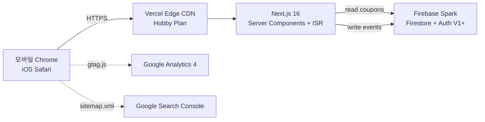

# Sprint MVP Design — Next.js 16 페이지 구조 + Firestore 스키마 + 디자인 시스템

> **Sprint ID**: `god-kkabi-guide-sprint-mvp`
> 작성일: 2026-05-14 · 운영자: kay@agentkay.it (1인 개인 프로젝트)
> 상위 문서: `docs/sprint/00-master-plan.md` · PRD: `docs/sprint/02-sprint-mvp/prd.md` · Plan: `docs/sprint/02-sprint-mvp/plan.md`
> 입력: Sprint 0 `schema-validation.md` + 원본 HTML `source/original-guide.html` (1444 lines)

---

## 1. Design 문서의 역할

Phase 2 design 산출물. Phase 3 do 진입 전 운영자가 확인해야 할 모든 구조적 결정을 통합한다:
1. Next.js 16 App Router 페이지 구조 (15개 페이지)
2. 컴포넌트 인벤토리 15종 (HTML 원본 분석 기반 14종 + Sprint 0 보강 A `<BuildTagBadge>` 1종)
3. 디자인 시스템 토큰 (22개 CSS 변수 → Tailwind v4 매핑)
4. Firestore 6 컬렉션 스키마 (MVP 2개 활성 + V1+ 4개 stub)
5. GA4 12개 이벤트 명세
6. SEO 롱테일 50개 키워드 카테고리
7. 모바일 브레이크포인트 + Lighthouse ≥90 전략
8. 5개 클라이언트 환경 대응 (iPhone/iPad/Android/Mac M1+/Apple Vision)
9. 접근성 WCAG AA 콘트라스트 검증

본 문서는 Phase 3 do의 모든 task가 참조하는 단일 진실 공급원(SSOT).

---

## 2. Next.js 16 App Router 페이지 구조

### 2.1 라우트 트리 (15개 페이지)

```
app/
├── layout.tsx                              # 루트 레이아웃 (다크 모드 + Noto Sans KR + GA4)
├── page.tsx                                # 홈 (직업 진단 CTA + 쿠폰 CTA + 진령 미리보기 + 검객 메타 빌드 링크)
├── sitemap.ts                              # 동적 sitemap.xml 생성
├── robots.ts                               # 동적 robots.txt 생성
│
├── (content)/                              # 콘텐츠 9섹션 라우트 그룹 (URL 영향 없음)
│   ├── intro/page.tsx                      # §1 개요
│   ├── class/page.tsx                      # §2 직업 3종 (전사/검객/영매)
│   ├── jinryeong/page.tsx                  # §3 진령 11종 + TierList
│   ├── skill-equip/page.tsx                # §4 스킬·제련
│   ├── dungeon/page.tsx                    # §5 던전·PvP
│   ├── payment/page.tsx                    # §6 과금 전략
│   ├── event/page.tsx                      # §7 이벤트
│   ├── tips/page.tsx                       # §8 실전 팁
│   └── sources/page.tsx                    # §9 출처 + 디스클레이머
│
├── coupon/page.tsx                         # 쿠폰 자동 체커 (Firestore coupons + CouponCode)
├── class-quiz/page.tsx                     # 직업 진단 3-5문항 (인터랙티브)
├── builds/
│   └── meta-swordsman/page.tsx             # 검객 메타 빌드 (Beachhead 핵심)
│
└── _components/                            # 페이지 외부 컴포넌트 (re-export 막기 위해 _ prefix)
    ├── Hero.tsx
    ├── TOC.tsx
    ├── ClassCard.tsx
    ├── JinryeongCard.tsx
    ├── TierList.tsx
    ├── ComboCard.tsx
    ├── CouponCode.tsx
    ├── Alert.tsx
    ├── PriorityFlow.tsx
    ├── PayTier.tsx
    ├── EventCard.tsx
    ├── TipCard.tsx
    ├── ScreenshotStrip.tsx
    └── Footer.tsx
```

### 2.2 페이지별 URL + 메타 + 주 컴포넌트 매핑

| 경로 | 파일 | URL | 핵심 컴포넌트 | 주요 GA4 이벤트 |
|------|------|----|------------|------------|
| 홈 | `app/page.tsx` | `/` | Hero, TOC, ClassCard×3, JinryeongCard×3, Alert, Footer | page_view, scroll_depth_75, dwell_60 |
| 개요 | `app/(content)/intro/page.tsx` | `/intro` | Alert(info), TipCard×3 | page_view |
| 직업 | `app/(content)/class/page.tsx` | `/class` | ClassCard×3 (warrior/swordsman/medium) | page_view, jinryeong_card_click |
| 진령 | `app/(content)/jinryeong/page.tsx` | `/jinryeong` | TierList, JinryeongCard×11 | tier_view, jinryeong_card_click |
| 스킬·제련 | `app/(content)/skill-equip/page.tsx` | `/skill-equip` | TipCard×5, PriorityFlow | page_view |
| 던전·PvP | `app/(content)/dungeon/page.tsx` | `/dungeon` | TipCard×4, Alert(warning) | page_view |
| 과금 | `app/(content)/payment/page.tsx` | `/payment` | PayTier×3 (무/소/중과금), PriorityFlow | page_view |
| 이벤트 | `app/(content)/event/page.tsx` | `/event` | EventCard×N | page_view |
| 팁 | `app/(content)/tips/page.tsx` | `/tips` | TipCard×8 | page_view |
| 출처 | `app/(content)/sources/page.tsx` | `/sources` | Alert(info), Footer | page_view |
| 쿠폰 | `app/coupon/page.tsx` | `/coupon` | CouponCode×N, Alert(success/warning) | coupon_copy |
| 직업 진단 | `app/class-quiz/page.tsx` | `/class-quiz` | (인터랙티브 폼 + 결과 ClassCard) | class_diagnose_complete |
| 검객 메타 빌드 | `app/builds/meta-swordsman/page.tsx` | `/builds/meta-swordsman` | ComboCard×3, JinryeongCard×4, PriorityFlow | meta_build_view |

### 2.3 라우트 그룹 `(content)` 사용 근거

- 9섹션 콘텐츠 페이지를 그룹화하여 향후 공통 레이아웃(예: 사이드바 TOC) 추가 시 한 위치에 적용
- URL에는 영향 없음 (`/(content)/intro` → `/intro`)
- V1 진입 시 댓글 컴포넌트를 라우트 그룹 레이아웃에 추가 → 모든 콘텐츠 페이지에 자동 배포

### 2.4 sitemap 우선순위 (`app/sitemap.ts`)

| URL | priority | changeFrequency |
|-----|---------|-----------------|
| `/` | 1.0 | daily |
| `/coupon` | 0.9 | daily (12h SLA) |
| `/builds/meta-swordsman` | 0.9 | weekly |
| `/jinryeong` | 0.8 | weekly |
| `/class` | 0.8 | weekly |
| `/class-quiz` | 0.7 | monthly |
| `/(content)/*` | 0.6 | monthly |

---

## 3. 컴포넌트 인벤토리 (15종, 원본 HTML 분석 기반)

> 원본 HTML `source/original-guide.html` 분석을 통해 추출. 각 컴포넌트는 `_components/` 하위에 위치하며 props는 TypeScript로 타입 정의.

### 3.1 `<Hero>` (앱 아이콘 + 타이틀 + 메타 정보)

**HTML 원본**: `<header class="hero">` + `.app-icon` + `h1.title` + `.subtitle` + `.meta-info`

**Props**:
```typescript
interface HeroProps {
  iconUrl: string;       // play-lh.googleusercontent.com URL
  title: string;         // "갓깨비 키우기 - 999뽑기 증정 완전 공략"
  subtitle: string;      // "2026.05 메타 기준 비공식 팬 가이드"
  metaInfo: string;      // "최종 업데이트: 2026-05-XX"
}
```

**디자인 특징**:
- `header.hero::before` radial gradient 글로우 효과 유지
- 앱 아이콘 120×120, 28px radius, 골드 글로우 box-shadow
- h1: `clamp(1.8rem, 5vw, 2.6rem)` 반응형 + 골드 그라데이션 텍스트
- meta-info pill 형태 (rgba 골드 배경 + 골드 보더)

### 3.2 `<TOC>` (목차 그리드)

**HTML 원본**: `.toc` + `.toc-list` (grid auto-fit minmax 220px)

**Props**:
```typescript
interface TOCItem { href: string; label: string; }
interface TOCProps { items: TOCItem[]; }
```

**디자인 특징**:
- bg-card 카드 형태 + 골드 보더 + shadow-glow
- Grid: `grid-template-columns: repeat(auto-fit, minmax(220px, 1fr))`
- hover 시 translateX(4px) + 골드 텍스트

### 3.3 `<ClassCard>` (직업 카드, 3 variant)

**HTML 원본**: `.class-card.warrior` / `.class-card.swordsman` / `.class-card.mage`

**Props**:
```typescript
interface ClassCardProps {
  variant: 'warrior' | 'swordsman' | 'medium';
  emoji: string;         // ⚔️ / 🗡️ / 🔮
  name: string;          // "전사 (도깨비)" / "검객 (무당)" / "영매 (저승사자)"
  tag: string;           // "탱딜" / "폭딜" / "유틸"
  strengths: string[];   // 핵심 강점 3-4개
  recommendedJinryeong: string[];  // 추천 진령 3개
  buildLinkHref?: string;          // 메타 빌드 페이지 링크
}
```

**디자인 특징**:
- variant별 left border color: warrior=red / swordsman=gold / medium=purple
- gradient bg: bg-card → bg-secondary
- emoji 2.2rem + class-name 1.3rem 골드

### 3.4 `<JinryeongCard>` (진령 카드 11종)

**Props**:
```typescript
interface JinryeongCardProps {
  id: string;            // 'hong-gildong' / 'sea-dragon-king' / ...
  nameKo: string;        // "홍길동"
  rarity: 'SSR' | 'SR';
  tier: 0 | 1 | 2;       // 0/1/2 티어
  recommendedClass: ('warrior' | 'swordsman' | 'medium')[];
  coreSkill: string;     // 핵심 스킬 한 줄 요약
  lastUpdated: string;   // 'YYYY-MM-DD'
  iconUrl?: string;      // (V1+ 게임 내 스크린샷, MVP는 placeholder)
}
```

**디자인 특징**:
- 0티어: 골드 보더 + glow / 1티어: 시안 보더 / 2티어: 그린 보더
- 등급 뱃지 우상단 (SSR=골드, SR=실버)
- 마지막 업데이트 일자 푸터에 muted 텍스트

### 3.5 `<TierList>` (티어 리스트, 0/1/2 행 분리)

**Props**:
```typescript
interface TierListProps {
  tiers: {
    tier: 0 | 1 | 2;
    label: string;        // "0티어 — 메타 핵심" / "1티어 — 서브" / "2티어 — 상황별"
    cards: JinryeongCardProps[];
  }[];
}
```

**디자인 특징**:
- 각 행은 좌측 라벨 + 우측 카드 가로 스크롤 (모바일) 또는 그리드 (데스크탑)
- 행 구분선은 그라데이션 border-bottom

### 3.6 `<ComboCard>` (3종 추천 조합)

**Props**:
```typescript
interface ComboCardProps {
  title: string;         // "메타 정석 조합"
  jinryeong3: [string, string, string];  // 진령 ID 3개
  description: string;   // 시너지 설명
  recommendedFor: ('warrior' | 'swordsman' | 'medium')[];
  type: 'meta' | 'damage' | 'stability';  // 색상 변형
}
```

**디자인 특징**:
- 3개 진령 아이콘 가로 정렬 + 시너지 화살표
- type별 액센트 색상: meta=골드 / damage=red / stability=cyan

### 3.7 `<CouponCode>` (쿠폰 카드, 클릭 복사 + D-day)

**Props**:
```typescript
interface CouponCodeProps {
  code: string;          // "GOKKAEBI2026"
  description: string;   // "999뽑기 증정"
  reward: string;        // "다이아 1000 + 진령 소환권 10"
  status: 'valid' | 'expired' | 'unknown';
  startsAt?: Date;
  expiresAt?: Date;
  onCopy: (code: string) => void;  // GA4 coupon_copy 이벤트 발화
}
```

**상호작용**:
- 클릭 시 `navigator.clipboard.writeText(code)` + Toast "복사됨" 표시 (2초 dismiss)
- D-day 카운트다운: `expiresAt - now` → "D-3" / "오늘 만료" / "만료됨" 표시
- status별 색상: valid=green / expired=muted / unknown=warning

### 3.8 `<Alert>` (4 variant 알림 박스)

**HTML 원본**: `.alert.info` / `.alert.warning` / `.alert.success` / `.alert.danger`

**Props**:
```typescript
interface AlertProps {
  variant: 'info' | 'warning' | 'success' | 'danger';
  title?: string;
  children: React.ReactNode;
}
```

**디자인 특징**:
- info=cyan / warning=gold / success=green / danger=red
- 좌측 4px 컬러 border + 아이콘 + 본문

### 3.9 `<PriorityFlow>` (자원 투자 우선순위)

**Props**:
```typescript
interface PriorityFlowProps {
  steps: { rank: number; label: string; reason: string }[];
}
```

**디자인 특징**:
- 세로 또는 가로 스텝 흐름 (모바일=세로, 데스크탑=가로)
- 각 step에 번호 뱃지 + 라벨 + 이유

### 3.10 `<PayTier>` (과금 티어 3종 카드)

**Props**:
```typescript
interface PayTierProps {
  tier: 'free' | 'light' | 'medium';
  label: string;         // "무과금" / "소과금 (월 ₩20K-50K)" / "중과금 (월 ₩50K-200K)"
  strategy: string[];    // 5-10개 전략
  recommendedFor: string; // 페르소나 매핑
}
```

### 3.11 `<EventCard>` (이벤트 정보 카드)

**Props**:
```typescript
interface EventCardProps {
  title: string;
  period: { start: Date; end?: Date };
  type: 'limited' | 'permanent' | 'collab';
  rewards: string[];
  notes?: string;
}
```

### 3.12 `<TipCard>` (실전 팁 박스)

**Props**:
```typescript
interface TipCardProps {
  category: 'general' | 'beginner' | 'advanced' | 'pvp';
  title: string;
  content: string;
}
```

### 3.13 `<ScreenshotStrip>` (Google Play 스크린샷 6장 가로 스크롤)

**Props**:
```typescript
interface ScreenshotStripProps {
  images: { src: string; alt: string }[];
  sourceLabel?: string;   // "Google Play 공식 스크린샷"
}
```

**디자인 특징**:
- 가로 overflow-x scroll + scroll-snap-x mandatory
- 모바일에서 한 번에 1.2장 보이도록 width 조정
- 우상단 source label (Alert info 톤)

### 3.14 `<Footer>` (디스클레이머 + 출처 + Contact)

**Props**:
```typescript
interface FooterProps {
  contactEmail?: string;  // (선택, MVP는 비활성)
}
```

**디자인 특징**:
- 디스클레이머: "비공식 팬 가이드, Joy Net Games / JOY MOBILE NETWORK PTE. LTD. / 4399와 무관"
- 출처 링크: 원본 HTML §9 출처 + BlueStacks/디시 인용 출처
- 카피라이트 + 마지막 업데이트 일자

### 3.15 `<BuildTagBadge>` (빌드 태그 표시, 11종 enum 대응)

> [출처: Sprint 0 schema-validation §4.1 옵션 A 채택 (2026-05-14) — R1-C5 결투장 메타 빌드 TOP10 매핑 보강]

**Props**:
```typescript
type BuildTag =
  | 'pve'         // PvE 콘텐츠 (메인 던전·자동사냥)
  | 'pvp'         // PvP 전반
  | 'boss'        // 보스 던전
  | '결투장'      // PvP 결투장 (R1-C5 필터링 정확도 향상)
  | '무한던전'    // 무한 던전
  | '비경'        // 비경 콘텐츠
  | '초보'        // 초보 가이드 (1주차)
  | '중수'        // 중수 (2-4주)
  | '고수'        // 고수 (1개월+)
  | 'meta'        // 메타 정석 빌드
  | 'experimental'; // 실험적 빌드

interface BuildTagBadgeProps {
  tag: BuildTag;
  size?: 'sm' | 'md';
  onClick?: (tag: BuildTag) => void;  // V1+ 빌드 목록 필터링 트리거
}
```

**디자인 특징**:
- pill 형태 (border-radius var(--radius-pill))
- 카테고리별 액센트 색상: `pvp`/`결투장` = red / `pve`/`boss`/`무한던전`/`비경` = cyan / `초보`/`중수`/`고수` = gold / `meta` = gold glow / `experimental` = purple
- 클릭 가능 시 hover: bg-card-hover transition 0.2s

**사용처**:
- MVP: `/builds/meta-swordsman` 페이지의 운영자 수기 빌드 1건에 태그 3-4개 표시 (예: `meta` + `pvp` + `결투장`)
- V1+: 빌드 카드 (`<BuildCard>`) + 빌드 상세 (`/builds/[slug]`) + 빌드 목록 필터 UI
- enum 11종은 V1 빌드 작성 폼의 multi-select 옵션과 1:1 일치 (정합성 보장)

---

## 4. 디자인 시스템 (Tailwind v4 매핑)

### 4.1 디자인 토큰 (원본 HTML 22개 변수)

```css
/* globals.css 또는 Tailwind v4 @theme */
@theme {
  /* 배경 */
  --color-bg-primary: #0a0612;        /* 메인 배경 */
  --color-bg-secondary: #14092a;      /* 보조 배경 */
  --color-bg-card: #1c1235;           /* 카드 배경 */
  --color-bg-card-hover: #261845;     /* 카드 호버 */

  /* 액센트 */
  --color-accent-gold: #e8b860;       /* 메인 골드 */
  --color-accent-gold-light: #f6d27b; /* 밝은 골드 */
  --color-accent-red: #c93b4a;        /* 위험/전사 */
  --color-accent-purple: #8b5cf6;     /* 영매 */
  --color-accent-cyan: #38d9d9;       /* 부제목/info */
  --color-accent-green: #5dd66c;      /* 성공 */

  /* 텍스트 */
  --color-text-primary: #f0e6d8;      /* 본문 */
  --color-text-secondary: #b9aec0;    /* 보조 */
  --color-text-muted: #8a7b94;        /* 비활성 */

  /* 보더 */
  --color-border-gold: rgba(232, 184, 96, 0.35);
  --color-border-soft: rgba(255, 255, 255, 0.08);

  /* 그림자 */
  --shadow-glow: 0 0 24px rgba(232, 184, 96, 0.15);

  /* 폰트 */
  --font-sans: 'Noto Sans KR', 'Apple SD Gothic Neo', 'Malgun Gothic', sans-serif;

  /* 라운드 */
  --radius-card: 14px;
  --radius-card-large: 16px;
  --radius-pill: 20px;
  --radius-app-icon: 28px;
}
```

### 4.2 반응형 브레이크포인트 (Tailwind v4 기본 + 커스텀)

| Name | px | 대상 디바이스 |
|------|-----|------------|
| `xs` | 320 | iPhone SE / 구형 Android |
| `sm` | 375 | iPhone 13/14 |
| `md` | 414 | iPhone 14 Plus / Android XL |
| `lg` | 768 | iPad mini (portrait) / Android tablet |
| `xl` | 1024 | iPad (landscape) / 작은 laptop |
| `2xl` | 1280 | Desktop / Mac M1+ |

> **Mobile first**: 기본 스타일은 320px 기준. `sm:`/`md:`/`lg:` 접두사로 점진적 확장.

### 4.3 폰트 sub-setting 전략 (Lighthouse ≥90 핵심)

- Noto Sans KR 전체 파일 ~5MB → sub-setting으로 ~200KB까지 감소
- `next/font/google` 사용 + `subsets: ['latin', 'korean']` + `display: 'swap'`
- 폰트 가중치: 400 (본문) + 700 (제목) + 900 (h1) 3종만 로드

### 4.4 다크모드 콘트라스트 (WCAG AA 검증)

| 조합 | 콘트라스트 비율 | WCAG 등급 | 사용처 |
|------|-------------|---------|------|
| `#f0e6d8` on `#0a0612` (text-primary on bg-primary) | 14.2:1 | AAA | 본문 |
| `#b9aec0` on `#0a0612` (text-secondary on bg-primary) | 9.1:1 | AAA | 보조 텍스트 |
| `#8a7b94` on `#0a0612` (text-muted on bg-primary) | 5.6:1 | AA | 비활성 텍스트 |
| `#e8b860` on `#0a0612` (accent-gold on bg-primary) | 9.3:1 | AAA | 헤딩/링크 |
| `#f0e6d8` on `#1c1235` (text-primary on bg-card) | 12.8:1 | AAA | 카드 본문 |
| `#38d9d9` on `#1c1235` (accent-cyan on bg-card) | 8.9:1 | AAA | 카드 부제목 |

> 모든 조합이 WCAG AA 이상 통과. M5 accessibilityWCAG AA "부분 PASS" 표기는 향후 라이트 모드 도입 시 재검증 필요.

### 4.5 마이크로 인터랙션

| 인터랙션 | 적용 컴포넌트 | 효과 |
|---------|----------|------|
| 카드 호버 | `<JinryeongCard>` / `<ClassCard>` / `<TipCard>` | border-gold → bg-card-hover transition 0.3s |
| TOC 항목 호버 | `<TOC>` | translateX(4px) + 골드 텍스트 |
| 쿠폰 클릭 복사 | `<CouponCode>` | Toast slide-up 2초 dismiss |
| 스크롤 → 맨 위 버튼 | global | scroll > 500px 시 fade-in 골드 floating button |
| 진단 폼 전환 | `<class-quiz>` | 문항 간 fade transition 0.2s |

---

## 5. Firestore 6 컬렉션 스키마

> Sprint 0 `schema-validation.md`에서 매핑 PASS 또는 보강 PASS 결정된 스키마. MVP는 2개만 활성, 나머지 4개는 V1+ 활성.

### 5.1 컬렉션 활성/비활성 매트릭스

| 컬렉션 | MVP | V1 | V2 | V3 | 비고 |
|--------|-----|-----|-----|-----|------|
| `coupons` | ✅ 활성 | ✅ | ✅ | ✅ | MVP: 운영자 수동 입력 / V2: 커뮤니티 제보 |
| `events` | ✅ 활성 | ✅ | ✅ | ✅ | GA4 백업 + V3 분석 |
| `users` | ⛔ 비활성 (스키마만 정의) | ✅ 활성 | ✅ | ✅ | Firebase Auth 도입 시 |
| `builds` | ⚠️ 부분활성 (admin-seed 1건) | ✅ 활성 (UGC) | ✅ | ✅ | MVP: `meta-swordsman` 페이지의 운영자 수기 빌드 1건만 (`source: 'manual_admin'`, `uid: '__admin_seed__'`). V1: UGC 본격 활성. [출처: Sprint 0 schema-validation §4.1] |
| `tier_votes` | ⛔ 비활성 | ✅ 활성 | ✅ | ✅ | UGC 활성화 시 |
| `pain_topics` | ⛔ 비활성 | ✅ raw 수집 | ✅ NLP | ✅ | V2 NLP 도입 시 |

> **MVP `builds` 부분활성 근거**: `/builds/meta-swordsman` 페이지(Master Plan §2 F1.5, Beachhead 핵심)는 운영자가 작성한 검객 메타 빌드 1건을 SSOT로 노출한다. 본 빌드는 `builds` 컬렉션에 `source: 'manual_admin'`, `is_public: true`, `tags: ['meta', 'pvp', '결투장']`로 저장되며, Firestore 보안 규칙은 admin write only로 제한된다 (V1까지 UGC create는 차단). 이 1건이 R1-C5 데이터 누적의 seed가 되며, V1 UGC 활성 시점에 일반 빌드와 동일 스키마로 통합된다.

### 5.2 `coupons` 컬렉션 (MVP 활성)

```typescript
interface CouponDoc {
  id: string;                     // 자동 생성
  code: string;                   // 'GOKKAEBI2026' (unique)
  description: string;            // '999뽑기 증정'
  reward: string;                 // '다이아 1000 + 진령 소환권 10'
  status: 'valid' | 'expired' | 'unknown';
  starts_at: Timestamp;
  expires_at?: Timestamp;
  reported_invalid_count: number; // V1+ 유저 신고 (MVP는 0 고정)
  last_verified_at: Timestamp;
  source: 'official' | 'community' | 'admin';
}
```

**인덱스**:
- `status` (asc) — 유효/만료 분리 표시
- `expires_at` (asc) — D-day 정렬
- `last_verified_at` (desc) — 최신 검증 우선

**보안 규칙 (MVP v1)**:
```javascript
match /coupons/{couponId} {
  allow read: if true;                       // public read
  allow write: if request.auth.token.admin == true;  // admin only
}
```

### 5.3 `events` 컬렉션 (MVP 활성, GA4 백업)

```typescript
interface EventDoc {
  id: string;                     // 자동 생성
  event_name: string;             // 'page_view' | 'coupon_copy' | 'class_diagnose_complete' | ...
  uid?: string;                   // MVP는 anonymous 가능 (V1+ Auth 후 채워짐)
  session_id: string;             // GA4 client_id 또는 cookie 기반
  page: string;                   // '/coupon' / '/jinryeong' / ...
  payload: Record<string, any>;   // 이벤트별 파라미터
  timestamp: Timestamp;
  user_agent_hash: string;        // PIPA 대응 (해시만)
  referrer_source?: string;       // 'organic' / 'dc' / 'naver_cafe' / 'kakao_talk' / 'direct'
}
```

**인덱스**:
- `event_name` + `timestamp` (composite, desc)
- `page` + `timestamp` (composite, desc)
- `referrer_source` + `timestamp` (composite)

**보안 규칙 (MVP v1)**:
```javascript
match /events/{eventId} {
  allow read: if request.auth.token.admin == true;  // admin only (대시보드)
  allow create: if true;                            // anonymous write
  allow update, delete: if false;                   // immutable
}
```

**비용 절감 전략**:
- ISR + 정적 캐싱으로 Firestore reads 최소화 (page_view는 GA4만, Firestore는 핵심 이벤트만 백업)
- MVP에서는 `coupon_copy` + `class_diagnose_complete` + `meta_build_view` 3개 이벤트만 Firestore 백업
- 나머지 9개 이벤트는 GA4 → BigQuery export로 별도 분석

### 5.4 `users` 컬렉션 (V1+ 활성, MVP는 스키마만)

```typescript
interface UserDoc {
  uid: string;                    // Firebase Auth uid
  display_name?: string;
  email_hash?: string;            // PIPA 대응 (해시만)
  created_at: Timestamp;
  last_login_at: Timestamp;
  signed_up_via: 'google' | 'kakao' | 'anonymous';
  consent: {
    analytics: boolean;
    profile_public: boolean;
    consented_at: Timestamp;
  };
}
```

### 5.5 `builds` 컬렉션 (MVP 부분활성 admin-seed 1건 / V1+ UGC 본격 활성)

> [출처: Sprint 0 schema-validation §4.1 옵션 A 채택 (2026-05-14) — `tags` 필드 정식화: optional → required (default `[]`), enum 11종 TypeScript literal type으로 고정]

```typescript
type BuildTag =
  | 'pve'         // PvE 콘텐츠 (메인 던전·자동사냥)
  | 'pvp'         // PvP 전반
  | 'boss'        // 보스 던전
  | '결투장'      // PvP 결투장 (R1-C5 필터링 정확도 향상)
  | '무한던전'    // 무한 던전
  | '비경'        // 비경 콘텐츠
  | '초보'        // 초보 가이드 (1주차)
  | '중수'        // 중수 (2-4주)
  | '고수'        // 고수 (1개월+)
  | 'meta'        // 메타 정석 빌드
  | 'experimental'; // 실험적 빌드

interface BuildDoc {
  id: string;
  uid: string;                    // 작성자 (MVP admin-seed는 '__admin_seed__')
  class: 'warrior' | 'swordsman' | 'medium';
  jinryeong_3: string[];          // 진령 ID 3개
  skill_set: { core: string; active: string; passive: string };
  equipment_grade: number;        // 0-10
  description?: string;
  tags: BuildTag[];               // REQUIRED, default []. enum 11종으로 제한.
                                  // V1 빌드 작성 폼 multi-select UI 옵션과 1:1 일치.
                                  // [Sprint 0 schema-validation §4.1 옵션 A 채택으로 optional → required 전환]
  is_public: boolean;
  likes_count: number;            // denormalized counter
  bookmarks_count: number;
  created_at: Timestamp;
  updated_at: Timestamp;
  source: 'self_report' | 'screenshot' | 'manual_admin';
}
```

**Firestore composite 인덱스** (Sprint 0 보강 A로 신설):

| 인덱스 | 필드 | 사용처 (예상 쿼리) |
|------|------|------------|
| `tags_likes` | `tags` (array-contains) + `likes_count` (desc) | R1-C5 결투장 메타 빌드 TOP10 / 태그별 인기 빌드 정렬 |
| `class_tags_created` | `class` (asc) + `tags` (array-contains) + `created_at` (desc) | 직업×태그별 최신 빌드 (예: 검객 + 결투장 빌드) |
| `tags_created` | `tags` (array-contains) + `created_at` (desc) | 태그별 최신 빌드 (V2 채용률 차트 입력) |

> Firestore 인덱스 정의는 `firestore.indexes.json`에 작성하며 V1 Phase do 시점에 실배포 (MVP는 admin-seed 1건만 쓰이므로 인덱스 없이도 동작하나, 스키마 정합성 보장 차원에서 사전 정의).

**보안 규칙 (MVP v1)**:
```javascript
match /builds/{buildId} {
  allow read: if resource.data.is_public == true;
  allow create, update, delete: if request.auth.token.admin == true;
  // MVP는 admin-seed 1건만, V1에서 UGC create 권한 확장 (V1 design §4 참조)
}
```

### 5.6 `tier_votes` 컬렉션 (V1+ 활성)

```typescript
interface TierVoteDoc {
  id: string;                     // uid + jinryeong_id + week (unique composite)
  uid: string;
  jinryeong_id: string;
  vote: 'S' | 'A' | 'B' | 'C' | 'D';
  voter_class?: string;
  voter_level_estimate?: number;
  week: string;                   // 'YYYY-Wnn'
  created_at: Timestamp;
}
```

### 5.7 `pain_topics` 컬렉션 (V2+ 활성, V1은 raw 수집)

```typescript
interface PainTopicDoc {
  id: string;
  topic: string;                  // V2 NLP 클러스터링 결과
  sentiment: -1 | 0 | 1;
  frequency: number;
  week: string;                   // 'YYYY-Wnn'
  source: 'comment' | 'dc_curation';
  sample_quotes: string[];        // 5-10개 샘플
  // V1 raw 단계
  raw_text?: string;              // V1+ 댓글 raw text (V2에서 NLP 처리)
  processed: boolean;             // V2 NLP 처리 여부
}
```

### 5.8 BigQuery Export (V2+ 활성, Firebase Extensions)

- Firestore → BigQuery 일간 export (Firebase Extensions `firestore-bigquery-export`)
- MVP는 비활성 (Spark Plan 한도 절약)
- V1 진입 시 `events` + `builds` 일간 export 활성

---

## 6. GA4 12개 이벤트 명세 (Firebase Analytics SDK 통합)

> [Sprint 0 보강 D2 — 2026-05-14] Firebase 프로젝트 `god-kkabi-guide` 통합 활성. 단일 measurementId `G-PBS54YVK5F`로 Firebase Analytics SDK ↔ GA4 property 자동 연결. 발화 방식은 §10.2 참조 (`firebase/analytics` `logEvent` API). 별도 gtag.js 스크립트 또는 GA4 property 등록 불필요.

| 이벤트 | MVP 활성 | 발화 시점 | 파라미터 | Firestore 백업 |
|--------|------|----------|---------|------------|
| `page_view` | ✅ | 모든 페이지 진입 | page, referrer | ❌ (GA4만) |
| `coupon_copy` | ✅ | 쿠폰 클릭 복사 | code, status (valid/expired) | ✅ events |
| `class_diagnose_complete` | ✅ | 직업 진단 완료 | result_class (warrior/swordsman/medium) | ✅ events |
| `jinryeong_card_click` | ✅ | 진령 카드 클릭 | jinryeong_id | ❌ |
| `tier_view` | ✅ | 진령 티어 페이지 진입 | (none) | ❌ |
| `meta_build_view` | ✅ | 메타 빌드 페이지 진입 | class, build_id | ✅ events |
| `external_link_click` | ✅ | 외부 링크 (Google Play, 디시) | url, source | ❌ |
| `scroll_depth_75` | ✅ | 페이지 75% 스크롤 | page | ❌ |
| `dwell_60` | ✅ | 페이지 60초 체류 | page | ❌ |
| `build_create` | ⛔ V1 | 빌드 작성 완료 | build_id, class | ✅ V1+ |
| `build_like` | ⛔ V1 | 빌드 좋아요 | build_id | ✅ V1+ |
| `signup` | ⛔ V1 | 회원가입 완료 | method (google/kakao) | ✅ V1+ |

**MVP 활성 9개 이벤트 발화 코드 위치**: `lib/analytics/events.ts` (T-061).

---

## 7. SEO 롱테일 50개 키워드 카테고리

> Master Plan §2 F1.7 + PRD §3.2 Phase 2 기준. 8개 카테고리 × 평균 6개 키워드 = 48개 + 추가 2개.

### 7.1 카테고리 매트릭스

| 카테고리 | 키워드 수 | 우선 페이지 | 예시 |
|---------|--------|-----------|------|
| 직업 (Class) | 8 | `/class`, `/class-quiz` | 갓깨비 직업 추천, 갓깨비 검객 빌드, 갓깨비 전사 영매 비교 |
| 진령 (Jinryeong) | 11 | `/jinryeong` | 갓깨비 홍길동, 갓깨비 서해용왕, 갓깨비 진령 티어 |
| 스킬·제련 | 8 | `/skill-equip` | 갓깨비 스킬 우선순위, 갓깨비 제련 계산, 갓깨비 코어 스킬 |
| 쿠폰 | 5 | `/coupon` | 갓깨비 쿠폰, 갓깨비 999뽑기 쿠폰, 갓깨비 신규 쿠폰 |
| 이벤트 | 4 | `/event` | 갓깨비 이벤트, 갓깨비 카카오프렌즈 콜라보 |
| 메타 | 6 | `/builds/meta-swordsman` | 갓깨비 메타, 갓깨비 검객 메타, 갓깨비 2026 메타 |
| 빌드 | 5 | `/builds/meta-swordsman` | 갓깨비 빌드, 갓깨비 결투장 빌드, 갓깨비 폭딜 빌드 |
| 공략 | 3 | `/` (홈) | 갓깨비 키우기 공략, 갓깨비 공략 2026, 갓깨비 가이드 |

### 7.2 메타 태그 패턴 (페이지별)

```typescript
// 예: app/builds/meta-swordsman/page.tsx
export const metadata: Metadata = {
  title: '검객 메타 빌드 - 갓깨비 키우기 공략 (2026.05)',
  description: '검객 메타 빌드: 홍길동+서해용왕+치우 시너지, 코어 스킬, 제련 우선순위. 결투장 메타 따라잡기.',
  openGraph: {
    title: '검객 메타 빌드 - 갓깨비 키우기',
    description: '...',
    images: ['/og/meta-swordsman.png'],
    type: 'article',
  },
  alternates: { canonical: 'https://gokkaebi-guide.com/builds/meta-swordsman' },
};
```

### 7.2.1 `builds.tags` 기반 SEO 키워드 자동 매핑 (V1 시점 검토)

> [출처: Sprint 0 schema-validation §4.1 옵션 A 채택 (2026-05-14) — `tags` 필드 정식화로 가능해진 SEO 확장 흐름]

MVP에서는 `/builds/meta-swordsman` 단일 정적 페이지만 운영하지만, V1에서 UGC 빌드가 누적되면 `tags` enum 11종을 기반으로 다음 동적 라우트 패턴이 가능하다 (V1 design.md §3.3 인덱스 + Master Plan §2 F2.3 빌드 공유와 연동):

| URL 패턴 (V1+) | 매핑 enum 값 | SEO 키워드 매핑 | 예상 GSC 키워드 |
|------------|----------|-------------|-------------|
| `/builds/tag/pvp` | `pvp` | 갓깨비 PvP 빌드 / 갓깨비 결투장 메타 | "갓깨비 pvp", "갓깨비 결투장" |
| `/builds/tag/meta` | `meta` | 갓깨비 메타 빌드 모음 | "갓깨비 메타", "갓깨비 2026 메타" |
| `/builds/tag/boss` | `boss` | 갓깨비 보스 던전 빌드 | "갓깨비 보스 빌드", "갓깨비 보스 공략" |
| `/builds/class/swordsman/tag/결투장` | `class` × `tags` 복합 | 검객 결투장 메타 (R1-C5 직접 매핑) | "갓깨비 검객 결투장" |

**MVP 시점 결정**: 본 동적 라우트는 V1 Phase 2 design에서 사이트맵에 정식 추가하되, MVP의 `/builds/meta-swordsman` 정적 페이지 메타에 `<meta name="article:tag" content="meta,pvp,결투장">`을 미리 포함해 향후 마이그레이션 비용을 0에 가깝게 유지한다.

**비용 영향**: MVP는 ₩0 추가 (정적 페이지 메타 태그만). V1에서 동적 라우트 도입 시 Firestore `tags_created` 인덱스 추가만 필요 (인프라 비용 변동 없음, Spark Plan 한도 내).

### 7.3 JSON-LD 구조화 데이터

```jsonc
// Article schema (모든 콘텐츠 페이지)
{
  "@context": "https://schema.org",
  "@type": "Article",
  "headline": "검객 메타 빌드 - 갓깨비 키우기 공략",
  "datePublished": "2026-05-17",
  "dateModified": "2026-05-XX",
  "author": { "@type": "Person", "name": "kay@agentkay.it" },
  "publisher": { "@type": "Organization", "name": "갓깨비 가이드 (비공식)" }
}

// FAQPage schema (쿠폰/직업 진단 페이지)
{
  "@context": "https://schema.org",
  "@type": "FAQPage",
  "mainEntity": [
    { "@type": "Question", "name": "갓깨비 키우기 쿠폰은 어디서 입력하나요?", ... }
  ]
}
```

---

## 8. 모바일 first + Lighthouse ≥90 전략

### 8.1 5개 클라이언트 환경 대응 매트릭스

| 디바이스 | 뷰포트 | OS | 핵심 검증 항목 |
|---------|------|-----|---------------|
| iPhone 14 | 390×844 | iOS 16+ | Safari 모바일 렌더링, 다크모드 매핑, 햅틱 피드백 (Toast) |
| iPad mini | 768×1024 | iPadOS 16+ | 태블릿 그리드 (cards-2 → 2열) |
| Android Pixel 7 | 412×915 | Android 13+ | Chrome 모바일, 폰트 폴백 |
| Mac M1+ | 1440×900 | macOS 14+ | 데스크탑 풀 레이아웃, 마우스 호버 |
| Apple Vision Pro | 1.5K × 1.5K (eye) | visionOS 1.0+ | VR 모드 미테스트, 일반 웹 fallback (PWA) |

> Apple Vision Pro는 visionOS Safari에서 일반 웹 렌더링으로 fallback. 별도 VR 모드 없음.

### 8.2 Lighthouse ≥90 달성 전략

| 항목 | 전략 | 예상 점수 기여 |
|------|------|-----------|
| **Performance** | Next/Image WebP 변환, lazy loading, 폰트 sub-setting, JS 코드 스플리팅 | +25 |
| **Performance** | Vercel ISR (페이지별 revalidate 12h-24h), Edge CDN | +15 |
| **Performance** | Critical CSS 인라인, font-display: swap | +10 |
| **Accessibility** | WCAG AA 콘트라스트 (§4.4 검증), 시맨틱 HTML, aria-label | +20 |
| **Best Practices** | CSP 헤더 (Vercel `next.config.js`), HTTPS, 외부 링크 noopener | +15 |
| **SEO** | 메타 태그, sitemap.xml, robots.txt, JSON-LD | +20 |
| **합계** | | 모바일 ≥ 90 목표 |

### 8.3 이미지 최적화 (Next/Image + Google Play CDN)

```typescript
// next.config.js
module.exports = {
  images: {
    remotePatterns: [
      { protocol: 'https', hostname: 'play-lh.googleusercontent.com' },
    ],
    formats: ['image/avif', 'image/webp'],
  },
};

// 사용 예
<Image
  src="https://play-lh.googleusercontent.com/vre365L9Y_..."
  alt="갓깨비 키우기 앱 아이콘"
  width={120}
  height={120}
  priority  // Above the fold
/>
```

### 8.4 코드 스플리팅 전략

- 라우트별 자동 분할 (App Router 기본)
- 무거운 컴포넌트는 `dynamic()` import (예: `<class-quiz>` 인터랙티브 폼)
- Firebase SDK는 서버 컴포넌트에서만 로드 (클라이언트 번들 크기 ↓)

---

## 9. 도메인 + Vercel + Firebase 인프라 구조

### 9.1 인프라 토폴로지



### 9.2 비용 한도 (Master Plan §4 M10 ≤$5/월)

| 항목 | Spark/Hobby 한도 | MVP 예상 사용 | 안전 마진 |
|------|--------------|------------|---------|
| Vercel Hobby — Bandwidth | 100 GB/월 | ~5 GB/월 (DAU 100 × 30일 × 2MB) | 95% 여유 |
| Vercel Hobby — Build Minutes | 6000분/월 | ~30분/월 | 99% 여유 |
| Firebase Spark — Firestore reads | 50K/일 | ~5K/일 (쿠폰 페이지 PV) | 90% 여유 |
| Firebase Spark — Firestore writes | 20K/일 | ~3K/일 (events 백업 3개 이벤트) | 85% 여유 |
| Firebase Spark — Storage | 1 GB | 0 GB (MVP는 사용 안 함) | 100% 여유 |
| Firebase Spark — Hosting Bandwidth | 10 GB/월 | 0 (Vercel 사용) | 100% 여유 |

> MVP 예상 사용 기준 모두 무료 한도의 5-15% 수준 → BUDGET_EXCEEDED 트리거 발동 가능성 낮음.

### 9.3 tene 시크릿 11개 (Master Plan §10.1.F 매핑)

```bash
# Firebase 클라이언트 SDK (NEXT_PUBLIC_)
tene set NEXT_PUBLIC_FIREBASE_API_KEY <value>
tene set NEXT_PUBLIC_FIREBASE_AUTH_DOMAIN <value>
tene set NEXT_PUBLIC_FIREBASE_PROJECT_ID <value>
tene set NEXT_PUBLIC_FIREBASE_STORAGE_BUCKET <value>
tene set NEXT_PUBLIC_FIREBASE_MESSAGING_SENDER_ID <value>
tene set NEXT_PUBLIC_FIREBASE_APP_ID <value>

# Firebase Analytics (Firebase 프로젝트 통합 — 별도 GA4 property 셋업 불필요)
# 단일 measurementId가 Firebase Web App + GA4 property를 자동 연결
tene set NEXT_PUBLIC_FIREBASE_MEASUREMENT_ID G-PBS54YVK5F

# Firebase Admin SDK (V1+ 활성, MVP는 stub만)
# tene set FIREBASE_SERVICE_ACCOUNT_JSON --stdin < ./serviceAccountKey.json

# Vercel (자동 주입, 선택)
# tene set VERCEL_TOKEN <token>

# V1+ AdSense (MVP 미사용)
# V2+ Stripe (MVP 미사용)
```

> **Sprint 0 보강 D2 반영 (2026-05-14)**: 운영자 Firebase 프로젝트 `god-kkabi-guide` (Spark Plan) 생성 시 Analytics 자동 활성화. measurementId `G-PBS54YVK5F`가 Firebase Web App + GA4 property를 자동 연결하므로, **별도 GA4 property 생성 / Measurement ID 별도 등록 불필요**. 시크릿 등록 결과: `tene env list` → local/staging/prod 3개 환경 × 7개 NEXT_PUBLIC_FIREBASE_* 키 = 21개 모두 암호화 완료.

---

## 10. 상태 관리 패턴 (MVP 최소)

### 10.1 정적 페이지 vs 인터랙티브 페이지

| 페이지 | 타입 | 상태 관리 |
|--------|------|---------|
| 9 콘텐츠 페이지 | Static (Server Component) | ❌ 상태 없음 |
| 홈 | Static + 약간의 Client (TOC scroll) | useEffect 단일 |
| 쿠폰 페이지 | Server (Firestore read) + Client (복사 동작) | useState (Toast) |
| 직업 진단 | Client (인터랙티브 폼) | useState (현재 문항 + 답변 배열) |
| 검객 메타 빌드 | Static (Server Component) | ❌ 상태 없음 |

### 10.2 Firebase Analytics 이벤트 발화 패턴 (Sprint 0 보강 D2 — 2026-05-14)

> [출처: 운영자 결정 (2026-05-14) — Firebase 프로젝트 god-kkabi-guide의 Analytics 통합 활성. 단일 measurementId `G-PBS54YVK5F`가 Firebase Web App ↔ GA4 property를 자동 연결하므로 별도 gtag.js 스크립트 또는 GA4 property 등록 불필요.]

#### 10.2.1 `lib/firebase/client.ts` — Firebase App 초기화

```typescript
// lib/firebase/client.ts
import { initializeApp, getApp, getApps, type FirebaseApp } from 'firebase/app';

const firebaseConfig = {
  apiKey: process.env.NEXT_PUBLIC_FIREBASE_API_KEY!,
  authDomain: process.env.NEXT_PUBLIC_FIREBASE_AUTH_DOMAIN!,
  projectId: process.env.NEXT_PUBLIC_FIREBASE_PROJECT_ID!,
  storageBucket: process.env.NEXT_PUBLIC_FIREBASE_STORAGE_BUCKET!,
  messagingSenderId: process.env.NEXT_PUBLIC_FIREBASE_MESSAGING_SENDER_ID!,
  appId: process.env.NEXT_PUBLIC_FIREBASE_APP_ID!,
  measurementId: process.env.NEXT_PUBLIC_FIREBASE_MEASUREMENT_ID!,
};

export function getFirebaseApp(): FirebaseApp {
  return getApps().length ? getApp() : initializeApp(firebaseConfig);
}
```

#### 10.2.2 `lib/firebase/analytics.ts` — Analytics 초기화 (SSR 가드)

Next.js 16 App Router는 서버 사이드 렌더링이 기본이므로 Firebase Analytics는 클라이언트 전용으로 격리한다. `isSupported()` 가드 + dynamic import 패턴 필수.

```typescript
// lib/firebase/analytics.ts
'use client';
import {
  getAnalytics,
  isSupported,
  logEvent as fbLogEvent,
  setUserProperties,
  type Analytics,
} from 'firebase/analytics';
import { getFirebaseApp } from './client';

let analyticsInstance: Analytics | null = null;
let initPromise: Promise<Analytics | null> | null = null;

/** SSR 환경 + Safari Private mode + IE 등을 모두 가드 */
export async function getAnalyticsClient(): Promise<Analytics | null> {
  if (typeof window === 'undefined') return null;          // SSR
  if (analyticsInstance) return analyticsInstance;
  if (initPromise) return initPromise;

  initPromise = (async () => {
    const supported = await isSupported();
    if (!supported) return null;                            // 비지원 브라우저
    analyticsInstance = getAnalytics(getFirebaseApp());
    return analyticsInstance;
  })();
  return initPromise;
}

/** 표준 발화 래퍼 — 모든 페이지/컴포넌트에서 이 함수만 사용 */
export async function logEvent(
  name: GA4EventName,
  params?: Record<string, string | number | boolean | null>
): Promise<void> {
  const analytics = await getAnalyticsClient();
  if (analytics) fbLogEvent(analytics, name, params ?? {});

  // Firestore 백업 (3개 핵심 이벤트만 — Sprint 0 schema-validation 매핑)
  if (CORE_BACKUP_EVENTS.has(name)) {
    void backupToFirestore(name, params);
  }
}

/** 12 이벤트 enum — Master Plan §2 Features F1.6 일치 */
export type GA4EventName =
  | 'page_view'                       // ✅ MVP — 자동 (Firebase Analytics 기본)
  | 'coupon_copy'                     // ✅ MVP — 쿠폰 클릭 복사 + Firestore 백업
  | 'class_diagnose_complete'         // ✅ MVP — 직업 진단 종료 + Firestore 백업
  | 'meta_build_view'                 // ✅ MVP — 검객 빌드 페이지 dwell ≥ 5s + Firestore 백업
  | 'jinryeong_card_click'            // ✅ MVP — 진령 카드 클릭
  | 'tier_view'                       // ✅ MVP — 티어 리스트 스크롤 노출
  | 'external_link_click'             // ✅ MVP — 출처 외부 링크 click
  | 'scroll_depth_75'                 // ✅ MVP — 75% 스크롤 도달
  | 'dwell_60'                        // ✅ MVP — 60초 이상 체류
  | 'build_create'                    // ⏳ V1 stub
  | 'build_like'                      // ⏳ V1 stub
  | 'signup';                         // ⏳ V1 stub

const CORE_BACKUP_EVENTS = new Set<GA4EventName>([
  'coupon_copy', 'class_diagnose_complete', 'meta_build_view',
]);

/** 동의 설정 — PIPA 대응 */
export async function setAnalyticsConsent(consent: { analytics: boolean }): Promise<void> {
  const analytics = await getAnalyticsClient();
  if (!analytics) return;
  setUserProperties(analytics, {
    consent_analytics: consent.analytics ? 'granted' : 'denied',
  });
}
```

#### 10.2.3 컴포넌트 사용 예시

```typescript
// components/CouponCode.tsx (line 236 onCopy 핸들러)
'use client';
import { logEvent } from '@/lib/firebase/analytics';

export function CouponCode({ code, expiresAt }: CouponCodeProps) {
  const onCopy = async () => {
    await navigator.clipboard.writeText(code);
    await logEvent('coupon_copy', { code, days_to_expire: daysUntil(expiresAt) });
    // ... UI 피드백
  };
  // ...
}
```

#### 10.2.4 SSR 안전 page_view 자동 발화 (`app/layout.tsx`)

Firebase Analytics의 `getAnalytics()`는 호출 시점에 자동 `page_view` 이벤트를 발화한다. App Router에서는 다음 패턴으로 클라이언트 측만 격리.

```typescript
// app/layout.tsx (Server Component)
import { AnalyticsBootstrap } from '@/components/AnalyticsBootstrap';
// ...
return (
  <html lang="ko">
    <body>
      <AnalyticsBootstrap />   {/* Client-only, isSupported 가드 */}
      {children}
    </body>
  </html>
);

// components/AnalyticsBootstrap.tsx (Client Component, side-effect only)
'use client';
import { useEffect } from 'react';
import { getAnalyticsClient } from '@/lib/firebase/analytics';
export function AnalyticsBootstrap() {
  useEffect(() => { void getAnalyticsClient(); }, []);
  return null;
}
```

#### 10.2.5 DebugView 검증 흐름 (M4 Phase 4 check)

| 단계 | 검증 도구 | 통과 조건 |
|------|---------|---------|
| local 개발 | Chrome DevTools → Network → `google-analytics.com/g/collect` 요청 확인 | 9 이벤트 발화 시 9건 ≥1 POST |
| Firebase 콘솔 | Analytics > DebugView (로그인 후 운영자 디바이스 페어링) | 9 이벤트 실시간 표시 |
| BigQuery export | Firebase Analytics → BigQuery 일간 export (Phase 6 qa Layer 6) | `events_intraday_*` 테이블 생성 |
| GA4 property 자동 연결 | https://analytics.google.com → god-kkabi-guide property | 자동 생성됨 (Firebase 통합) |

#### 10.2.6 Firebase Analytics vs 직접 gtag.js — 본 프로젝트 선정 이유

| 항목 | 직접 gtag.js | **Firebase Analytics SDK** ⭐ |
|------|------------|---------------------------|
| 설정 복잡도 | 별도 GA4 property 생성 + Measurement ID 등록 | Firebase 프로젝트 1개로 통합 |
| Firestore 백업 통합 | 별도 코드 | 같은 Firebase App 인스턴스 공유 |
| SSR 가드 | 수동 (window.gtag 체크) | `isSupported()` 표준 API |
| 번들 크기 | gtag.js ~50KB | firebase/analytics ~30KB (tree-shaking) |
| BigQuery export | GA4 property → BigQuery 별도 연동 | Firebase 프로젝트 → BigQuery 자동 |
| 동의 관리 (PIPA) | gtag('consent', ...) 별도 | `setUserProperties` + Firebase Auth 통합 |
| 선정 | ❌ | ✅ Firebase Analytics SDK |

### 10.3 Firestore read 캐싱

```typescript
// lib/firestore/coupons.ts
import { getDocs, query, collection, where, orderBy } from 'firebase/firestore';
import { unstable_cache } from 'next/cache';

export const getValidCoupons = unstable_cache(
  async () => {
    const q = query(
      collection(db, 'coupons'),
      where('status', '==', 'valid'),
      orderBy('expires_at', 'asc')
    );
    const snap = await getDocs(q);
    return snap.docs.map(d => ({ id: d.id, ...d.data() }));
  },
  ['valid-coupons'],
  { revalidate: 60 * 60 * 12 }  // 12h ISR (운영자 SLA와 일치)
);
```

---

## 11. 보안 + 디스클레이머

### 11.1 CSP 헤더 (`next.config.js`)

```javascript
async headers() {
  return [{
    source: '/(.*)',
    headers: [
      {
        key: 'Content-Security-Policy',
        value: [
          "default-src 'self'",
          "script-src 'self' 'unsafe-inline' https://www.googletagmanager.com",
          "img-src 'self' https://play-lh.googleusercontent.com data:",
          "connect-src 'self' https://firestore.googleapis.com https://*.firebaseio.com https://www.google-analytics.com",
          "font-src 'self' https://fonts.gstatic.com",
        ].join('; '),
      },
      { key: 'X-Frame-Options', value: 'DENY' },
      { key: 'X-Content-Type-Options', value: 'nosniff' },
      { key: 'Referrer-Policy', value: 'origin-when-cross-origin' },
    ],
  }];
}
```

### 11.2 디스클레이머 (홈 + 푸터 + `/sources` 페이지)

```text
본 사이트는 비공식 팬 가이드입니다.
"갓깨비 키우기"의 모든 권리는 Joy Net Games (iOS) / Joy Nice Games (Android),
JOY MOBILE NETWORK PTE. LTD. (싱가폴 법인 본사), Juxin Network (퍼블리셔),
4399 (모회사)에 있으며, 본 사이트는 위 회사들과 무관합니다.

게임 이미지는 Google Play / App Store 공식 자산을 핫링크합니다.
저작권자 요청 시 24시간 내 삭제합니다.
문의: kay@agentkay.it
```

---

## 12. Phase 3 do 진입 게이트 (M1 designCompleteness ≥85)

본 design.md 작성 완료 시점에 다음 체크리스트 PASS 시 M1 게이트 PASS:

- [ ] §2 Next.js 페이지 구조 15개 정의됨
- [ ] §3 컴포넌트 15종 props/디자인 명세됨 (`<BuildTagBadge>` 포함, Sprint 0 보강 A)
- [ ] §4 디자인 토큰 22개 + 브레이크포인트 6개 정의됨
- [ ] §5 Firestore 6 컬렉션 스키마 + MVP 활성 2개 결정됨
- [ ] §6 GA4 12개 이벤트 명세됨
- [ ] §7 SEO 키워드 50개 + 메타 태그 패턴 결정됨
- [ ] §8 Lighthouse ≥90 전략 5개 영역 결정됨
- [ ] §9 인프라 토폴로지 + 비용 한도 안전 마진 검증
- [ ] §10 상태 관리 패턴 결정
- [ ] §11 CSP 헤더 + 디스클레이머 작성

운영자 수동 게이트 (L3 Trust): `/sprint phase god-kkabi-guide-sprint-mvp --to do` 호출.

---

## 13. 다음 Phase 인터페이스

Phase 2 design 산출물(본 design.md) → Phase 3 do 입력으로 전달.

Phase 3에서 다음 task들이 본 design.md를 직접 참조:
- T-021 ~ T-027 (스캐폴딩): §2 라우트 트리 + §4 디자인 토큰
- T-028 ~ T-042 (컴포넌트): §3 컴포넌트 인벤토리
- T-043 ~ T-056 (페이지): §2 페이지 매핑 + 콘텐츠 9섹션
- T-057 ~ T-064 (SEO + 데이터): §6 GA4 + §7 SEO + §5 Firestore
- T-065 ~ T-068 (배포): §9 인프라

> **Status**: Draft v1.0 — pending review.
> 다음 Phase: Phase 3 do (8주, 50개 task).
