# 컴포넌트 인벤토리 — 15종 명세서

> 작성일: 2026-05-15 · 운영자: kay@agentkay.it (1인 개인 프로젝트)
> 상위 문서: `docs/sprint/02-sprint-mvp/design.md` §3 + `design-system-research.md` §6
> 입력: 원본 HTML `source/original-guide.html` (1444 lines) 분석 + Sprint 0 schema-validation 보강 A
> 아키텍처: `components/domain/` 위치, shadcn/ui 기반, cva variant 패턴

---

## 0. 컴포넌트 의존성 그래프

```mermaid
graph TD
    subgraph "ui/ — shadcn 베이스"
        Button["Button\n(shadcn)"]
        Card["Card\n(shadcn)"]
        Badge["Badge\n(shadcn)"]
        Tabs["Tabs\n(shadcn)"]
        Dialog["Dialog\n(shadcn)"]
        ScrollArea["ScrollArea\n(shadcn)"]
        Separator["Separator\n(shadcn)"]
        Sonner["Sonner/Toast\n(shadcn)"]
    end

    subgraph "motion/ — Magic UI"
        BlurFade["BlurFade\n(Magic UI)"]
        AnimGradText["AnimatedGradientText\n(Magic UI)"]
        ShimmerBtn["ShimmerButton\n(Magic UI)"]
    end

    subgraph "domain/ — 갓깨비 도메인"
        Hero["Hero"]
        TOC["TOC"]
        ClassCard["ClassCard"]
        JinryeongCard["JinryeongCard"]
        TierList["TierList"]
        ComboCard["ComboCard"]
        CouponCode["CouponCode"]
        Alert["Alert"]
        PriorityFlow["PriorityFlow"]
        PayTier["PayTier"]
        EventCard["EventCard"]
        TipCard["TipCard"]
        ScreenshotStrip["ScreenshotStrip"]
        Footer["Footer"]
        BuildTagBadge["BuildTagBadge"]
    end

    Hero --> Card
    Hero --> AnimGradText
    Hero --> BlurFade
    TOC --> Card
    TOC --> BlurFade
    ClassCard --> Card
    ClassCard --> Badge
    JinryeongCard --> Card
    JinryeongCard --> Badge
    TierList --> JinryeongCard
    TierList --> Separator
    ComboCard --> Card
    ComboCard --> Badge
    ComboCard --> JinryeongCard
    CouponCode --> Card
    CouponCode --> Button
    CouponCode --> Badge
    CouponCode --> Sonner
    Alert --> Badge
    PriorityFlow --> Badge
    PayTier --> Card
    PayTier --> Badge
    EventCard --> Card
    EventCard --> Badge
    TipCard --> Card
    ScreenshotStrip --> ScrollArea
    Footer --> Separator
    BuildTagBadge --> Badge
```



---

## 1. `<Hero>` — 앱 아이콘 + 타이틀 + 메타 정보

**위치**: `components/domain/hero.tsx`
**HTML 원본**: `<header class="hero">` + `.app-icon` + `h1.title` + `.subtitle` + `.meta-info`

### Props 타입 (TypeScript strict)

```typescript
import type { ImageProps } from 'next/image';

interface HeroProps {
  iconUrl: string;                       // Google Play CDN URL
  iconAlt: string;                       // 이미지 접근성 alt
  title: string;                         // "갓깨비 키우기 - 999뽑기 증정 완전 공략"
  subtitle: string;                      // "2026.05 메타 기준 비공식 팬 가이드"
  metaInfo: string;                      // "최종 업데이트: 2026-05-XX"
  priority?: boolean;                    // Next/Image priority (above the fold)
}
```

### variant 매트릭스 (cva)

```typescript
// cva는 Hero에서 radial glow 강도 변형만 적용
const heroVariants = cva('relative overflow-hidden text-center', {
  variants: {
    glow: {
      strong: 'before:opacity-100',
      subtle: 'before:opacity-50',
    },
  },
  defaultVariants: { glow: 'strong' },
});
```

### shadcn 매핑

- 직접 `Card` 사용 안 함 (헤더 영역 자체가 독립 섹션)
- `AnimatedGradientText` (Magic UI) → h1 골드 그라데이션 흐름
- `BlurFade` (Magic UI) → 아이콘 + 타이틀 진입 애니메이션

### Magic UI 모션

- `<AnimatedGradientText>` — h1.title에 골드-골드라이트 그라데이션 흐름
- `<BlurFade>` — `.hero-content` 진입 시 blur 0→1 + translateY 20px→0, delay 0.1s

### Lucide 아이콘

없음 (순수 텍스트 + Next/Image 아이콘 이미지)

---

## 2. `<TOC>` — 목차 그리드

**위치**: `components/domain/toc.tsx`
**HTML 원본**: `.toc` + `.toc-list` (grid auto-fit minmax 220px)

### Props 타입

```typescript
interface TOCItem {
  href: string;                          // "/jinryeong", "/coupon" 등
  label: string;                         // "진령 11종 티어"
  emoji?: string;                        // "🔮" (선택, 아이콘 강화)
}

interface TOCProps {
  items: TOCItem[];
  title?: string;                        // "전체 목차" (기본값)
}
```

### shadcn 매핑

- `Card` → 목차 전체 감싸는 컨테이너
- `Separator` → 목차 제목과 항목 사이 구분선

### Magic UI 모션

- `<BlurFade>` → 목차 카드 전체 진입 애니메이션, delay 0.2s

### Lucide 아이콘

- `ChevronRight` — 각 항목 우측 화살표 (hover 시 translateX 4px 연동)

---

## 3. `<ClassCard>` — 직업 카드 (전사/검객/영매)

**위치**: `components/domain/class-card.tsx`
**HTML 원본**: `.class-card.warrior` / `.class-card.swordsman` / `.class-card.mage`

### Props 타입

```typescript
type ClassVariant = 'warrior' | 'swordsman' | 'medium';

interface ClassCardProps {
  variant: ClassVariant;
  emoji: string;                         // ⚔️ / 🗡️ / 🔮
  name: string;                          // "전사 (도깨비)" / "검객 (무당)" / "영매 (저승사자)"
  tag: string;                           // "탱딜" / "폭딜" / "유틸"
  strengths: string[];                   // 핵심 강점 3-4개 (bullet 리스트)
  recommendedJinryeong: string[];        // 추천 진령 이름 3개
  buildLinkHref?: string;                // 메타 빌드 페이지 링크 (검객만)
  onClick?: () => void;                  // GA4 이벤트 발화 트리거
}
```

### variant 매트릭스 (cva)

```typescript
const classCardVariants = cva(
  'relative rounded-[14px] p-6 border-l-4 transition-all duration-300 hover:bg-[var(--color-bg-card-hover)]',
  {
    variants: {
      variant: {
        warrior:   'border-l-[var(--color-accent-red)]   bg-gradient-to-br from-[var(--color-bg-card)] to-[var(--color-bg-secondary)]',
        swordsman: 'border-l-[var(--color-accent-gold)]  bg-gradient-to-br from-[var(--color-bg-card)] to-[var(--color-bg-secondary)]',
        medium:    'border-l-[var(--color-accent-purple)] bg-gradient-to-br from-[var(--color-bg-card)] to-[var(--color-bg-secondary)]',
      },
    },
    defaultVariants: { variant: 'swordsman' },
  },
);
```

### shadcn 매핑

- `Card` → 베이스 레이어 (cva로 border-left 색상만 오버라이드)
- `Badge` → `tag` 필드 (탱딜/폭딜/유틸) 표시

### Magic UI 모션

없음 (MVP 성능 우선, 호버 transition만 CSS)

### Lucide 아이콘

- `ExternalLink` — `buildLinkHref` 있을 때 "메타 빌드 보기" 링크 우측

---

## 4. `<JinryeongCard>` — 진령 카드 11종

**위치**: `components/domain/jinryeong-card.tsx`

### Props 타입

```typescript
type JinryeongRarity = 'SSR' | 'SR';
type JinryeongTier = 0 | 1 | 2;
type GameClass = 'warrior' | 'swordsman' | 'medium';

interface JinryeongCardProps {
  id: string;                            // 'hong-gildong' | 'sea-dragon-king' | ...
  nameKo: string;                        // "홍길동"
  rarity: JinryeongRarity;
  tier: JinryeongTier;                   // 0 = 메타핵심, 1 = 서브, 2 = 상황별
  recommendedClass: GameClass[];
  coreSkill: string;                     // 핵심 스킬 한 줄 요약
  lastUpdated: string;                   // 'YYYY-MM-DD'
  iconUrl?: string;                      // V1+ 게임 내 스크린샷 (MVP: undefined → placeholder)
  onClick?: (id: string) => void;        // GA4 jinryeong_card_click 이벤트
}
```

### variant 매트릭스 (cva)

```typescript
const jinryeongCardVariants = cva(
  'relative rounded-[14px] p-5 border transition-all duration-300 hover:bg-[var(--color-bg-card-hover)]',
  {
    variants: {
      tier: {
        0: 'border-[var(--color-accent-gold)]   shadow-[var(--shadow-glow)]',
        1: 'border-[var(--color-accent-cyan)]   shadow-none',
        2: 'border-[var(--color-accent-green)]  shadow-none',
      },
    },
    defaultVariants: { tier: 1 },
  },
);

const rarityBadgeVariants = cva('absolute top-3 right-3 text-xs font-bold px-2 py-0.5 rounded-full', {
  variants: {
    rarity: {
      SSR: 'bg-[var(--color-accent-gold)] text-[var(--color-bg-primary)]',
      SR:  'bg-[var(--color-text-secondary)] text-[var(--color-bg-primary)]',
    },
  },
});
```

### shadcn 매핑

- `Card` → 베이스 (tier별 border 색상 오버라이드)
- `Badge` → rarity 뱃지 (SSR/SR) 우상단 절대 위치

### Magic UI 모션

없음 (MVP 성능 우선)

### Lucide 아이콘

- `Clock` — lastUpdated 필드 앞 시각 아이콘 (muted 색상)

---

## 5. `<TierList>` — 0~2티어 행 분리 티어 테이블

**위치**: `components/domain/tier-list.tsx`

### Props 타입

```typescript
interface TierRow {
  tier: JinryeongTier;
  label: string;                         // "0티어 — 메타 핵심" / "1티어 — 서브" / "2티어 — 상황별"
  cards: JinryeongCardProps[];
}

interface TierListProps {
  tiers: TierRow[];
  compact?: boolean;                     // 홈페이지 미리보기용 축소형
}
```

### shadcn 매핑

- `Separator` → 각 tier 행 사이 구분선 (그라데이션 border-bottom 대체)

### Magic UI 모션

없음

### Lucide 아이콘

- `ChevronDown` — compact=true 시 "전체 보기" 펼침 트리거

---

## 6. `<ComboCard>` — 3종 추천 진령 조합

**위치**: `components/domain/combo-card.tsx`

### Props 타입

```typescript
type ComboType = 'meta' | 'damage' | 'stability';

interface ComboCardProps {
  title: string;                         // "메타 정석 조합"
  jinryeong3: [string, string, string];  // 진령 ID 3개 (JinryeongCard로 렌더링)
  description: string;                   // 시너지 설명
  recommendedFor: GameClass[];
  type: ComboType;
}
```

### variant 매트릭스 (cva)

```typescript
const comboCardVariants = cva('rounded-[14px] p-6 border', {
  variants: {
    type: {
      meta:      'border-[var(--color-accent-gold)]   bg-gradient-to-br from-[var(--color-bg-card)] to-[var(--color-bg-secondary)]',
      damage:    'border-[var(--color-accent-red)]    bg-gradient-to-br from-[var(--color-bg-card)] to-[var(--color-bg-secondary)]',
      stability: 'border-[var(--color-accent-cyan)]   bg-gradient-to-br from-[var(--color-bg-card)] to-[var(--color-bg-secondary)]',
    },
  },
  defaultVariants: { type: 'meta' },
});
```

### shadcn 매핑

- `Card` → 베이스
- `Badge` → recommendedFor 직업 태그

### Lucide 아이콘

- `ArrowRight` — 진령 3개 사이 시너지 화살표

---

## 7. `<CouponCode>` — 쿠폰 카드 (복사 + D-day + 상태)

**위치**: `components/domain/coupon-code.tsx`

### Props 타입

```typescript
type CouponStatus = 'valid' | 'expired' | 'unknown';

interface CouponCodeProps {
  code: string;                          // "GOKKAEBI2026"
  description: string;                   // "999뽑기 증정"
  reward: string;                        // "다이아 1000 + 진령 소환권 10"
  status: CouponStatus;
  startsAt?: Date;
  expiresAt?: Date;
  onCopy?: (code: string) => Promise<void>;  // GA4 coupon_copy + clipboard.writeText
}
```

### variant 매트릭스 (cva)

```typescript
const couponStatusVariants = cva('border rounded-[14px] p-5 cursor-pointer transition-all duration-200', {
  variants: {
    status: {
      valid:   'border-[var(--color-accent-green)] hover:bg-[var(--color-bg-card-hover)]',
      expired: 'border-[var(--color-border-soft)] opacity-60 cursor-not-allowed',
      unknown: 'border-[var(--color-accent-gold)] hover:bg-[var(--color-bg-card-hover)]',
    },
  },
  defaultVariants: { status: 'unknown' },
});

const ddayBadgeVariants = cva('text-xs font-semibold px-2 py-0.5 rounded-full', {
  variants: {
    urgency: {
      today:   'bg-[var(--color-accent-red)] text-white',
      soon:    'bg-[var(--color-accent-gold)] text-[var(--color-bg-primary)]',
      normal:  'bg-[var(--color-bg-card-hover)] text-[var(--color-text-secondary)]',
      expired: 'bg-[var(--color-text-muted)] text-[var(--color-bg-primary)]',
    },
  },
});
```

### shadcn 매핑

- `Card` → 베이스
- `Button` → "복사" 버튼 (ShimmerButton Magic UI로 대체 가능, MVP는 Button만)
- `Badge` → D-day 뱃지
- `Sonner` — Toast "복사됐어요! 게임에서 입력해보세요" (2초 auto-dismiss)

### Magic UI 모션

- (MVP에서는 CSS transition만. V1에서 ShimmerButton 도입 검토)

### Lucide 아이콘

- `Copy` — 복사 버튼 아이콘 (클릭 후 `Check`로 0.8초간 전환)
- `Clock` — 만료일 앞 아이콘
- `Gift` — reward 정보 앞 아이콘

---

## 8. `<Alert>` — 4 variant 알림 박스

**위치**: `components/domain/alert.tsx`

### Props 타입

```typescript
type AlertVariant = 'info' | 'warning' | 'success' | 'danger';

interface AlertProps {
  variant: AlertVariant;
  title?: string;
  children: React.ReactNode;
  dismissible?: boolean;                 // V1+: 닫기 버튼
}
```

### variant 매트릭스 (cva)

```typescript
const alertVariants = cva('relative rounded-lg p-4 border-l-4 flex gap-3', {
  variants: {
    variant: {
      info:    'border-l-[var(--color-accent-cyan)]  bg-[var(--color-accent-cyan)]/10',
      warning: 'border-l-[var(--color-accent-gold)]  bg-[var(--color-accent-gold)]/10',
      success: 'border-l-[var(--color-accent-green)] bg-[var(--color-accent-green)]/10',
      danger:  'border-l-[var(--color-accent-red)]   bg-[var(--color-accent-red)]/10',
    },
  },
  defaultVariants: { variant: 'info' },
});
```

### shadcn 매핑

- shadcn `Alert` 컴포넌트를 베이스로 커스텀 (shadcn 기본 스타일 오버라이드)

### Lucide 아이콘

- `Info` — info variant
- `AlertTriangle` — warning variant
- `CheckCircle` — success variant
- `XCircle` — danger variant

---

## 9. `<PriorityFlow>` — 자원 투자 우선순위 스텝

**위치**: `components/domain/priority-flow.tsx`

### Props 타입

```typescript
interface PriorityStep {
  rank: number;                          // 1, 2, 3, ...
  label: string;                         // "코어 스킬 강화"
  reason: string;                        // "DPS 기여도 45%, 먼저 강화 시 효율 극대화"
}

interface PriorityFlowProps {
  steps: PriorityStep[];
  orientation?: 'horizontal' | 'vertical';  // 기본: responsive (md 이상=horizontal)
}
```

### shadcn 매핑

- `Badge` → rank 번호 뱃지 (골드 원형)
- `Separator` → 스텝 사이 구분선 (horizontal: vertical separator, vertical: horizontal)

### Lucide 아이콘

- `ArrowRight` — horizontal 스텝 사이 (md 이상)
- `ArrowDown` — vertical 스텝 사이 (md 미만)

---

## 10. `<PayTier>` — 과금 티어 3종 카드

**위치**: `components/domain/pay-tier.tsx`

### Props 타입

```typescript
type PayLevel = 'free' | 'light' | 'medium';

interface PayTierProps {
  tier: PayLevel;
  label: string;                         // "무과금" / "소과금 (월 ₩20K-50K)" / "중과금 (월 ₩50K-200K)"
  strategy: string[];                    // 전략 5-10개 bullet
  recommendedFor: string;                // 페르소나 매핑 설명
  monthlyBudget?: string;                // "₩0" / "₩20K-50K" / "₩50K-200K"
}
```

### variant 매트릭스 (cva)

```typescript
const payTierVariants = cva('rounded-[14px] p-6 border', {
  variants: {
    tier: {
      free:   'border-[var(--color-border-soft)]   bg-[var(--color-bg-card)]',
      light:  'border-[var(--color-accent-cyan)]   bg-gradient-to-br from-[var(--color-bg-card)] to-[var(--color-bg-secondary)]',
      medium: 'border-[var(--color-accent-gold)]   bg-gradient-to-br from-[var(--color-bg-card)] to-[var(--color-bg-secondary)]',
    },
  },
  defaultVariants: { tier: 'free' },
});
```

### shadcn 매핑

- `Card` → 베이스
- `Badge` → tier 레이블 (무과금/소과금/중과금)

### Lucide 아이콘

- `Check` — strategy 각 항목 앞 체크마크

---

## 11. `<EventCard>` — 이벤트 정보 카드

**위치**: `components/domain/event-card.tsx`

### Props 타입

```typescript
type EventType = 'limited' | 'permanent' | 'collab';

interface EventCardProps {
  title: string;
  period: {
    start: Date;
    end?: Date;                          // 상시 이벤트는 end 없음
  };
  type: EventType;
  rewards: string[];
  notes?: string;                        // "카카오프렌즈 진령은 텍스트 설명 위주"
  isActive: boolean;                     // 현재 진행 중 여부
}
```

### variant 매트릭스 (cva)

```typescript
const eventCardVariants = cva('rounded-[14px] p-5 border', {
  variants: {
    type: {
      limited:   'border-[var(--color-accent-gold)]',
      permanent: 'border-[var(--color-border-soft)]',
      collab:    'border-[var(--color-accent-purple)]',
    },
    isActive: {
      true:  'opacity-100',
      false: 'opacity-50',
    },
  },
  defaultVariants: { type: 'limited', isActive: 'true' },
});
```

### shadcn 매핑

- `Card` → 베이스
- `Badge` → 이벤트 type 뱃지 (한정/상시/콜라보)

### Lucide 아이콘

- `Calendar` — 기간 표시 앞
- `Gift` — rewards 앞
- `Sparkles` — collab 이벤트 타입 아이콘

---

## 12. `<TipCard>` — 실전 팁 박스

**위치**: `components/domain/tip-card.tsx`

### Props 타입

```typescript
type TipCategory = 'general' | 'beginner' | 'advanced' | 'pvp';

interface TipCardProps {
  category: TipCategory;
  title: string;
  content: string;                       // 마크다운 또는 plain text
  sourceLabel?: string;                  // 출처 표시 (인용 30% 해당 시)
  sourceUrl?: string;
}
```

### variant 매트릭스 (cva)

```typescript
const tipCardVariants = cva('rounded-[14px] p-5 border-l-4', {
  variants: {
    category: {
      general:  'border-l-[var(--color-accent-cyan)]  bg-[var(--color-bg-card)]',
      beginner: 'border-l-[var(--color-accent-green)] bg-[var(--color-bg-card)]',
      advanced: 'border-l-[var(--color-accent-gold)]  bg-[var(--color-bg-card)]',
      pvp:      'border-l-[var(--color-accent-red)]   bg-[var(--color-bg-card)]',
    },
  },
  defaultVariants: { category: 'general' },
});
```

### shadcn 매핑

- `Card` → 베이스
- `Badge` → category 레이블

### Lucide 아이콘

- `Lightbulb` — 팁 아이콘 (기본)
- `Sword` — pvp 카테고리 (Iconify game-icons 사용 가능)
- `ExternalLink` — sourceUrl 있을 시 출처 링크

---

## 13. `<ScreenshotStrip>` — Google Play 스크린샷 6장 가로 스크롤

**위치**: `components/domain/screenshot-strip.tsx`

### Props 타입

```typescript
interface ScreenshotImage {
  src: string;                           // Google Play CDN URL
  alt: string;                           // SEO 접근성 alt
  width?: number;                        // 기본 270
  height?: number;                       // 기본 480
}

interface ScreenshotStripProps {
  images: ScreenshotImage[];
  sourceLabel?: string;                  // "출처: Google Play 공식 스크린샷"
  sourceUrl?: string;                    // Google Play 링크
}
```

### shadcn 매핑

- `ScrollArea` → 가로 스크롤 컨테이너 (scrollbar-width: thin, gold 톤)

### Lucide 아이콘

- `ExternalLink` — sourceLabel 옆 외부 링크 아이콘

**스크롤 구현 노트**:
```typescript
// scroll-snap 패턴 — shadcn ScrollArea 내에 적용
// 각 이미지 스크롤 스냅 정렬
className="snap-x snap-mandatory scroll-smooth"
// 이미지 컨테이너
className="snap-center shrink-0 w-[260px] sm:w-[270px]"
```

---

## 14. `<Footer>` — 디스클레이머 + 출처 + Contact

**위치**: `components/domain/footer.tsx`

### Props 타입

```typescript
interface FooterProps {
  contactEmail?: string;                 // MVP는 미노출, V1에서 "kay@agentkay.it"
  lastUpdated?: string;                  // "2026-05-15"
  sourceLinks?: { label: string; href: string }[];  // 출처 링크 목록
}
```

### shadcn 매핑

- `Separator` → 디스클레이머 위 구분선

### Lucide 아이콘

- `Shield` — 비공식 사이트 디스클레이머 아이콘
- `ExternalLink` — 출처 링크 아이콘

**디스클레이머 텍스트** (고정값, 하드코딩):
```
본 사이트는 비공식 팬 가이드입니다. "갓깨비 키우기"의 모든 권리는
Joy Net Games (iOS) / Joy Nice Games (Android), JOY MOBILE NETWORK PTE. LTD.,
Juxin Network (퍼블리셔), 4399 (모회사)에 있습니다.
저작권자 요청 시 24시간 내 삭제합니다.
```

---

## 15. `<BuildTagBadge>` — 빌드 태그 뱃지 (11종 enum)

**위치**: `components/domain/build-tag-badge.tsx`
**출처**: Sprint 0 schema-validation §4.1 옵션 A 채택 (2026-05-14)

### Props 타입

```typescript
export type BuildTag =
  | 'pve'           // PvE 콘텐츠 (메인 던전·자동사냥)
  | 'pvp'           // PvP 전반
  | 'boss'          // 보스 던전
  | '결투장'        // PvP 결투장 (R1-C5 필터링 정확도)
  | '무한던전'      // 무한 던전
  | '비경'          // 비경 콘텐츠
  | '초보'          // 초보 가이드 (1주차)
  | '중수'          // 중수 (2-4주)
  | '고수'          // 고수 (1개월+)
  | 'meta'          // 메타 정석 빌드
  | 'experimental'; // 실험적 빌드

interface BuildTagBadgeProps {
  tag: BuildTag;
  size?: 'sm' | 'md';
  onClick?: (tag: BuildTag) => void;     // V1+ 빌드 목록 필터링 트리거
  asButton?: boolean;                    // onClick 존재 시 button 렌더링
}
```

### variant 매트릭스 (cva)

```typescript
const buildTagVariants = cva(
  'inline-flex items-center font-semibold select-none rounded-full transition-colors duration-200',
  {
    variants: {
      tag: {
        pvp:          'bg-[var(--color-accent-red)]/20   text-[var(--color-accent-red)]   border border-[var(--color-accent-red)]/40',
        결투장:       'bg-[var(--color-accent-red)]/20   text-[var(--color-accent-red)]   border border-[var(--color-accent-red)]/40',
        pve:          'bg-[var(--color-accent-cyan)]/20  text-[var(--color-accent-cyan)]  border border-[var(--color-accent-cyan)]/40',
        boss:         'bg-[var(--color-accent-cyan)]/20  text-[var(--color-accent-cyan)]  border border-[var(--color-accent-cyan)]/40',
        무한던전:     'bg-[var(--color-accent-cyan)]/20  text-[var(--color-accent-cyan)]  border border-[var(--color-accent-cyan)]/40',
        비경:         'bg-[var(--color-accent-cyan)]/20  text-[var(--color-accent-cyan)]  border border-[var(--color-accent-cyan)]/40',
        초보:         'bg-[var(--color-accent-gold)]/20  text-[var(--color-accent-gold)]  border border-[var(--color-accent-gold)]/40',
        중수:         'bg-[var(--color-accent-gold)]/20  text-[var(--color-accent-gold)]  border border-[var(--color-accent-gold)]/40',
        고수:         'bg-[var(--color-accent-gold)]/20  text-[var(--color-accent-gold)]  border border-[var(--color-accent-gold)]/40',
        meta:         'bg-[var(--color-accent-gold)]/30  text-[var(--color-accent-gold)]  border border-[var(--color-accent-gold)] shadow-[var(--shadow-glow)]',
        experimental: 'bg-[var(--color-accent-purple)]/20 text-[var(--color-accent-purple)] border border-[var(--color-accent-purple)]/40',
      },
      size: {
        sm: 'px-2 py-0.5 text-xs',
        md: 'px-3 py-1   text-sm',
      },
      interactive: {
        true:  'cursor-pointer hover:opacity-80',
        false: 'cursor-default',
      },
    },
    defaultVariants: { size: 'md', interactive: false },
  },
);
```

### shadcn 매핑

- `Badge` → 베이스 스타일에서 pills 형태 오버라이드. 독립 구현이 더 견고하므로 shadcn Badge 상속 대신 직접 구현 권장.

### Lucide 아이콘

없음 (텍스트 pill 형태만)

**사용처**:
- MVP: `/builds/meta-swordsman` 페이지의 태그 3-4개 (예: `meta` + `pvp` + `결투장`)
- V1+: `<BuildCard>` + `/builds/[slug]` + 빌드 목록 필터 UI

---

## 16. 컴포넌트 공통 패턴

### 16.1 cn() 헬퍼

```typescript
// lib/utils.ts (shadcn 표준)
import { clsx, type ClassValue } from 'clsx';
import { twMerge } from 'tailwind-merge';

export function cn(...inputs: ClassValue[]): string {
  return twMerge(clsx(inputs));
}
```

### 16.2 cva + VariantProps 패턴

```typescript
// 모든 domain 컴포넌트 공통 패턴
import { cva, type VariantProps } from 'class-variance-authority';
import { cn } from '@/lib/utils';

const componentVariants = cva('base-class', {
  variants: { ... },
  defaultVariants: { ... },
});

type ComponentVariants = VariantProps<typeof componentVariants>;

interface ComponentProps extends ComponentVariants {
  className?: string;
  children?: React.ReactNode;
  // ... 도메인 props
}

export function ComponentName({ variant, className, ...props }: ComponentProps) {
  return (
    <div className={cn(componentVariants({ variant }), className)}>
      {/* ... */}
    </div>
  );
}
```

### 16.3 클린 아키텍처 import 방향 (단방향 엄수)

```
app/          →  components/domain/  →  components/ui/ + components/motion/
app/          →  lib/                →  (외부 라이브러리만)
types/        ←  (모든 계층에서 import 가능)
```

**금지 패턴**:
```typescript
// ❌ components/ui/ 에서 domain 로직 import 금지
import { BuildTag } from '@/components/domain/build-tag-badge';

// ❌ components/domain/ 끼리 순환 import 금지
// JinryeongCard → ComboCard → JinryeongCard (순환)
// → 해결: ComboCard는 jinryeong3 ID 배열만 받고 내부에서 데이터 조회
```

---

> **Status**: Draft v1.0 — Phase 3 do.B (컴포넌트 14종 구현 Week 2-3) 진입 전 참조.
> **다음 산출물**: Phase 3 do.A 스캐폴딩 (T-021 ~ T-027)
> **연관 문서**: `design.md` §3, `design-system-research.md` §5-§6, `types/` 디렉토리
