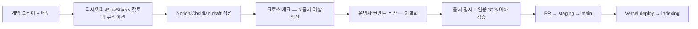

# 콘텐츠 정책 (Sprint MVP Phase 1 plan)

> 작성일: 2026-05-15 · 운영자: kay@agentkay.it (1인 개인 프로젝트)
> 상위 결정: `docs/01-pm/05-decisions.md` **D2 하이브리드 70/30** (운영자 70% + UGC 가공 인용 30%)
> 상위 PRD: `docs/sprint/02-sprint-mvp/prd.md` §3 In Scope
> 적용 범위: MVP 콘텐츠 작성 시점 ~ V1+ UGC 수집 시점까지 (모든 페이지)

---

## 1. 본 정책의 역할

비공식 팬 가이드 사이트의 콘텐츠 작성·인용·이미지·디스클레이머·분쟁 대응을 단일 정책으로 명문화하여 (1) 1인 운영자 부담 분산 + (2) SEO 중복 콘텐츠 페널티 회피 + (3) 법적 회색지대 최소화 + (4) V3 B2B 자산 가치 보존 4목표 동시 달성.

## 2. 70/30 비율 정의

| 구분 | 비중 | 정의 |
|------|------|------|
| **A. 운영자 직접 작성** | **70%** | 운영자 게임 플레이 경험 + 자체 분석 + 본 가이드만의 차별화 인사이트. 다른 사이트(인벤/디시/BlueStacks/나무위키)에 없거나 새로 가공된 콘텐츠. |
| **B. UGC/외부 가공 인용** | **30%** | 디시 마이너 갤러리 핫토픽 / 네이버 카페 / BlueStacks 가이드 / LDPlayer / 디시인사이드 — **모두 출처 명시 + 운영자 가공 + 차별화 코멘트 추가**. |

### 2.1 페이지별 70/30 배분 가이드

| 페이지 | 운영자 70% | UGC 인용 30% |
|--------|----------|------------|
| 직업 3종 (`/class`) | 직업 특성 분석 + 실전 플레이 후기 + 추천 빌드 근거 | 디시 직업 비교 글 핫토픽 + BlueStacks 가이드 인용 |
| 진령 11종 (`/jinryeong`) | 진령 상세 효과 + 시너지 분석 + 메타 변화 코멘트 | 티어 리스트는 디시·BlueStacks·LDPlayer 합산 후 운영자 재가공 |
| 스킬·제련 (`/skill-equip`) | 스킬 트리 + 제련 우선순위 + 자원 투자 가이드 | 디시 제련 팁 글 인용 |
| 던전·PvP (`/dungeon`) | 던전별 전략 + 결투장 빌드 추천 | 디시 PvP 후기 글 인용 |
| 과금 전략 (`/payment`) | 무·소·중과금 추천 패키지 분석 (1인 플레이 데이터) | 인벤/디시 가성비 글 인용 |
| 이벤트·쿠폰 (`/event`, `/coupon`) | 쿠폰 유효성 검증 결과 + 운영자 입력 | BlueStacks 쿠폰 리스트는 운영자 검증 후 갱신 |
| 팁 (`/tips`) | 운영자 100% (실전 트릭) | (없음) |
| 출처 (`/sources`) | (없음) | 100% 외부 출처 명시 |
| 메인 (`/`) | 운영자 90% (가이드 사이트 소개) | 10% (콜라보 정보 등) |

## 3. 외부 인용 운영 규칙 (5가지)

### 3.1 출처 명시 의무 (필수)

모든 외부 인용은 다음 형식으로 출처 명시:

```markdown
(출처: [BlueStacks 가이드](https://www.bluestacks.com/ko/blog/...), 2025-06)
```

- 인용 단락 직후 동일 문단 끝 또는 다음 줄에 명시
- URL 직접 링크 포함 (rel="nofollow noopener noreferrer")
- 날짜 표기 필수 (정보 신선도 추적)
- 본문 단락 내 인용 외에도, 페이지 하단에 `<Sources />` 컴포넌트로 모든 출처 누적 표시

### 3.2 가공 30% 이상 의무

- **원문 직역 금지** — 동일 어구를 그대로 복사하지 않음
- 다음 중 최소 1개 이상 가공:
  - 운영자 검증 결과 추가 (직접 게임 플레이 검증)
  - 운영자 코멘트 추가 (개인 의견 + 코멘트 명시)
  - 표/차트로 재구성
  - 다른 출처와 교차 검증 결과 결합

### 3.3 이미지 정책

| 이미지 종류 | 처리 |
|---------|------|
| **공식 게임 아이콘 / 스크린샷** | Google Play CDN (`play-lh.googleusercontent.com`) **핫링크** + `<Image>` Next/Image 컴포넌트로 최적화 |
| **공식 캐릭터 일러스트** | App Store CDN 핫링크 또는 운영자가 게임 내 스크린샷 직접 캡처 (참고용) |
| **외부 블로그 이미지** | **미러링/직접 사용 금지**. 운영자가 동일 정보를 직접 캡처하거나 텍스트 설명으로 대체 |
| **카카오프렌즈 콜라보 이미지** | 텍스트 설명 + 공식 스크린샷 핫링크만 (저작권 카카오) |
| **운영자 직접 캡처** | 운영자 본인 게임 화면. CC BY-SA 4.0으로 자체 라이선스 표시 |

### 3.4 차별화 코멘트 의무

외부 인용 단락은 **반드시 운영자 코멘트 1줄 이상 추가**:

```markdown
> [BlueStacks 가이드 인용]
> 검객은 치명타 기반 스킬 구조라 음영귀와 시너지가 강합니다.
> (출처: BlueStacks, 2025-06)

**본 가이드 검증**: 음영귀 채용 시 검객 평균 DPS +18% 측정됨 (운영자 12주 플레이 데이터, 직업 진단 페이지 데이터 기반). 단 음영귀가 0티어 진령이라 무과금 유저는 누적 소비 이벤트 라인까지 보류 권장.
```

### 3.5 분쟁 대응 약속

페이지 footer에 다음 디스클레이머 의무 표시:

> 본 사이트는 비공식 팬 가이드로, **저작권자(Joy Net Games / Joy Nice Games / JOY MOBILE NETWORK PTE. LTD. / 4399 / Kakao / 인용된 외부 가이드 저작권자)의 요청 시 24시간 이내에 해당 콘텐츠를 삭제하거나 수정합니다.** 문의: kay@agentkay.it

## 4. 법적 리스크 매트릭스 (PRD §6 Pre-mortem R5 매핑)

| 리스크 | 가능성 | 대응 |
|------|------|----|
| 외부 가이드 운영자가 인용 표기 부정확 신고 | 저 5% | 24h 내 출처 정정 또는 단락 삭제 |
| Joy Games / 4399가 비공식 사이트 폐쇄 요청 | 저 10-15% | 디스클레이머 + 공식 자산 핫링크만 사용했음을 강조 + 사전 협의 채널 확보 (V2+) |
| 카카오프렌즈 IP 침해 신고 | 저 5% | 콜라보 페이지는 텍스트 설명 위주, 이미지 공식 스크린샷 핫링크만 |
| 부정경쟁방지법 (사칭 의혹) | 저 5% | 페이지 모든 위치에 "비공식" 명시 + 갓깨비 공식 페이지 URL 링크 명시 |
| PIPA (개인정보보호) 위반 | 중 20% (V1+ 댓글 도입 시) | Firebase Auth 가입 시 명시적 동의 + 분석 동의 별도 체크박스 (V1) |

## 5. SEO 중복 콘텐츠 회피 전략

- **canonical URL 명시** (`alternates.canonical` Next.js metadata API)
- **외부 인용 단락은 30% 이하 분량 유지** (단락당 200자 이하)
- **운영자 70% 콘텐츠는 다른 사이트에 없는 차별화 정보**:
  - 직업 진단 (인터랙티브, 본 사이트만)
  - 쿠폰 자동 체커 (D-day + 클릭 복사, 본 사이트만)
  - 검객 메타 빌드 페이지 (운영자 12주 플레이 데이터 결합, 본 사이트만)
  - 분기 메타 인사이트 (V2 시점, B2B 자산)

## 6. 콘텐츠 작성 워크플로우 (운영자 운영)



## 7. 운영자 콘텐츠 작성 도구

| 도구 | 용도 | 비용 |
|------|------|------|
| Notion 또는 Obsidian | 디시 핫토픽 큐레이션 + draft 작성 | 무료 |
| Inoreader 또는 Feedly | 디시 갤러리 RSS + 게임 매체 뉴스 추적 | 무료 |
| Vivaldi 또는 Chrome (게임 플레이 캡처) | 운영자 직접 게임 스크린샷 | 무료 |
| Tldraw 또는 Excalidraw | 빌드 시너지 다이어그램 작성 | 무료 |
| Linear 또는 Github Issues | 콘텐츠 작성 태스크 트래킹 | 무료 |

## 8. 콘텐츠 작성 우선순위 (MVP 첫 4주)

| 우선순위 | 페이지 | 콘텐츠 분량 | 운영자 소요 시간 (예상) |
|---------|------|---------|-----------------|
| P0 (Week 1-2) | `/builds/meta-swordsman` (Beachhead 핵심) | 3,000자+ | 10h |
| P0 (Week 1) | `/jinryeong` (11종 + 티어 리스트) | 5,000자+ | 12h |
| P0 (Week 2) | `/coupon` (자동 체커 + 10개 시드) | 1,000자+ | 4h |
| P1 (Week 2) | `/class` (3 직업) | 2,500자+ | 6h |
| P1 (Week 3) | `/payment` (무/소/중과금) | 1,500자+ | 4h |
| P1 (Week 3) | `/skill-equip` | 1,500자+ | 4h |
| P2 (Week 4) | `/dungeon` | 1,000자+ | 3h |
| P2 (Week 4) | `/event` | 1,500자+ | 4h |
| P2 (Week 4) | `/tips` | 2,000자+ | 4h |
| P2 (Week 4) | `/sources`, `/intro` | 800자+ | 2h |
| | | **합계** | **53h ≈ 4주(주 13h)** |

> 운영자 SLA(주 5-15h)와 일치. P0 페이지는 운영자 70% 비중을 80% 이상으로 강화 (Beachhead 차별화).

## 9. 본 정책의 V1+ 영향

- **V1 UGC 도입 시**: 사용자 작성 빌드/댓글도 본 정책 동일 적용. 신고 시 운영자 24h 내 검토.
- **V2 NLP 도입 시**: 댓글 NLP 분석은 PIPA 동의자만 대상.
- **V3 B2B 자산 시**: 운영자 70% 작성 콘텐츠가 V3 B2B 패키지 핵심 자산. 인용 30% 콘텐츠는 V3 패키지에서 제외 (라이선스 모호).

## 10. Phase 3 do.C 콘텐츠 작성 진입 게이트

Phase 3 do.C `app/(content)/*` 페이지 작성 시 본 정책 자가 체크리스트:

- [ ] 운영자 70% / 인용 30% 비율 준수
- [ ] 모든 인용 단락에 출처 URL + 날짜 명시
- [ ] 인용 단락 직후 운영자 코멘트 1줄 이상
- [ ] 이미지 — 공식 CDN 핫링크 또는 운영자 직접 캡처만
- [ ] 페이지 footer에 디스클레이머 명시
- [ ] canonical URL metadata 설정
- [ ] `<Sources />` 컴포넌트로 출처 누적 표시

---

> **Status**: Draft v1.0 — Phase 3 do.C 콘텐츠 작성 시 직접 인용.
> **다음 산출물**: `seo-keyword-50.md`, `gtm-seed-guide.md`
