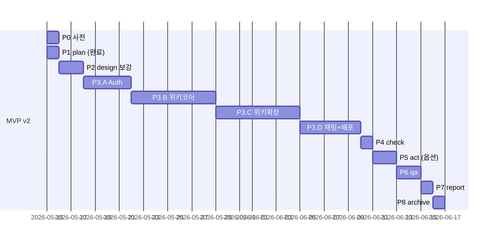

# Sprint MVP v2 Master Plan — 갓깨비 키우기 커뮤니티 위키

> **운영자**: kay@agentkay.it (1인 개인 프로젝트)
> **Sprint ID**: `god-kkabi-guide-sprint-mvp-v2`
> **작성일**: 2026-05-15
> **상태**: Draft v1.0 — 운영자 승인 후 P2 진입
> **Trust Level**: L4 Aggressive + Chrome MCP 시각 검증
> **예상 기간**: 6-8주 (M3 졸업: 2026-07-01 ~ 2026-07-15)

---

## 0. Quick Read (1 페이지 요약)

### 무엇을 만드나?
**갓깨비 키우기 커뮤니티 위키** — 단순 정적 가이드(v1)를 폐기하고, **위키 + 인증 + 실시간 채팅 + 사용자 콘텐츠 + 개인화 북마크** 플랫폼으로 전면 재설계.

### 왜 바꾸나?
1. 운영자가 [GitHub Pages](https://agent-kay-it.github.io/godkkabi-guide/)로 임시 정적 HTML을 게임 유저에게 배포 → **반응 우수 + 콘텐츠 풍부도 검증됨**
2. 단순 정적 가이드의 한계 — **사용자 DB · 재방문 동기 · 커뮤니티 형성** 부족
3. **whiteoutsurvival.wiki 모델** — 게임 위키 + 커뮤니티 통합 플랫폼이 reference

### 핵심 산출물
- 6 카테고리 wiki (직업·장비·스킬·진령·문파·콘텐츠) — **80+ entity**
- Firebase Auth + 사용자 등록 (서버ID + UID + 문파 + 닉네임 + 직업)
- 실시간 채팅 3 채널 (전체 + 서버별 + 문파별) + 이미지 첨부 + 플로팅 위젯
- 북마크 시스템 + 모음 페이지
- 운영자 admin 대시보드 + 쿠폰 CRUD + 신고 처리
- **Lighthouse Mobile ≥ 85** + **WCAG AA** + **17 GA4 이벤트** (v1 9 + v2 8)

### 무엇이 폐기되나?
v1 MVP 16 페이지 + 기존 디자인 토큰 22개 + Noto Sans KR 폰트 — **공개 안 된 상태로 폐기**.

### 무엇이 재사용되나?
인프라(Next.js 16 + Firebase + Vercel + tene + 클린 아키텍처) + 컴포넌트 10개(토큰 교체) + 문서 9개(확장).

---

## 1. 비전 (Vision)

갓깨비 키우기 유저가 **"이 사이트가 내 도구"라고 인식하고 매일 방문**할 수 있는, 1인 운영 비공식 커뮤니티 위키.

핵심 약속:
- ⚡ **30초 안에 답** — 직업 진단 + 위키 검색
- 🔖 **내 도구** — 북마크 + 개인화 (서버·문파·직업 자동 매핑)
- 💬 **동료가 있다** — 같은 서버·문파 유저와 실시간 채팅·이미지 공유
- 📚 **신뢰 가능** — 운영자 12주 검증 + 매주 갱신 SLA

---

## 2. 4 페르소나 매핑

| 페르소나 | JTBD | 첫 인지 → 가입 → 재방문 흐름 |
|---------|------|--------------------------|
| **P1 신규** | "30초에 직업 결정" | 직업 진단 → 검객 추천 → 가입 → 본인 정보 등록 → 검객 wiki 탐색 |
| **P2 중수** | "다음 자원 투자 결정" | 검객 wiki → 우선순위 → 본인 빌드 스크린샷 → 문파 채팅 공유 |
| **P3 고수/문파 리더** | "노하우 공유 + 문파 관리" | 본인 자동 표시 → 문파 채팅 공지 → 게시물 → 신뢰 점수 (V1+) |
| **P4 운영자** | "매주 검증·갱신" | /admin → wiki 갱신 + 쿠폰 추가 + 신고 처리 + 주간 보고서 |

---

## 3. 5 핵심 기능 (Top Features by Priority)

### P0 — 절대 필수
1. **Firebase Auth (Google OAuth)** — 사용자 DB 확보 시작점
2. **사용자 등록 폼** — 서버ID + UID + 문파 + 닉네임 + 직업
3. **위키 직업 3 + 진령 11 entity** — 콘텐츠 코어 (35+ 페이지)
4. **북마크 시스템** — 개인화 도구
5. **신규 디자인 시스템** — Pretendard + bronze/jade/vermilion/indigo

### P1 — 강력 권장
6. **위키 장비 30+ + 스킬 15+ + 콘텐츠 20+ entity** — 위키 완성도
7. **실시간 채팅 3 채널** — 커뮤니티 형성
8. **이미지 첨부** — 노하우 공유 (스크린샷)
9. **운영자 admin 대시보드** — 운영 효율

### P2 — V1+ 이전 가능
10. 사용자 팁 작성 / 사용자 게시물 / @멘션 / 음성 알림

---

## 4. 6 카테고리 위키 매트릭스

| 카테고리 | URL | Entity 수 (MVP) | 갱신 주기 |
|----------|-----|----------------|---------|
| **직업** | `/wiki/class/[id]` | 3 | 월간 |
| **장비** | `/wiki/equipment/[slug]` | 30+ (V1 50+) | 격주 |
| **스킬** | `/wiki/skill/[slug]` | 15+ (V1 30+) | 격주 |
| **진령** | `/wiki/jinryeong/[id]` | 11 | 주간 (티어 변동) |
| **문파** | `/wiki/munpa-system` | 1 (V1 문파별) | 분기 |
| **콘텐츠** | `/wiki/content/[slug]` | 20+ (V1 30+) | 격주 |
| **합계** | | **80+ entity** | — |

---

## 5. 페이지 인벤토리 (약 30 정적 + 80+ 동적)

### 5.1 공개 페이지 (Auth 불필요)
- `/` 홈
- `/class-quiz` 직업 진단
- `/wiki` 인덱스 + 6 카테고리 카탈로그/상세 (약 95 페이지)
- `/tips`, `/tips/[id]`
- `/coupon`
- `/intro`, `/sources`

### 5.2 Auth 필수
- `/auth/sign-in`, `/auth/register`
- `/settings`, `/my/bookmarks`, `/my/posts` (V1+)
- `/tips/new`

### 5.3 Admin (custom claim)
- `/admin`, `/admin/coupons`, `/admin/moderation`

**sitemap.xml 합계**: 약 **120-130 routes**.

---

## 6. 데이터 모델 (Firestore 12+ 컬렉션)

| 컬렉션 | 활성 | 주요 필드 |
|--------|------|----------|
| `users` | ✅ MVP | uid, serverId, gameUid, munpa, nickname, classId, role, bookmarkIds |
| `servers` | ✅ MVP | id (S+숫자), userCount, munpaCount |
| `munpas` | ✅ MVP | id, serverId, name, memberCount |
| `chat_channels` | ✅ MVP | id, type (global/server/munpa), messageCount |
| `chat_messages` | ✅ MVP | channelId, uid, text, imageUrl, mentions, createdAt |
| `bookmarks` | ✅ MVP | uid, targetType, targetId, title |
| `wiki_classes` | ✅ MVP | id, statsGrid, recommendedJinryeong/Skills, metaUsage |
| `wiki_equipments` | ✅ MVP | slug, category, grade, effects, refinementLevels |
| `wiki_skills` | ✅ MVP | slug, classId, type, effects, synergies |
| `wiki_jinryeong` | ✅ MVP | id, rarity, tier, recommendedClass, recommendedCombos |
| `wiki_contents` | ✅ MVP | slug, type, recommendedBuilds, rewards, schedule |
| `tips` | ✅ MVP (확장) | category, title, content, authorUid, isOfficial |
| `user_posts` | ⏳ V1+ | — |
| `coupons` | ✅ MVP (유지) | (v1 동일) |
| `events` (GA4 backup) | ✅ MVP (유지) | (v1 동일) |
| `builds` | ✅ MVP (유지) | admin-seed 1건 |
| `tier_votes`, `pain_topics` | ⏳ V1+/V2+ | — |

---

## 7. 디자인 시스템 v2

### 색상 토큰 (18개)
- Ink: base/elev/card/card-strong/line/line-strong (6)
- Bronze: main/soft/deep (3) — **swordsman / 1티어 / 메인 액센트**
- Jade: main/soft (2) — **pve / success**
- Vermilion: main/soft (2) — **warrior / 0티어 / pvp / danger**
- Indigo: 1 — **mage / 2티어 / info**
- Text: text/soft/mute (3)
- Radius (3): card/card-lg/pill

### 폰트
- **Sans**: Pretendard Variable
- **Mono**: JetBrains Mono (수치/코드)

### 11 이미지 자산
- App icon + 7 banner + 3 in-game screenshot
- Google Play CDN 9 screenshot (운영자 직접 다운로드)
- 모두 webp 자체 호스팅

---

## 8. PDCA Phase 일정

**총 33일 (단일 풀타임) / 6-8주 (운영자 SLA 5-15h/주)**.

---

## 9. M3 졸업 조건 (Graduation Criteria)

| 항목 | 기준 |
|------|------|
| Lighthouse Mobile Performance | ≥ **85** (v1 90 → 완화, Auth/채팅 영향) |
| Accessibility | ≥ 90 |
| Best Practices | ≥ 90 |
| SEO | ≥ 90 |
| Production 배포 | 완료 |
| 위키 entity 합계 | ≥ 80 |
| 사용자 가입 수 (M+30) | ≥ 30 |
| DAU (M+30) | ≥ 100 |
| 채팅 메시지 수 (M+30) | ≥ 200 |
| 사용자 평균 북마크 | ≥ 3 |
| 30일 retention | ≥ 30% |

---

## 10. 운영자 결정 게이트 (G-Gates v2)

| 게이트 | 시점 | 결정 |
|--------|------|------|
| **G1 Auth Provider** | P2 | Google OAuth 1차 vs Google+카카오 듀얼 |
| **G2 채팅 백엔드** | P2 | Firestore onSnapshot vs Realtime DB |
| **G3 이미지 정책** | P3.D | 1MB / JPG·PNG·WebP / 모더레이션 |
| **G4 도메인 등록** | P3.D | kkaebizigi.com / gokkaebi.guide / jinryeong.kr 등 |
| **G5 Blaze 전환** | M3 | DAU 200+ → 유료 플랜 |

---

## 11. 폐기 / 유지 / 신규 자산 요약

| 영역 | 폐기 | 유지 | 신규 |
|------|------|------|------|
| 페이지 | 16 (v1) | 0 | ~25 정적 + 95 동적 |
| 컴포넌트 | 5 재작성 | 10 (토큰 교체) | 21 신규 |
| Firestore 컬렉션 | 0 | 3 (coupons/events/builds) | 12 신규 |
| 디자인 토큰 | 22 (gold) | 0 | 18 (bronze/jade/vermilion/indigo) |
| 폰트 | Noto Sans KR | 0 | Pretendard Variable + JetBrains Mono |
| 이미지 자산 | 0 | (Hero 핫링크) | 11 자체 호스팅 + 9 다운로드 |

---

## 12. Pre-mortem 8 시나리오

| ID | 위험 | 확률 | 대응 |
|----|------|------|------|
| R1 | Auth 진입 장벽 → 이탈 | 30% | wiki read 익명 + 가입 단순화 |
| R2 | 채팅 비활성 (빈 채널) | 40% | 운영자 매일 시드 + 봇 메시지 |
| R3 | Firestore Spark 한도 초과 | 25% | 무한 스크롤 페이지네이션 + Blaze 전환 |
| R4 | 사용자 신고/스팸 | 20% | 24h 검토 + 자동 숨김 |
| R5 | 법적 클레임 (Joy Nice Games) | 5% | 비공식 명시 + 24h 삭제 |
| R6 | 디자인 시스템 불일치 | 10% | P3.B 시각 검증 |
| R7 | wiki 시드 콘텐츠 부족 | 35% | MVP 50 entity로 축소 가능 |
| R8 | Pretendard 폰트 사이즈 영향 | 15% | localFont 최적화 |

---

## 13. 비용 예상 (월간)

### MVP (Spark Plan + Vercel Hobby)
- Firebase: $0
- Vercel: $0
- 도메인: $1-2/월 (G4 결정 시)
- **합계: $0-2/월**

### V1 (DAU 200+ 시 Blaze 전환 시점)
- Firebase Blaze: $5-10/월
- Vercel Hobby (트래픽 한도 내): $0
- **합계: $5-12/월**

### V3 (DAU 1000+ 가정)
- Firebase Blaze: $20-40
- Vercel Pro: $20
- **합계: $40-60/월**

---

## 14. 다음 단계 (Operator Action)

### 즉시 (P2 진입 전)
1. ✅ 본 MASTER-PLAN.md 검토 및 승인
2. ⏳ G1 Auth Provider 결정 (Google 1차 권장)
3. ⏳ G2 채팅 백엔드 결정 (Firestore 1차 권장)

### P3.A 진입 전 (Auth 시작)
4. ⏳ Firebase Console에서 Authentication 활성화 (Google provider)
5. ⏳ Firestore Database 생성 (us-central1 또는 asia-northeast3)
6. ⏳ Firebase Storage 활성화

### P3.D 진입 전 (배포)
7. ⏳ G3 이미지 정책 결정
8. ⏳ G4 도메인 결정 + 등록
9. ⏳ Vercel 환경변수 추가 (Firebase Storage 키 + Auth domain 등)

---

## 15. 산출물 인덱스

| 문서 | 위치 | 라인 수 (예상) |
|------|------|-------------|
| **MASTER-PLAN.md** (본 문서) | `docs/sprint/03-sprint-mvp-v2/MASTER-PLAN.md` | ~350 |
| SCOPE-CHANGE.md | `docs/sprint/03-sprint-mvp-v2/SCOPE-CHANGE.md` | ~250 |
| prd.md | `docs/sprint/03-sprint-mvp-v2/prd.md` | ~500 |
| design.md | `docs/sprint/03-sprint-mvp-v2/design.md` | ~1000 |
| plan.md | `docs/sprint/03-sprint-mvp-v2/plan.md` | ~400 |
| (P2 보강 6 산출물) | `docs/sprint/03-sprint-mvp-v2/phase-2-design/*.md` | TBD |

---

## 16. 본 Sprint의 V1 인풋 (성공 시)

V1에서 다음 자산이 활성화됨:
1. **사용자 DB** — Auth + 30+ 등록 사용자 + 활동 데이터
2. **위키 80+ entity** — V1 검색·필터·태그 확장
3. **채팅 데이터** — V1 NLP 분석 기반 (V2+)
4. **북마크 패턴** — V1 추천 알고리즘 입력
5. **콘텐츠 풀** — V1 사용자 게시물 활성화 기반

V1 신규 작업:
- 사용자 게시물 (`user_posts`) 본격 활성
- AdSense 통합
- 카카오 OAuth 추가 (G1 듀얼 결정 시)
- @멘션 + Push Notification (FCM)
- 댓글 시스템
- Vercel Pro + 도메인 결정

---

> **Sprint v2 시작**: 본 MASTER-PLAN.md + 4 문서 (prd/design/plan/scope-change) 운영자 승인 후 P2 진입.
> **Production URL**: 추후 결정 (G4 도메인 + Vercel 배포)
> **Repository**: https://github.com/agent-kay-it/god-kkabi-guide (staging 브랜치)
