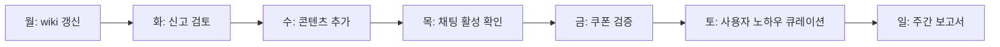

# Sprint MVP v2 Design — 갓깨비 키우기 커뮤니티 위키 (기술 설계)

> 운영자: kay@agentkay.it
> 작성일: 2026-05-15
> 입력: `prd.md`, `SCOPE-CHANGE.md`, `source/godkkabi-guide/`

---

## 1. 아키텍처 개요

### 1.1 레이어 구조 (Clean Architecture + Ports & Adapters)

```
┌─────────────────────────────────────────────────────────────┐
│ app/ (Next.js 16 App Router — Presentation)                 │
│  ├── (public)/        — 비인증 페이지 (홈/위키/팁/쿠폰)        │
│  ├── (auth)/          — 인증 페이지 (sign-in/register)        │
│  ├── (user)/          — 인증 필수 (settings/my/*)            │
│  ├── (admin)/         — admin claim 필수                     │
│  └── api/             — Server Actions (Auth + 모더레이션)    │
├─────────────────────────────────────────────────────────────┤
│ components/                                                  │
│  ├── ui/              — shadcn primitives                    │
│  ├── motion/          — Magic UI motion (재사용 + 신규)      │
│  ├── domain/          — 갓깨비 위키 컴포넌트                  │
│  ├── feature/         — Auth / Chat / Bookmark / 등록 폼       │
│  └── chat/            — 채팅 전용 (FloatingChat, ChannelList) │
├─────────────────────────────────────────────────────────────┤
│ lib/                                                         │
│  ├── firebase/        — App + Auth + Firestore + Storage      │
│  ├── firestore/       — 12 컬렉션 어댑터                       │
│  ├── auth/            — Auth state hooks + Server Actions     │
│  ├── chat/            — 채팅 SDK (onSnapshot wrapper)         │
│  ├── bookmark/        — 북마크 어댑터                          │
│  └── utils.ts                                                 │
├─────────────────────────────────────────────────────────────┤
│ types/                                                        │
│  ├── firestore.ts     — 12 컬렉션 doc 타입                     │
│  ├── auth.ts          — 사용자 등록 폼 타입 + Role               │
│  ├── chat.ts          — 메시지/채널 타입                         │
│  └── ga4.ts                                                   │
└─────────────────────────────────────────────────────────────┘
```

### 1.2 의존 방향 (단방향)

```
domain → motion + ui + feature/{Auth,Bookmark}
chat → ui + lib/chat
feature → ui + lib/{auth,firebase,bookmark,chat}
ui → (없음 — pure leaf)
lib/firestore → lib/firebase (Ports & Adapters)
```

---

## 2. 페이지 구조 (App Router)

### 2.1 디렉토리 구조

```
app/
├── (public)/
│   ├── layout.tsx                    — 공개 레이아웃 + FloatingChat
│   ├── page.tsx                      — 홈
│   ├── class-quiz/page.tsx           — 직업 진단
│   ├── wiki/
│   │   ├── page.tsx                  — 위키 인덱스 (6 카테고리)
│   │   ├── class/
│   │   │   ├── page.tsx              — 직업 종합 비교
│   │   │   └── [classId]/page.tsx    — 직업 상세 (3 entity)
│   │   ├── jinryeong/
│   │   │   ├── page.tsx              — 진령 카탈로그
│   │   │   └── [id]/page.tsx         — 진령 상세 (11 entity)
│   │   ├── equipment/
│   │   │   ├── page.tsx              — 장비 카탈로그
│   │   │   └── [slug]/page.tsx       — 장비 상세 (30+ entity)
│   │   ├── skill/
│   │   │   ├── page.tsx              — 스킬 카탈로그
│   │   │   └── [slug]/page.tsx       — 스킬 상세 (15+ entity)
│   │   ├── munpa-system/page.tsx     — 문파 시스템 가이드
│   │   └── content/
│   │       ├── page.tsx              — 콘텐츠 카탈로그
│   │       └── [slug]/page.tsx       — 콘텐츠 상세 (20+ entity)
│   ├── tips/
│   │   ├── page.tsx                  — 팁 모음
│   │   └── [id]/page.tsx             — 팁 상세
│   ├── coupon/page.tsx               — 쿠폰
│   ├── intro/page.tsx                — 소개
│   └── sources/page.tsx              — 출처
├── (auth)/
│   ├── sign-in/page.tsx              — 로그인 (Google OAuth)
│   └── register/page.tsx             — 첫 등록 폼
├── (user)/
│   ├── settings/page.tsx             — 사용자 설정
│   ├── my/
│   │   ├── bookmarks/page.tsx        — 내 북마크
│   │   └── posts/page.tsx            — 내 게시물 (V1+)
│   └── tips/new/page.tsx             — 팁 작성
├── (admin)/
│   └── admin/
│       ├── page.tsx                  — 운영자 대시보드
│       ├── coupons/page.tsx          — 쿠폰 관리
│       └── moderation/page.tsx       — 모더레이션
├── api/
│   ├── auth/[...nextauth]/route.ts   — Auth 콜백
│   ├── chat/send/route.ts            — 메시지 전송 (Server Action)
│   └── moderation/report/route.ts    — 신고 처리
├── sitemap.ts                         — 동적 sitemap (120+ entries)
└── robots.ts
```

### 2.2 라우트 그룹 활용

- `(public)`, `(auth)`, `(user)`, `(admin)`은 URL에 영향 없음
- 각 그룹의 layout.tsx에서 권한 가드:
  - `(user)/layout.tsx`: Auth 미인증 시 `/auth/sign-in` redirect + 미등록 시 `/auth/register` redirect
  - `(admin)/layout.tsx`: admin claim 미보유 시 404

---

## 3. 디자인 시스템 (Tailwind v4 @theme + shadcn/ui 커스텀)

### 3.0 디자인 철학 (source/godkkabi-guide 정밀 분석)

운영자가 source/godkkabi-guide/index.html에 구축한 완성된 디자인을 정밀 매핑.

**핵심 원칙**:
1. **Glassmorphism** — 모든 카드는 `rgba(*, 0.55~0.78)` 반투명 + `backdrop-filter: blur(10-20px) saturate(180%)`
2. **Layered radial gradients** — 배경에 bronze + jade + indigo 3종 radial gradient overlay (낮은 opacity)
3. **Editorial typography** — 한국어 본문은 `letter-spacing: -0.01em` (tight), 라벨은 `letter-spacing: 0.04-0.08em + uppercase` (wide)
4. **Mono for data** — 수치/코드는 JetBrains Mono (시각적 hierarchy + 가독성)
5. **No emojis** — 1-letter 아이콘 (`i`, `↻`) 또는 lucide-react SVG만 사용
6. **Class accent system** — warrior=vermilion / swordsman=bronze / mage=indigo (3px 좌측 stripe)
7. **Subtle micro-interactions** — `transform: translateY(-1px)` + `transition var(--dur-fast)`

### 3.0.1 shadcn/ui 베이스 + 커스텀 매핑 전략

| 요소 | 베이스 | 커스텀 |
|------|--------|--------|
| Button | shadcn `Button` (cva variants) | bronze 메인 / vermilion danger / jade success / indigo info |
| Card | shadcn `Card` (CardHeader/Title/Content) | rgba glass + backdrop-filter + bronze hover stripe |
| Badge | shadcn `Badge` | tier별 (vermilion/bronze/indigo) + class별 + 11 BuildTag enum |
| Alert | shadcn `Alert` (Alert, AlertTitle, AlertDescription) | jade/vermilion/bronze/indigo 4 variant + 좌측 4px stripe |
| Separator | shadcn | bronze gradient option |
| Sonner Toast | shadcn `Sonner` | dark theme + bronze accent |
| Dialog | shadcn | glassmorphism + backdrop blur |
| Tabs | shadcn | 채널 스위처 (global/server/munpa) |
| Popover | shadcn | 사용자 메뉴 + 신고 메뉴 |
| Tooltip | shadcn | 진령 시너지 미리보기 |
| **Avatar** (신규 추가) | shadcn `Avatar` | photoURL + nickname 이니셜 fallback + classBadge overlay |
| **Form/Input** (신규) | shadcn `Form` (RHF + Zod) | 등록 폼 5 필드 |
| **Checkbox/Switch** (신규) | shadcn | PIPA 4 동의 |

**근거**: shadcn은 copy-paste 방식이므로 우리가 100% 소유 + 자유 커스텀. cva 패턴으로 variant 무제한 확장.

### 3.1 색상 토큰 (`app/globals.css`)

```css
@import 'tailwindcss';

@theme {
  /* ─── Ink (배경 레이어) ─── */
  --color-ink-base: #07070b;
  --color-ink-elev: #0e0e15;
  --color-ink-card: rgba(22, 22, 32, 0.55);
  --color-ink-card-strong: rgba(28, 28, 40, 0.78);
  --color-ink-line: rgba(255, 255, 255, 0.06);
  --color-ink-line-strong: rgba(255, 255, 255, 0.12);

  /* ─── Bronze (메인 액센트 / swordsman / 1티어) ─── */
  --color-bronze: #c89968;
  --color-bronze-soft: #e8c79a;
  --color-bronze-deep: #8a6841;

  /* ─── Jade (보조 / pve / success) ─── */
  --color-jade: #7eb6a8;
  --color-jade-soft: #a8d4c8;

  /* ─── Vermilion (warrior / 0티어 / danger / pvp) ─── */
  --color-vermilion: #c87870;
  --color-vermilion-soft: #e5a7a1;

  /* ─── Indigo (mage / 2티어 / info) ─── */
  --color-indigo: #8b8bc5;

  /* ─── Text ─── */
  --color-text: #ece7dd;
  --color-text-soft: #b8b1a4;
  --color-text-mute: #6e6a64;

  /* ─── Radius ─── */
  --radius-card: 14px;
  --radius-card-lg: 16px;
  --radius-pill: 999px;

  /* ─── Animation ─── */
  --ease-out: cubic-bezier(0.16, 1, 0.3, 1);

  /* ─── Font ─── */
  --font-sans: 'Pretendard Variable', Pretendard, -apple-system, BlinkMacSystemFont, system-ui, 'Apple SD Gothic Neo', sans-serif;
  --font-mono: 'JetBrains Mono', 'SF Mono', Consolas, monospace;
}
```

### 3.2 글로벌 배경 (Hero glow + radial gradients)

```css
body {
  background:
    radial-gradient(ellipse 80% 50% at 20% 0%, rgba(200, 153, 104, 0.10) 0%, transparent 50%),
    radial-gradient(ellipse 60% 40% at 80% 100%, rgba(126, 182, 168, 0.06) 0%, transparent 50%),
    radial-gradient(ellipse 50% 30% at 50% 50%, rgba(139, 139, 197, 0.04) 0%, transparent 50%),
    var(--color-ink-base);
  color: var(--color-text);
  font-family: var(--font-sans);
}
```

### 3.3 폰트 로드 (Pretendard Variable + JetBrains Mono)

```typescript
// app/layout.tsx
import localFont from 'next/font/local';
import { JetBrains_Mono } from 'next/font/google';

const pretendard = localFont({
  src: '../public/fonts/PretendardVariable.woff2',
  display: 'swap',
  variable: '--font-pretendard',
  weight: '45 920',
});

const jetbrainsMono = JetBrains_Mono({
  subsets: ['latin'],
  weight: ['400', '500', '700'],
  display: 'swap',
  variable: '--font-mono',
});
```

운영자 다운로드: `wget https://cdn.jsdelivr.net/gh/orioncactus/pretendard/dist/web/variable/woff2/PretendardVariable.woff2 -O public/fonts/PretendardVariable.woff2`

### 3.4 디자인 패턴 카탈로그 (source/godkkabi-guide 정밀 매핑)

#### 3.4.1 TopBar (scroll-aware glassmorphism)
```typescript
// components/feature/top-bar.tsx
'use client';
import { useEffect, useState } from 'react';
import Image from 'next/image';
import Link from 'next/link';
import { cn } from '@/lib/utils';

export function TopBar() {
  const [scrolled, setScrolled] = useState(false);
  useEffect(() => {
    const onScroll = () => setScrolled(window.scrollY > 10);
    window.addEventListener('scroll', onScroll);
    return () => window.removeEventListener('scroll', onScroll);
  }, []);
  return (
    <nav
      className={cn(
        'fixed inset-x-0 top-0 z-50 border-b border-transparent transition-all duration-300',
        scrolled && 'border-ink-line bg-[rgba(7,7,11,0.72)] backdrop-blur-[20px] backdrop-saturate-[180%]',
      )}
    >
      <div className="mx-auto flex max-w-screen-xl items-center justify-between gap-4 px-5 py-3.5 sm:px-[5vw]">
        <Link href="/" className="flex items-center gap-2.5 text-[0.95rem] font-semibold tracking-tight text-text">
          <Image src="/images/app-icon.webp" alt="갓깨비 키우기" width={26} height={26} className="rounded-[7px]" />
          <span>깨비지기</span>
        </Link>
        {/* nav items */}
      </div>
    </nav>
  );
}
```

#### 3.4.2 HeroMeta (pill badge with backdrop)
```typescript
// components/domain/hero-meta.tsx
export function HeroMeta({ children }: { children: React.ReactNode }) {
  return (
    <div
      className="mb-7 inline-flex items-center gap-2.5 rounded-full border border-ink-line-strong bg-[rgba(14,14,21,0.6)] py-1.5 pl-2 pr-3.5 text-[0.78rem] tracking-wide text-text-soft backdrop-blur-[10px]"
    >
      {children}
    </div>
  );
}

// Inner badge (chip 내부 강조)
export function HeroMetaBadge({ children }: { children: React.ReactNode }) {
  return (
    <span className="rounded-full bg-bronze/15 px-2 py-0.5 text-[0.72rem] font-semibold text-bronze-soft">
      {children}
    </span>
  );
}
```

#### 3.4.3 GlassCard (재사용 기본 카드)
```typescript
// components/ui/glass-card.tsx (shadcn Card 확장)
import { cn } from '@/lib/utils';

export function GlassCard({ className, children, accent }: {
  className?: string;
  children: React.ReactNode;
  accent?: 'warrior' | 'swordsman' | 'mage' | 'pve' | 'pvp';
}) {
  const accentColor = {
    warrior: 'before:bg-vermilion',
    swordsman: 'before:bg-bronze',
    mage: 'before:bg-indigo',
    pve: 'before:bg-jade',
    pvp: 'before:bg-vermilion',
  };
  return (
    <div
      className={cn(
        'relative overflow-hidden rounded-2xl border border-ink-line bg-ink-card backdrop-blur-md',
        accent && 'before:absolute before:left-0 before:top-0 before:h-full before:w-[3px] before:content-[""]',
        accent && accentColor[accent],
        className,
      )}
    >
      {children}
    </div>
  );
}
```

#### 3.4.4 StatCell (라벨 + 값 + 비율)
```typescript
// components/domain/stat-cell.tsx
interface StatCellProps {
  label: string;
  value: string;
  rate?: string;        // 'JetBrains Mono'로 숫자 강조
}

export function StatCell({ label, value, rate }: StatCellProps) {
  return (
    <div className="bg-ink-elev/55 p-3.5 transition-colors hover:bg-ink-card-strong">
      <div className="mb-0.5 text-[0.7rem] uppercase tracking-wider text-text-mute">
        {label}
      </div>
      <div className="text-[0.95rem] font-semibold text-text">
        {rate && (
          <span className="mr-1 font-mono text-[0.85rem] text-accent">{rate}</span>
        )}
        {value}
      </div>
    </div>
  );
}
```

#### 3.4.5 Note (tip/warn variant — info box)
```typescript
// components/domain/note.tsx
import { Info, AlertTriangle } from 'lucide-react';
import { cva, type VariantProps } from 'class-variance-authority';
import { cn } from '@/lib/utils';

const noteVariants = cva(
  'flex gap-3 rounded-xl border bg-ink-card p-4 backdrop-blur-md',
  {
    variants: {
      variant: {
        tip: 'border-indigo/30',
        warn: 'border-vermilion/30',
        success: 'border-jade/30',
        info: 'border-ink-line',
      },
    },
    defaultVariants: { variant: 'tip' },
  },
);

const iconVariants = cva('flex h-7 w-7 shrink-0 items-center justify-center rounded-full', {
  variants: {
    variant: {
      tip: 'bg-indigo/15 text-indigo',
      warn: 'bg-vermilion/15 text-vermilion',
      success: 'bg-jade/15 text-jade',
      info: 'bg-ink-line-strong text-text-soft',
    },
  },
  defaultVariants: { variant: 'tip' },
});

interface NoteProps extends VariantProps<typeof noteVariants> {
  variant: 'tip' | 'warn' | 'success' | 'info';
  title?: string;
  children: React.ReactNode;
}

export function Note({ variant, title, children }: NoteProps) {
  const Icon = variant === 'tip' ? Info : AlertTriangle;
  return (
    <div className={cn(noteVariants({ variant }))}>
      <div className={cn(iconVariants({ variant }))}>
        <Icon className="h-3.5 w-3.5" />
      </div>
      <div className="flex-1">
        {title ? (
          <div className={cn('mb-1 font-semibold', `text-${variant === 'tip' ? 'indigo' : variant === 'warn' ? 'vermilion' : 'text'}`)}>
            {title}
          </div>
        ) : null}
        <div className="text-sm text-text-soft">{children}</div>
      </div>
    </div>
  );
}
```

#### 3.4.6 TierStripe (수직 라벨 + 그라데이션)
```typescript
// 0/1/2 티어 행의 좌측 64px 컬럼
export function TierStripe({ tier }: { tier: 0 | 1 | 2 }) {
  const colors = {
    0: 'before:bg-vermilion text-vermilion',
    1: 'before:bg-bronze text-bronze',
    2: 'before:bg-indigo text-indigo',
  };
  return (
    <div
      className={cn(
        'relative grid h-full place-items-center font-mono text-sm uppercase tracking-widest',
        'before:absolute before:left-0 before:top-[10%] before:h-[80%] before:w-0.5 before:content-[""]',
        colors[tier],
      )}
    >
      <span>티어 {tier}</span>
    </div>
  );
}
```

#### 3.4.7 Body Background (radial gradients)
```css
body {
  background:
    radial-gradient(ellipse 80% 50% at 20% 0%, rgba(200, 153, 104, 0.10) 0%, transparent 50%),
    radial-gradient(ellipse 60% 40% at 80% 100%, rgba(126, 182, 168, 0.06) 0%, transparent 50%),
    radial-gradient(ellipse 50% 30% at 50% 50%, rgba(139, 139, 197, 0.04) 0%, transparent 50%),
    var(--color-ink-base);
}
```

#### 3.4.8 Hero Background (앙상블 — banner-korean-carry 또는 다른 배너)
```typescript
<section className="relative grid min-h-screen content-center">
  {/* Banner image as backdrop */}
  <Image
    src="/images/banner-korean-carry.webp"
    alt=""
    fill
    priority
    className="object-cover opacity-30"
  />
  {/* Gradient overlay */}
  <div
    className="absolute inset-0"
    style={{
      background: 'radial-gradient(ellipse 75% 55% at 50% 45%, rgba(7,7,11,0.3) 0%, rgba(7,7,11,0.7) 55%, rgba(7,7,11,0.93) 100%), linear-gradient(180deg, rgba(7,7,11,0.3) 0%, rgba(7,7,11,0.35) 50%, var(--color-ink-base) 100%)',
    }}
  />
  {/* Content */}
  <div className="relative z-10 ...">
    <HeroMeta>...</HeroMeta>
    <h1 className="text-5xl font-bold tracking-tight text-text">...</h1>
  </div>
</section>
```

### 3.5 Editorial Typography 규칙

| 요소 | 스타일 |
|------|--------|
| h1 (Hero) | font-bold `clamp(2.5rem, 6vw, 4rem)` letter-spacing -0.02em text-text |
| h2 (Section) | font-bold text-2xl letter-spacing -0.01em text-text |
| h3 (Subsection) | font-semibold text-lg letter-spacing 0.04em uppercase text-bronze-soft |
| Body | font-normal text-base leading-[1.65] text-text-soft |
| Label (uppercase) | font-mono text-xs letter-spacing 0.08em uppercase text-text-mute |
| Numeric (data) | font-mono font-medium text-bronze |

### 3.6 마이크로 인터랙션

| 인터랙션 | 적용 컴포넌트 | 효과 |
|---------|----------|------|
| Card hover | GlassCard | `translateY(-1px)` + border 강조 |
| Class banner hover | ClassCard | `image scale(1.04) + transition 300ms` |
| Stat cell hover | StatCell | `bg-ink-card-strong` 농도 증가 |
| Button hover | shadcn Button (default) | `bg → bronze-soft` |
| Link hover | global | `color: bronze → bronze-soft + underline-offset 4` |
| Scroll → topbar | TopBar | `bg blur(20px) + saturate(180%) 트랜지션` |

---

## 4. Auth 흐름 (NextAuth.js v5 + Firebase Adapter)

### 4.0 운영자 결정 (G1) — Google + Kakao 듀얼

Google OAuth는 Firebase Auth 기본 지원이나 Kakao는 OIDC 비호환으로 Custom Token 처리 필요.
**선택: NextAuth.js v5 (Auth.js)** + Firebase Adapter — Google/Kakao 통합 + Session 관리.

흐름:
```
사용자 → /auth/sign-in → NextAuth provider 선택 (Google | Kakao)
  ↓
NextAuth OAuth 콜백 → Firebase Custom Token 발급 (Cloud Function 또는 Server Action)
  ↓
Firebase Auth 클라이언트 signInWithCustomToken
  ↓
/users/{uid} 조회 → 미존재 시 /auth/register redirect
```

### 4.1 Provider: Google + Kakao

```typescript
// lib/firebase/auth.ts
'use client';
import { getAuth, GoogleAuthProvider, signInWithPopup, signOut, type User } from 'firebase/auth';
import { getFirebaseApp } from './client';

export function getAuthClient() {
  return getAuth(getFirebaseApp());
}

export async function signInWithGoogle(): Promise<User> {
  const auth = getAuthClient();
  const provider = new GoogleAuthProvider();
  const result = await signInWithPopup(auth, provider);
  return result.user;
}

export async function signOutClient(): Promise<void> {
  await signOut(getAuthClient());
}
```

### 4.2 Auth State Hook

```typescript
// lib/auth/useAuth.ts
'use client';
import { useEffect, useState } from 'react';
import { onAuthStateChanged, type User } from 'firebase/auth';
import { getAuthClient } from '@/lib/firebase/auth';

interface AuthState {
  user: User | null;
  loading: boolean;
}

export function useAuth(): AuthState {
  const [state, setState] = useState<AuthState>({ user: null, loading: true });
  useEffect(() => {
    const unsubscribe = onAuthStateChanged(getAuthClient(), (user) => {
      setState({ user, loading: false });
    });
    return unsubscribe;
  }, []);
  return state;
}
```

### 4.3 사용자 등록 흐름

```
Google OAuth signin → firebase user 생성
  ↓
firestore /users/{uid} 조회
  ├── 존재 → 통과 (/ 또는 redirect 원래 페이지)
  └── 미존재 → /auth/register 강제 redirect
       ↓
       등록 폼 (서버ID + UID + 문파 + 닉네임 + 직업) 입력
       ↓
       Server Action: /api/auth/register
         ├── 서버ID 형식 검증 (`/^S\d{1,4}$/`)
         ├── UID 중복 검증 (gameUid index)
         ├── 닉네임 unique 검증 (server scope)
         ├── /users/{uid} 문서 생성
         ├── /servers/{serverId} 문서 upsert
         ├── /munpas/{serverId}_{munpaName} 문서 upsert (memberCount++)
         └── custom claim 설정 (server, munpa)
       ↓
       성공 → / redirect
```

### 4.4 라우트 가드

```typescript
// app/(user)/layout.tsx
import { redirect } from 'next/navigation';
import { cookies } from 'next/headers';
import { verifyAuth } from '@/lib/auth/server';

export default async function UserLayout({ children }: { children: React.ReactNode }) {
  const session = await verifyAuth(cookies());
  if (!session) redirect('/auth/sign-in');
  if (!session.registered) redirect('/auth/register');
  return <>{children}</>;
}
```

---

## 5. Firestore 12+ 컬렉션 스키마

### 5.1 `users` (MVP 활성)

```typescript
interface UserDoc {
  uid: string;                  // Firebase Auth uid (PK)
  email: string;                // OAuth email
  displayName?: string;         // OAuth display name (optional)
  photoURL?: string;            // OAuth photo (optional)

  // 등록 폼 필드
  serverId: string;             // 'S785' 정규식 /^S\d{1,4}$/
  gameUid: string;              // 게임에서 복사한 UID (변경 불가)
  munpa: string;                // 문파명 (최대 30자)
  nickname: string;             // 닉네임 (최대 12자, server scope unique)
  classId: 'warrior' | 'swordsman' | 'medium';

  // 메타
  role: 'user' | 'admin';
  createdAt: Timestamp;
  updatedAt: Timestamp;
  lastLoginAt: Timestamp;

  // 북마크 (denormalized, 빠른 조회용)
  bookmarkIds: string[];        // 최대 200개 — V1+ 별도 컬렉션 분리

  // PIPA 동의
  consent: {
    analytics: boolean;
    chat: boolean;
    consentedAt: Timestamp;
  };
}
```

**인덱스**:
- `serverId` (asc) — 서버별 사용자 조회
- `serverId` + `munpa` (composite) — 문파별 사용자 조회
- `gameUid` (unique) — 중복 방지

**보안 규칙**:
```javascript
match /users/{userId} {
  allow read: if request.auth != null && request.auth.uid == userId;
  allow create: if request.auth != null && request.auth.uid == userId;
  allow update: if request.auth != null && request.auth.uid == userId
    && request.resource.data.gameUid == resource.data.gameUid; // gameUid 변경 불가
  allow delete: if false; // V1+ 본인 탈퇴 기능
}
```

### 5.2 `servers` (MVP 활성)

```typescript
interface ServerDoc {
  id: string;                  // 'S785' PK
  userCount: number;           // denormalized counter
  munpaCount: number;          // denormalized counter
  createdAt: Timestamp;
  updatedAt: Timestamp;
}
```

**보안 규칙**:
```javascript
match /servers/{serverId} {
  allow read: if true; // 공개
  allow write: if request.auth.token.admin == true; // 또는 Cloud Function (자동 upsert)
}
```

### 5.3 `munpas` (MVP 활성)

```typescript
interface MunpaDoc {
  id: string;                  // `{serverId}_{munpaName}` PK
  serverId: string;
  name: string;
  memberCount: number;         // denormalized
  description?: string;        // 문파 소개 (V1+)
  leaderUid?: string;          // 길드 마스터 (V1+)
  createdAt: Timestamp;
}
```

**인덱스**: `serverId` (asc) + `memberCount` (desc) — 서버별 인기 문파 정렬

### 5.4 `chat_channels` (MVP 활성)

```typescript
interface ChatChannelDoc {
  id: string;                  // 'global' | `server:{serverId}` | `munpa:{serverId}:{munpaName}`
  type: 'global' | 'server' | 'munpa';
  serverId?: string;
  munpaName?: string;
  lastMessageAt?: Timestamp;
  messageCount: number;        // denormalized
}
```

### 5.5 `chat_messages` (MVP 활성)

```typescript
interface ChatMessageDoc {
  id: string;
  channelId: string;
  uid: string;
  nickname: string;            // denormalized (조회 절약)
  classId: string;             // denormalized (직업 표시)
  text: string;                // 최대 500자
  imageUrl?: string;           // Storage URL (V1: 1MB 제한)
  mentions: string[];          // 멘션된 uid 배열 (V1+)
  createdAt: Timestamp;
  reportedCount: number;       // 신고 수 (모더레이션)
  isDeleted: boolean;          // soft delete
}
```

**인덱스**:
- `channelId` + `createdAt` (desc) — 채널별 최신 메시지
- `uid` + `createdAt` (desc) — 사용자 메시지 검색 (V1+)

**보안 규칙**:
```javascript
match /chat_messages/{messageId} {
  allow read: if request.auth != null && !resource.data.isDeleted;
  allow create: if request.auth != null
    && request.resource.data.uid == request.auth.uid
    && request.resource.data.text.size() <= 500
    && request.resource.data.text.size() > 0
    && request.resource.data.reportedCount == 0
    && request.resource.data.isDeleted == false;
  allow update: if request.auth.uid == resource.data.uid // 본인 수정
    || request.auth.token.admin == true; // admin
  allow delete: if request.auth.token.admin == true; // admin only
}
```

### 5.6 `bookmarks` (MVP 활성)

```typescript
interface BookmarkDoc {
  id: string;                  // `{uid}_{targetType}_{targetId}` 또는 자동 ID
  uid: string;
  targetType: 'wiki' | 'tip' | 'user_post';
  targetSubType?: string;      // wiki: 'class'/'jinryeong'/'equipment'/...
  targetId: string;            // entity ID
  title: string;               // denormalized (북마크 모음에서 빠른 표시)
  thumbnailUrl?: string;
  createdAt: Timestamp;
}
```

**대안**: `users.bookmarkIds: string[]` array에 ID만 저장 + 매번 별도 조회 (read 절약). MVP는 hybrid — array는 IDs만 + bookmarks 컬렉션에 메타.

**인덱스**: `uid` + `createdAt` (desc) — 내 북마크 최신순

### 5.7 `wiki_classes` (MVP 활성)

```typescript
interface WikiClassDoc {
  id: 'warrior' | 'swordsman' | 'medium';
  nameKo: string;              // "전사 (도깨비)"
  emoji: string;
  tagline: string;
  hero: {
    bannerKey: string;         // 'banner-korean-carry' 등
  };
  strengths: string[];
  weaknesses: string[];
  recommendedJinryeong: string[]; // jinryeong IDs
  recommendedSkills: string[];    // skill slugs
  stats: {
    survival: number;          // 1-10
    pveDps: number;
    pvpRating: number;
    autoEfficiency: number;
  };
  metaUsage: {
    pvpTop50: number;          // % (예: 0.68)
    bossDungeon: number;
    autoFarming: number;
  };
  operatorComment: string;     // 운영자 12주 검증 코멘트
  sources: { label: string; url: string }[];
  updatedAt: Timestamp;
}
```

### 5.8 `wiki_jinryeong` (MVP 활성)

```typescript
interface WikiJinryeongDoc {
  id: string;                   // 'eumyeong_gwi' 등 11종
  nameKo: string;
  nameEn?: string;              // 영문 (V1+ 다국어)
  rarity: 'SSR' | 'SR';
  tier: 0 | 1 | 2;
  recommendedClass: ('warrior' | 'swordsman' | 'medium')[];
  coreSkillName: string;
  coreSkillEffect: string;
  detailDescription: string;    // 운영자 작성 상세
  recommendedCombos: {
    title: string;
    jinryeong3: [string, string, string];
    description: string;
  }[];
  iconUrl?: string;             // 'images/catalog-jinryeong-ssr.webp' crop 또는 placeholder
  lastUpdated: string;
  updatedAt: Timestamp;
}
```

### 5.9 `wiki_equipments` (MVP 활성)

```typescript
interface WikiEquipmentDoc {
  id: string;
  slug: string;                 // URL slug
  category: 'weapon' | 'armor' | 'accessory' | 'soul_stone' | 'material';
  nameKo: string;
  grade: 'normal' | 'rare' | 'epic' | 'legendary' | 'mythic';
  effects: {
    name: string;
    value: string;              // '치명타 +25%'
  }[];
  refinementLevels: {           // 제련 단계별 효과
    level: number;
    effects: string[];
  }[];
  acquisition: string;          // 획득처
  iconUrl?: string;
  operatorTip?: string;
  updatedAt: Timestamp;
}
```

**인덱스**: `category` + `grade` (composite)

### 5.10 `wiki_skills` (MVP 활성)

```typescript
interface WikiSkillDoc {
  id: string;
  slug: string;
  nameKo: string;               // '신검일섬', '월광난무' 등
  classId: 'warrior' | 'swordsman' | 'medium';
  type: 'core' | 'active' | 'passive';
  effect: string;
  synergies: {
    targetId: string;           // jinryeong ID 또는 equipment ID
    targetType: 'jinryeong' | 'equipment';
    description: string;
  }[];
  cooldownSeconds?: number;
  damageFormula?: string;       // 'ATK × 250%'
  operatorTip?: string;
  updatedAt: Timestamp;
}
```

**인덱스**: `classId` + `type` (composite)

### 5.11 `wiki_contents` (MVP 활성)

```typescript
interface WikiContentDoc {
  id: string;
  slug: string;
  type: 'main_dungeon' | 'infinite_dungeon' | 'bigyeong' | 'boss_dungeon' | 'pvp' | 'event' | 'collab';
  nameKo: string;
  description: string;
  recommendedClass?: string[];
  recommendedJinryeong?: string[];
  recommendedBuildTags?: string[]; // BuildTag enum 11
  rewards?: string[];
  schedule?: { start: Timestamp; end?: Timestamp };
  operatorTip?: string;
  thumbnailKey?: string;        // images/banner-*.webp
  updatedAt: Timestamp;
}
```

### 5.12 `tips` (확장)

```typescript
interface TipDoc {
  id: string;
  category: 'general' | 'beginner' | 'advanced' | 'pvp' | 'economy';
  title: string;
  content: string;             // markdown 또는 plaintext
  authorUid: string;           // 'operator' 또는 사용자 uid
  isOfficial: boolean;         // 운영자 작성 여부
  bookmarkCount: number;       // denormalized
  reportedCount: number;
  createdAt: Timestamp;
  updatedAt: Timestamp;
}
```

**보안 규칙**:
```javascript
match /tips/{tipId} {
  allow read: if true;
  allow create: if request.auth != null && request.auth.uid == request.resource.data.authorUid;
  allow update, delete: if request.auth.uid == resource.data.authorUid
    || request.auth.token.admin == true;
}
```

### 5.13 `coupons`, `events` (기존 유지)
v1 design.md §5.2, §5.3 동일 유지.

---

## 6. 채팅 시스템 (Real-time Chat — Hybrid Backend)

### 6.1 백엔드 선택 (G2 결정): **하이브리드 — Realtime DB (채팅) + Firestore (나머지)**

**근거** — 운영자 결정 (2026-05-15, 무료 한도 효율):

| 항목 | Firestore | Realtime DB | 채팅 사용 시 |
|------|-----------|-------------|------------|
| Reads/일 (free) | 50,000 | 해당 없음 | Firestore: DAU 100시 60,000+ reads로 한도 초과 위험 |
| 동시 connections | 거의 무제한 | 100 | Realtime DB: DAU 100명까지 안전 |
| Bandwidth | 10 GiB/월 | 10 GB/월 | Realtime DB: 메시지 200 bytes × 채팅량 → 월 0.2 GB (2%) |
| Storage | 1 GiB | 1 GB | 채팅 메시지는 둘 다 여유 |

**결정**:
- `chat_messages` → **Realtime Database** (`/chat/messages/{channelId}/{messageId}`)
- 모든 다른 데이터 → **Firestore** (`users`, `wiki_*`, `bookmarks`, `chat_channels` 메타, `tips`, `coupons`)
- 비용 효율: Firestore reads 한도 30% 사용 → DAU 200까지 안전

**Trade-off**:
- ⚠️ Realtime DB 동시 100 connection 한계 → DAU 200+ 도달 시 Blaze 전환 (G5)
- ⚠️ 두 시스템 학습 + 보안 규칙 분리 운영 부담
- ✅ 무료 한도 효율 +40% (Firestore reads 안전 + Realtime DB bandwidth 여유)

### 6.1.1 Realtime DB 채팅 스키마

```typescript
// Realtime DB 구조 (JSON tree)
{
  "chat": {
    "messages": {
      "global": {
        "msg_001": {
          "uid": "...",
          "nickname": "kay",
          "classId": "swordsman",
          "text": "안녕",
          "imageUrl": null,
          "createdAt": 1747268000000,
          "reportedCount": 0,
          "isDeleted": false
        }
      },
      "server:S785": { ... },
      "munpa:S785:천상천하": { ... }
    },
    "presence": {
      "S785": {
        "{uid}": {
          "online": true,
          "lastSeen": 1747268000000
        }
      }
    }
  }
}
```

### 6.1.2 Realtime DB 보안 규칙

```json
{
  "rules": {
    "chat": {
      "messages": {
        "$channelId": {
          ".read": "auth != null",
          "$messageId": {
            ".write": "auth != null && (newData.child('uid').val() == auth.uid || root.child('users').child(auth.uid).child('role').val() == 'admin')",
            ".validate": "newData.child('text').isString() && newData.child('text').val().length <= 500",
            ".indexOn": ["createdAt"]
          }
        }
      },
      "presence": {
        "$serverId": {
          "$uid": {
            ".write": "auth.uid == $uid"
          }
        }
      }
    }
  }
}
```

### 6.1.3 Firestore vs Realtime DB 책임 분리

| 데이터 | 위치 | 이유 |
|--------|------|------|
| `chat_channels` (메타: 채널 정보) | Firestore | 검색·인덱스 |
| `chat_messages` (실시간 메시지) | **Realtime DB** | 동시 listener 무제한 + bandwidth 효율 |
| `chat_reports` (신고 기록) | Firestore | 운영자 모더레이션 큐 |
| 사용자 차단 상태 | Firestore `users.banned` | Auth 통합 |

### 6.2 데이터 흐름

```
[Chat UI (FloatingChat 컴포넌트)]
  ↓ 1) 채널 선택 (global/server/munpa)
  ↓ 2) onSnapshot 구독
[lib/chat/subscribe.ts]
  ↓ query collection('chat_messages').where('channelId','==',id).orderBy('createdAt','desc').limit(20)
[Firestore]
  ↓ 3) 메시지 도착
[lib/chat/transform.ts] (denormalize + 시간 포맷)
  ↓
[Chat UI 렌더]
  ↓ 4) 메시지 입력 + 전송
[lib/chat/send.ts]
  ↓ Server Action /api/chat/send
  ↓ 검증 (500자, sanitize, rate limit 분당 30회)
[Firestore addDoc] + [denormalize: nickname, classId]
```

### 6.3 플로팅 위젯 (FloatingChat)

```typescript
// components/chat/floating-chat.tsx
'use client';
import { useState } from 'react';
import { useAuth } from '@/lib/auth/useAuth';
import { MessageSquare } from 'lucide-react';

export function FloatingChat() {
  const { user } = useAuth();
  const [open, setOpen] = useState(false);
  if (!user) return null; // 비로그인 시 비표시 — 사인인 CTA는 별도

  return (
    <>
      {/* 토글 버튼 (우하단 fixed) */}
      <button
        type="button"
        onClick={() => setOpen(!open)}
        aria-label="채팅 열기"
        className="fixed bottom-4 right-4 z-50 flex h-12 w-12 items-center justify-center rounded-full bg-bronze shadow-lg hover:bg-bronze-soft"
      >
        <MessageSquare className="h-5 w-5 text-ink-base" />
        {/* 새 메시지 dot */}
      </button>

      {/* 패널 (열림 시) */}
      {open ? (
        <div className="fixed bottom-20 right-4 z-50 h-[60vh] w-[360px] rounded-card bg-ink-card-strong p-4 backdrop-blur-md">
          {/* ChannelSwitcher (global/server/munpa) */}
          {/* MessageList (onSnapshot) */}
          {/* MessageInput */}
        </div>
      ) : null}
    </>
  );
}
```

### 6.4 채널 자동 가입

사용자 등록 직후 (`/api/auth/register` Server Action):
1. `chat_channels` 컬렉션에 다음 채널 upsert:
   - `global` (이미 존재)
   - `server:{serverId}` (서버 신규일 경우 생성)
   - `munpa:{serverId}:{munpaName}` (문파 신규일 경우 생성)
2. 클라이언트 측에서 본 3 채널의 onSnapshot 구독

### 6.5 알림 (Notification)

- **in-app 토스트**: 새 메시지 도착 시 (위젯 닫힘 상태 + 본인 멘션 시) — sonner Toast 활용
- **브라우저 Push**: V1+ Firebase Cloud Messaging (FCM) 도입
- **음성/진동**: 옵션 (사용자 settings)

### 6.6 이미지 첨부 (Firebase Storage)

```typescript
// lib/chat/upload-image.ts
'use client';
import { getStorage, ref, uploadBytesResumable, getDownloadURL } from 'firebase/storage';
import { getFirebaseApp } from '@/lib/firebase/client';

export async function uploadChatImage(uid: string, file: File): Promise<string> {
  if (file.size > 1024 * 1024) throw new Error('이미지는 1MB 이하만 가능합니다.');
  if (!['image/jpeg', 'image/png', 'image/webp'].includes(file.type)) {
    throw new Error('JPG/PNG/WebP만 지원합니다.');
  }

  const storage = getStorage(getFirebaseApp());
  const path = `chat/${uid}/${Date.now()}_${file.name}`;
  const storageRef = ref(storage, path);
  const snapshot = await uploadBytesResumable(storageRef, file);
  return await getDownloadURL(snapshot.ref);
}
```

**Storage 보안 규칙**:
```javascript
service firebase.storage {
  match /b/{bucket}/o {
    match /chat/{uid}/{file=**} {
      allow read: if true;
      allow write: if request.auth.uid == uid
        && request.resource.size < 1024 * 1024
        && request.resource.contentType.matches('image/.*');
    }
  }
}
```

---

## 7. 북마크 시스템

### 7.1 상태 관리

- **저장**: `bookmarks` 컬렉션 (id = `${uid}_${targetType}_${targetId}` 복합)
- **빠른 조회**: `users.bookmarkIds: string[]` array (denormalized, 최대 200)
- **모음 페이지**: `bookmarks` 컬렉션에서 `where('uid','==',user.uid).orderBy('createdAt','desc')` 페이지네이션

### 7.2 BookmarkButton 컴포넌트

```typescript
// components/feature/bookmark-button.tsx
'use client';
import { useState } from 'react';
import { Bookmark, BookmarkCheck } from 'lucide-react';
import { useAuth } from '@/lib/auth/useAuth';
import { toggleBookmark } from '@/lib/bookmark/toggle';
import { logEvent } from '@/lib/firebase/analytics';

interface BookmarkButtonProps {
  targetType: 'wiki' | 'tip';
  targetSubType?: string;
  targetId: string;
  title: string;
  thumbnailUrl?: string;
}

export function BookmarkButton(props: BookmarkButtonProps) {
  const { user } = useAuth();
  const [isBookmarked, setIsBookmarked] = useState(false); // initial state from server

  const handleClick = async () => {
    if (!user) {
      // /auth/sign-in?next=current redirect
      return;
    }
    const newState = await toggleBookmark(user.uid, props);
    setIsBookmarked(newState);
    void logEvent(newState ? 'bookmark_add' : 'bookmark_remove', {
      target_type: props.targetType,
      target_id: props.targetId,
    });
  };

  return (
    <button onClick={handleClick} aria-label="북마크">
      {isBookmarked ? <BookmarkCheck /> : <Bookmark />}
    </button>
  );
}
```

---

## 8. GA4 이벤트 매트릭스 (v2 확장)

### 8.1 기존 9 이벤트 (v1 유지)
- page_view, coupon_copy, class_diagnose_complete, meta_build_view, jinryeong_card_click, tier_view, external_link_click, scroll_depth_75, dwell_60

### 8.2 v2 신규 8 이벤트
- `sign_in_success` — Google OAuth 완료
- `user_register_complete` — 등록 폼 완료
- `bookmark_add` / `bookmark_remove`
- `chat_message_sent` — 채팅 전송
- `chat_image_upload` — 이미지 업로드
- `wiki_entity_view` — wiki 페이지 5초 dwell
- `tip_create` — 사용자 팁 작성

### 8.3 Firestore 백업 대상
v1 3건 + v2 신규 3건 = **총 6건**:
- coupon_copy, class_diagnose_complete, meta_build_view (v1)
- sign_in_success, user_register_complete, tip_create (v2)

---

## 9. SEO 전략 (v2 확장)

### 9.1 동적 sitemap

```typescript
// app/sitemap.ts
import type { MetadataRoute } from 'next';
import { getAllWikiEntries } from '@/lib/firestore/wiki';

export default async function sitemap(): Promise<MetadataRoute.Sitemap> {
  const SITE = process.env.NEXT_PUBLIC_SITE_URL ?? 'https://...';
  const lastModified = new Date();

  // 정적 페이지
  const staticPages: MetadataRoute.Sitemap = [
    { url: SITE, priority: 1.0, changeFrequency: 'weekly' },
    { url: `${SITE}/wiki`, priority: 0.95 },
    { url: `${SITE}/coupon`, priority: 0.9 },
    { url: `${SITE}/class-quiz`, priority: 0.85 },
    // ... 약 20 정적
  ].map(p => ({ ...p, lastModified, changeFrequency: 'weekly' as const }));

  // 동적 wiki 엔티티
  const wikiEntries = await getAllWikiEntries();
  const dynamicPages = wikiEntries.map(e => ({
    url: `${SITE}/wiki/${e.category}/${e.slug ?? e.id}`,
    lastModified: e.updatedAt.toDate(),
    changeFrequency: 'monthly' as const,
    priority: e.category === 'class' ? 0.9 : e.category === 'jinryeong' ? 0.85 : 0.75,
  }));

  return [...staticPages, ...dynamicPages];
}
```

### 9.2 JSON-LD 매트릭스

| 페이지 | Schema |
|--------|--------|
| `/` | WebSite + Organization |
| `/wiki` | CollectionPage + BreadcrumbList |
| `/wiki/class/[id]` | Article + Person(author) |
| `/wiki/jinryeong/[id]` | Article + CreativeWork |
| `/wiki/equipment/[slug]` | Article + Product (게임 아이템) |
| `/wiki/skill/[slug]` | Article |
| `/wiki/content/[slug]` | Article + Event (이벤트인 경우) |
| `/coupon` | FAQPage |
| `/tips` | ItemList |
| `/tips/[id]` | Article |
| `/class-quiz` | Quiz |

---

## 10. 컴포넌트 인벤토리 (v2)

### 10.1 재사용 (v1 → 토큰 교체)
1. `<TOC>` — bronze 색상으로 교체
2. `<TierList>` — vermilion/bronze/indigo 매핑
3. `<Alert>` — jade(success) / vermilion(danger) / indigo(info)
4. `<TipCard>` — 4 카테고리 색상 매핑
5. `<EventCard>` — vermilion(limited) / jade(permanent) / indigo(collab)
6. `<PayTier>` — 3 변형
7. `<Footer>` — disclaimer 갱신
8. `<PriorityFlow>` — bronze
9. `<BuildTagBadge>` — 11종 enum 유지
10. `<ScreenshotStrip>` — 자체 호스팅 이미지 (`/images/screenshot-*.webp`)

### 10.2 재작성 (v1 → v2)
1. `<Hero>` — banner-korean-carry 배경 + 새 타이포 + JetBrains Mono 메타 칩
2. `<ClassCard>` — vermilion/bronze/indigo accent stripe + 통계 그리드 추가
3. `<JinryeongCard>` — catalog-jinryeong-ssr 모티프
4. `<CouponCode>` — 신고 버튼 추가
5. `<ComboCard>` — wiki 엔티티 페이지 내부로 흡수 (`SynergyBlock`)

### 10.3 신규 (v2)
1. `<SignInButton>` — Google OAuth 버튼 + 로딩
2. `<UserRegisterForm>` — 5 필드 + 검증 + 제출
3. `<UserAvatar>` — photoURL + nickname + serverID + classBadge
4. `<UserSettingsForm>` — UID 외 모든 필드 수정
5. `<BookmarkButton>` — star 토글
6. `<BookmarkList>` — 카테고리별 그룹 + 빈 상태
7. `<FloatingChat>` — 우하단 fixed 위젯
8. `<ChannelSwitcher>` — global/server/munpa 탭
9. `<MessageList>` — onSnapshot + 무한 스크롤
10. `<MessageItem>` — 아바타 + 닉네임 + classBadge + 텍스트/이미지 + 시간
11. `<MessageInput>` — 텍스트 입력 + 이미지 첨부 + 전송
12. `<ImageUploadButton>` — Storage 1MB 검증
13. `<NewMessageToast>` — 본인 멘션 시 알림
14. `<WikiCategoryNav>` — 6 카테고리 사이드바
15. `<WikiSearchBar>` — 검색 (V1+ 본격 검색은 Algolia)
16. `<WikiEntityCard>` — 카탈로그 그리드 카드
17. `<StatsGrid>` — 통계 4-6 cell
18. `<SynergyBlock>` — 진령 시너지 표시
19. `<SourceCitation>` — 출처 인용 + 운영자 코멘트
20. `<AdminCouponManager>` — 쿠폰 CRUD UI
21. `<ReportButton>` — 신고 (사용자 게시물)

---

## 11. 이미지 자산 마이그레이션

### 11.1 source/godkkabi-guide/images → public/images

```bash
# 11 webp 파일 복사
cp source/godkkabi-guide/images/*.webp public/images/
```

### 11.2 추가 다운로드 필요 (Google Play CDN 9 screenshots)
ASSETS.md에 명시된 9 스크린샷을 Google Play CDN에서 다운로드 → `public/images/screenshot-{01-09}.webp`.

운영자 액션 (P3 do.A 시점):
```bash
# prepare-assets.sh (운영자 직접 실행)
curl 'https://play-lh.googleusercontent.com/kC_conifhC...' -o public/images/screenshot-01.webp
# ... 9개
```

### 11.3 Next.js Image 설정

```typescript
// next.config.ts
images: {
  remotePatterns: [
    // 자체 호스팅으로 핫링크 의존성 제거 후 본 패턴 줄임
    { protocol: 'https', hostname: 'play-lh.googleusercontent.com' }, // 잔여 CDN fallback
  ],
  formats: ['image/avif', 'image/webp'],
}
```

---

## 12. 성능 전략 (Lighthouse ≥ 85)

### 12.1 v1 적용 패턴 유지
- preconnect 외부 CDN
- Firebase Analytics `requestIdleCallback` 지연 로드
- next/image priority on Hero
- 폰트 sub-setting (Pretendard Variable 적용)

### 12.2 v2 신규 고려사항
- **Auth SDK 지연 로드**: `firebase/auth`는 사용자 액션 시점에만 import (dynamic import)
- **채팅 onSnapshot 게으른 구독**: FloatingChat 열림 시점에만 구독
- **wiki 페이지 정적 prerender**: ISR 24h (운영자 갱신 시점 fast revalidation)
- **이미지 최적화**: 자체 호스팅 webp + 적절한 sizes 속성

### 12.3 Bundle Size 제어
- Firebase SDK 모듈 트리쉐이킹 (modular API만 사용)
- shadcn primitives 필요한 것만 import
- framer-motion `motion/react` import (전체 X)

---

## 13. 보안 + 디스클레이머

### 13.1 CSP 헤더 (next.config.ts 갱신)

```javascript
'Content-Security-Policy': [
  "default-src 'self'",
  "script-src 'self' 'unsafe-inline' 'unsafe-eval' https://www.googletagmanager.com https://apis.google.com",
  "img-src 'self' https://play-lh.googleusercontent.com https://lh3.googleusercontent.com https://firebasestorage.googleapis.com data: blob:",
  "connect-src 'self' https://*.firebaseio.com https://firestore.googleapis.com https://www.google-analytics.com https://firebase.googleapis.com https://identitytoolkit.googleapis.com https://securetoken.googleapis.com https://firebasestorage.googleapis.com",
  "font-src 'self' https://cdn.jsdelivr.net data:",
  "style-src 'self' 'unsafe-inline'",
  "frame-src https://accounts.google.com",
].join('; ')
```

### 13.2 디스클레이머
- 비공식 팬 가이드 명시
- 사용자 게시물 책임 표시
- DMCA 대응 24시간 약속

### 13.3 PIPA 동의
- 등록 폼에 명시적 동의 체크박스
- Analytics 동의 별도 체크
- 채팅 데이터 처리 안내

---

## 14. 모더레이션 (G3 결정 완료)

운영자 결정 (2026-05-15): B.1~B.6 모두 채택 + **운영자 신고 해지 권한 추가**.

### 14.1 사용자 신고 시스템 (MVP 활성)

#### 14.1.1 신고 흐름
- 각 채팅 메시지/팁/사용자 게시물에 ⋯ 메뉴 → "신고" 버튼
- 신고 사유 선택 (4 카테고리):
  - `spam` — 스팸/광고
  - `abusive` — 욕설/혐오 표현
  - `nsfw` — 부적절 이미지
  - `off_topic` — 게임 무관 / 기타
- 클라이언트 → Server Action `/api/moderation/report`:
  - 본인 메시지 신고 차단
  - 중복 신고 차단 (같은 uid가 같은 messageId)
  - Firestore `chat_reports/{reportId}` 생성 + 대상 메시지 `reportedCount++`

#### 14.1.2 자동 숨김 임계
- `reportedCount >= 3` 자동 도달 시:
  - Realtime DB: `chat/messages/{channelId}/{messageId}.isDeleted = true`
  - 사용자 화면에서 "이 메시지는 검토 중입니다" 표시
  - 운영자 admin 큐에 표시

#### 14.1.3 ⭐ 운영자 신고 해지 (운영자 결정 추가)
**운영자가 자동 숨김된 메시지를 검토 후 "유지" 결정 시**:
- `/admin/moderation` 페이지에서 [유지] 액션
- 자동 처리:
  - Realtime DB `isDeleted = false` 복원
  - Firestore `chat_messages.reportedCount = 0` 리셋 (Realtime DB 데이터는 별도)
  - **신고자들의 신고 기록 archive**: `chat_reports/{reportId}.resolved = 'kept_by_operator'`
  - 신고 이력 audit log 보존 (분쟁/통계용 30일)
- **DB 직접 수정 권한** (운영자 admin claim):
  - Firestore Console에서 직접 reportedCount 조정 가능
  - Realtime DB Console에서 isDeleted 토글 가능
  - Admin UI에서도 동일 작업 UI 제공

#### 14.1.4 신고 통계 + 누적 카운트 (V1+)
- 사용자별 신고 누적 (`users/{uid}.reportedTotal`)
- 운영자 임계 도달 알림 (3/10 신고 도달 시)

### 14.2 자동 텍스트 필터링 (MVP 활성)

- **라이브러리**: 한국어 욕설 사전 — `korean-bad-words` (오픈소스, MIT) 또는 자체 사전
- **검사 시점**: 메시지 전송 직전 (Server Action `/api/chat/send`)
- **처리 방식**: **별표 마스킹** (예: "ㅅㅂ" → "ㅅ*") — 메시지 차단 X, 사용자 인식 가능
- **운영자 모드 토글**: 운영자가 admin UI에서 마스킹 vs 차단 정책 변경 가능
- **MVP 시드 키워드**: 한국어 기초 욕설 20-30 단어
- **V1+ 확장**: 사용자별 신고 받은 키워드 자동 사전 추가

### 14.3 자동 이미지 모더레이션 (V1+ 활성)

MVP는 적용 X (수동 검토). V1+에서 다음 옵션:

#### 14.3.1 옵션 A — NSFW.js (클라이언트, 무료)
- TensorFlow.js 기반 NSFW 분류기 (오픈소스)
- 모델 0.5-1 MB 다운로드 (서비스 워커 캐시)
- 5 카테고리 분류: Drawing / Hentai / Neutral / Porn / Sexy
- 업로드 직전 브라우저에서 검사 → `Porn`/`Hentai` 0.5+ 시 거부
- 비용 0 (클라이언트 추론)

#### 14.3.2 옵션 B — Google Cloud Vision SafeSearch
- adult/violent/spoof/medical/racy 5 카테고리 등급 (`UNLIKELY` ~ `VERY_LIKELY`)
- 비용: 1,000건/월 무료 (DAU 100 시점 충분)
- Server Action으로 Storage 업로드 후 비동기 검사 → 부적절 시 자동 삭제 + 사용자 알림

#### 14.3.3 V1 선택 기준
- DAU < 100 → 옵션 A (클라이언트)
- DAU > 100 → 옵션 B (서버측 검증 신뢰성)

### 14.4 사용자 행동 페널티 (V1+ 활성)

#### 14.4.1 신고 누적 임계
| 신고 누적 | 자동 처리 |
|---------|---------|
| 3회 | 1차 경고 (in-app 알림) + 운영자 통보 |
| 10회 | 24시간 일시 차단 (`users.banned: true` + `banUntil: timestamp`) |
| 20회 | 영구 차단 후보 (운영자 검토 큐) |

#### 14.4.2 차단 사용자 처리
- `users.banned: true` 설정 시:
  - 모든 채팅 채널 전송 차단 (Realtime DB Security Rules에서 검증)
  - 북마크/팁 작성 차단
  - 위키 read는 허용 (read-only)
  - 차단 사유 안내 페이지 표시

#### 14.4.3 차단 해제
- 운영자 직접 (Firestore `users.banned: false`)
- 24h 일시 차단은 `banUntil` 만료 시 자동 해제 (Cloud Function 또는 클라이언트 시간 체크)

### 14.5 운영자 모더레이션 워크플로우 (MVP 활성)

#### 14.5.1 /admin/moderation 페이지
```
┌─────────────────────────────────────────────────────────┐
│ 모더레이션 큐 (자동 숨김 메시지)               [필터▼]    │
├─────────────────────────────────────────────────────────┤
│ [메시지] "예시 신고된 메시지"                            │
│ 작성자: kay (S785, 천상천하 문파, 검객)                   │
│ 채널: server:S785                                        │
│ 신고: 3건 (스팸 2, 욕설 1)                                │
│ 작성: 2026-05-15 14:30                                  │
│ 첨부: [이미지 미리보기]                                  │
│                                                          │
│ [유지] [삭제] [사용자 경고] [사용자 차단 (V1+)]            │
├─────────────────────────────────────────────────────────┤
│ 처리 이력 (audit log)                                     │
│ ...                                                       │
└─────────────────────────────────────────────────────────┘
```

#### 14.5.2 운영자 액션 매트릭스
| 액션 | 효과 |
|------|------|
| **유지** | reportedCount 리셋 + isDeleted=false + chat_reports `resolved='kept_by_operator'` |
| **삭제** | isDeleted=true 영구 + Storage 이미지 삭제 (있을 시) |
| **사용자 경고** (V1+) | in-app 알림 + 누적 경고 카운트++ |
| **사용자 차단** (V1+) | users.banned=true + 사유 기록 |

#### 14.5.3 SLA
- 신고 → 운영자 검토: **24시간 이내**
- 자동 숨김 → 사용자 알림: 즉시
- 운영자 결정 → 사용자 알림: 검토 완료 시 in-app 토스트

### 14.6 PIPA + 법적 안전 장치 (MVP 활성)

#### 14.6.1 가입 시 명시적 동의
등록 폼에 다음 동의 체크박스 (모두 필수):
- ☑ 본인은 만 14세 이상입니다
- ☑ 채팅 메시지·이미지가 다른 사용자에게 공개됨에 동의합니다
- ☑ 본 사이트는 비공식 팬 가이드임을 이해합니다
- ☑ 분쟁 발생 시 본 사이트 운영자(kay@agentkay.it)는 24시간 이내 대응합니다

#### 14.6.2 데이터 보존 정책
- 삭제된 메시지 + 차단된 사용자 데이터: **30일 보존 후 영구 삭제** (분쟁 대응)
- 사용자 탈퇴 시 (V1+):
  - users 문서 `deletedAt` 설정 + 30일 후 영구 삭제
  - 본인 작성 메시지/팁은 익명 처리 (nickname → "탈퇴한 사용자")

#### 14.6.3 운영자 신고 채널
- 외부 신고: `kay@agentkay.it` (24h SLA)
- 내부 신고: 사이트 내 모든 콘텐츠 ⋯ 신고 버튼
- 법적 요청 (DMCA / 저작권자 클레임): 24h 내 콘텐츠 삭제 약속

#### 14.6.4 GDPR/PIPA 사용자 권리
- 본인 데이터 열람: `/settings/my-data` (V1+)
- 본인 데이터 다운로드: JSON export (V1+)
- 본인 데이터 삭제: 탈퇴 (V1+)

### 14.7 자동 모더레이션 V2+ 로드맵

| 기능 | V2 적용 시점 |
|------|----------|
| AI 욕설 분류 (한국어 BERT 또는 KoBERT) | DAU 500+ |
| 이미지 OCR로 텍스트 욕설 검출 | DAU 1000+ |
| 사용자 평판 시스템 (신뢰 점수) | V1+ |
| Shadow ban (사용자는 보이지만 다른 사용자에게는 안 보임) | V2 |

---

## 15. 운영자 워크플로우 (Operator UX)



운영자 도구:
- `/admin` 대시보드 — DAU/메시지/북마크/신고 카운터
- wiki 엔티티 CRUD (V1+ 본격 UI, MVP는 Firestore Console 직접)
- 매주 자동 보고서 (Vercel Cron)

---

> **다음 산출물**: `plan.md` (Phase별 WBS 100+ 태스크)
