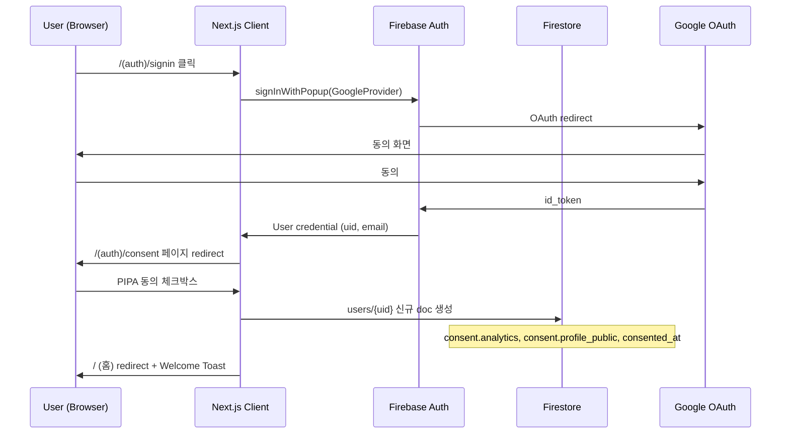
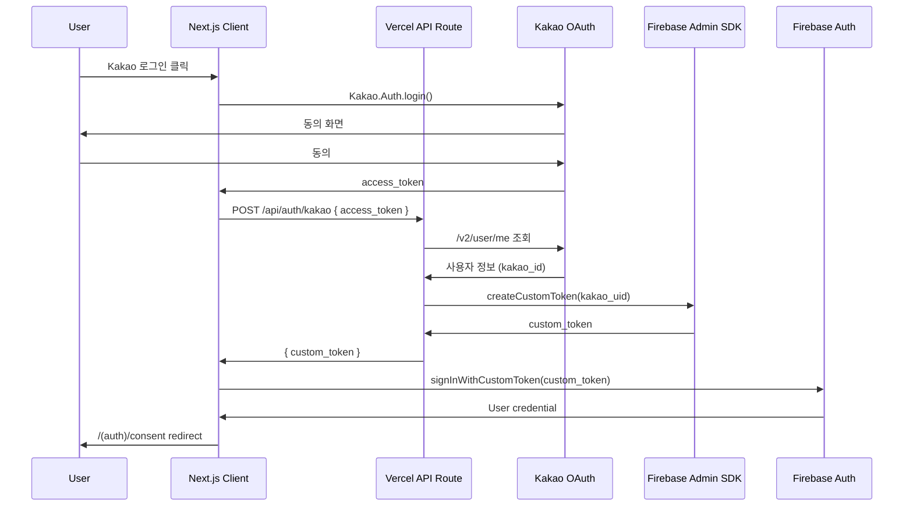
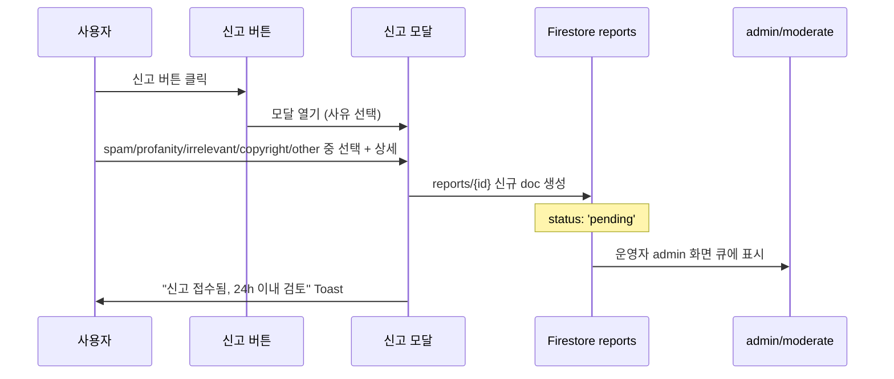

# Sprint V1 Design — Firebase Auth 흐름 + UGC 스키마 + 모더레이션 + admin

> **Sprint ID**: `god-kkabi-guide-sprint-v1`
> 작성일: 2026-05-14 · 운영자: kay@agentkay.it (1인 개인 프로젝트)
> 상위 문서: `docs/sprint/00-master-plan.md` · PRD: `docs/sprint/03-sprint-v1/prd.md` · Plan: `docs/sprint/03-sprint-v1/plan.md`
> 입력: Sprint MVP 코드베이스 + Sprint 0 검증 스키마 + V1 운영 정책

---

## 1. 본 Design의 역할

Phase 2 design 산출물. Phase 3 do 진입 전 다음을 결정한다:
1. Firebase Auth 흐름 (Google + Kakao + PIPA 동의)
2. UGC 컬렉션 스키마 V1 확정 (`users`, `builds`, `comments`, `reports`, `boss_ratings` — Sprint 0 보강 B, `tier_votes`, `pain_topics`)
3. Firestore 보안 규칙 v2 (user-owned + admin override)
4. 댓글/빌드/좋아요 UI 패턴
5. 운영자 모더레이션 도구 화면 (admin route)
6. AdSense 1-2 슬롯 배치
7. Pain Point raw 수집 흐름
8. M3 securityScan 항목 (CSRF, CSP, Auth)

---

## 2. Firebase Auth 흐름 (Google + Kakao)

### 2.1 Auth Provider 매트릭스

| Provider | 도입 시점 | 사용 라이브러리 | 비고 |
|----------|---------|------------|------|
| Google OAuth | Phase 3 Sub do.A | Firebase Auth `GoogleAuthProvider` | 기본 |
| Kakao OAuth | Phase 3 Sub do.A | Kakao JavaScript SDK + Firebase Custom Token | 한국 시장 필수 |
| Anonymous → Social Migration | Phase 3 Sub do.A | Firebase Auth `linkWithCredential` | MVP 익명 → V1 회원 |
| Email/Password | ❌ 도입 안 함 | - | SPAM 방지 |

### 2.2 Google OAuth 흐름 (Mermaid)



### 2.3 Kakao OAuth 흐름

Kakao는 Firebase Auth 기본 Provider가 아니므로 Custom Token 패턴:



### 2.4 익명 → 회원 마이그레이션

MVP에서 익명 사용자가 쿠폰 페이지 사용 → V1 진입 후 회원가입 시 익명 uid의 이벤트 데이터 마이그레이션:

```typescript
// lib/auth/migrate-anonymous.ts
import { linkWithCredential, GoogleAuthProvider } from 'firebase/auth';

async function migrateAnonymousToGoogle() {
  const credential = GoogleAuthProvider.credential(idToken);
  const result = await linkWithCredential(auth.currentUser!, credential);
  // 익명 uid → 소셜 uid 마이그레이션 자동 처리됨
  // events 컬렉션의 anonymous uid → 신규 uid 업데이트
  await updateEventsUidMapping(prevAnonUid, result.user.uid);
}
```

### 2.5 PIPA 동의 페이지 (`/(auth)/consent`)

**필수 동의** (체크 안 하면 가입 불가):
- [x] 서비스 이용약관 동의
- [x] 개인정보 처리방침 동의

**선택 동의** (체크해도 가입 가능):
- [ ] 분석 데이터 수집 동의 (GA4 + Firestore `events`)
- [ ] 프로필 공개 동의 (빌드 작성자 표시)

저장 위치: `users/{uid}.consent`:
```typescript
{
  analytics: boolean,
  profile_public: boolean,
  consented_at: Timestamp,
  terms_version: '2026-05-14',  // 약관 변경 시 재동의 트리거
}
```

### 2.6 데이터 삭제 요청 (`/my/delete-account`)

- 운영자 SLA 7일 이내 처리
- 삭제 대상: `users/{uid}`, `users/{uid}/bookmarks`, `builds.uid == {uid}` (작성자 익명화), `comments.uid == {uid}` (작성자 익명화)
- Cloud Functions로 일괄 처리 (V2 도입 검토)

---

## 3. Firestore 7+1 컬렉션 V1 확정 스키마

### 3.1 V1 활성 컬렉션 매트릭스

| 컬렉션 | MVP | V1 | 신규 필드 (V1) |
|--------|-----|-----|---------|
| `coupons` | ✅ | ✅ | (변경 없음) |
| `events` | ✅ | ✅ | uid 채워짐 |
| `users` | ⛔ | ✅ 활성 | (전체 활성) |
| `builds` | ⚠️ admin-seed 1건 | ✅ 활성 (UGC) | `tags` (Sprint 0 보강 A로 required + enum 11종), `slug` |
| `comments` | (없음) | ✅ 신규 | (V1 신규 컬렉션) |
| `reports` | (없음) | ✅ 신규 | (V1 신규 컬렉션) |
| `boss_ratings` | (없음) | ✅ 신규 | (V1 신규 컬렉션, Sprint 0 보강 B — R2-C3 매핑 보강) |
| `tier_votes` | ⛔ | ⚠️ 도입 검토 | (V2 본격 활성) |
| `pain_topics` | ⛔ | ✅ raw 모드 | `raw_text`, `processed: false` |

### 3.2 `users` 컬렉션 V1 (활성)

```typescript
interface UserDoc {
  uid: string;                    // Firebase Auth uid
  display_name?: string;
  email_hash: string;             // SHA-256 해시 (PIPA 대응)
  created_at: Timestamp;
  last_login_at: Timestamp;
  signed_up_via: 'google' | 'kakao' | 'anonymous';
  consent: {
    analytics: boolean;
    profile_public: boolean;
    consented_at: Timestamp;
    terms_version: string;
  };
  role?: 'user' | 'admin';        // V1 admin: 운영자 1명만 (kay@agentkay.it)
  reports_received_count: number; // 받은 신고 수 (자동 차단 임계값)
  is_banned?: boolean;            // 자동 차단 또는 운영자 차단
  banned_at?: Timestamp;
}
```

**서브컬렉션**: `users/{uid}/bookmarks/{buildId}` (작성 시 `{ created_at: Timestamp }`만)

### 3.3 `builds` 컬렉션 V1 (활성, MVP admin-seed 1건과 동일 스키마)

> [출처: Sprint 0 schema-validation §4.1 옵션 A 채택 (2026-05-14) — `tags` optional → required + enum 11종 고정. MVP design §5.5와 정합성 유지.]

```typescript
// MVP design.md §5.5와 동일 enum (단일 SSOT)
type BuildTag =
  | 'pve' | 'pvp' | 'boss' | '결투장' | '무한던전' | '비경'
  | '초보' | '중수' | '고수' | 'meta' | 'experimental';

interface BuildDoc {
  id: string;
  slug: string;                   // {class}-{yyyymmdd}-{shortid} (unique)
  uid: string;                    // 작성자
  display_name_snapshot: string;  // 작성 시점 display_name (수정 후에도 유지)
  class: 'warrior' | 'swordsman' | 'medium';
  jinryeong_3: string[];          // 진령 ID 3개
  skill_set: {
    core: string;
    active: string;
    passive: string;
  };
  equipment_grade: number;        // 0-10
  description?: string;           // 작성자 코멘트
  tags: BuildTag[];               // REQUIRED, default []. enum 11종 제한.
                                  // 빌드 작성 폼 §6.1 Step 3 multi-select UI 옵션과 1:1 일치.
                                  // [Sprint 0 보강 A — R1-C5 결투장 메타 빌드 TOP10 매핑 정확도 확보]
  is_public: boolean;
  likes_count: number;            // denormalized
  bookmarks_count: number;        // denormalized
  comments_count: number;         // denormalized
  created_at: Timestamp;
  updated_at: Timestamp;
  source: 'self_report' | 'screenshot' | 'manual_admin';
  is_deleted?: boolean;           // 운영자 삭제 시 (soft delete)
}
```

**인덱스** (MVP design §5.5에서 사전 정의된 3종 V1 실배포):
- `class` + `created_at` (desc): 직업별 최신 빌드
- `tags` (array-contains) + `likes_count` (desc): R1-C5 결투장 메타 빌드 TOP10 / 태그별 인기 빌드
- `class` + `tags` (array-contains) + `created_at` (desc): 직업×태그 복합 (V2 채용률 차트 입력)
- `tags` (array-contains) + `created_at` (desc): 태그별 최신 빌드
- `jinryeong_3` (array-contains) + `created_at` (desc): 진령별 빌드

### 3.4 `comments` 컬렉션 V1 (신규)

```typescript
interface CommentDoc {
  id: string;
  uid: string;
  display_name_snapshot: string;
  parent_type: 'build' | 'page';
  parent_id: string;              // build slug 또는 page path
  parent_path: string;            // '/builds/swordsman-20260615-abc' or '/jinryeong'
  content: string;                // 욕설 필터 통과 후 저장
  likes_count: number;
  reports_count: number;          // 신고 횟수 (자동 차단 임계값)
  created_at: Timestamp;
  updated_at: Timestamp;
  is_deleted?: boolean;
  is_filtered?: boolean;          // 자동 욕설 필터 차단
}
```

**인덱스**:
- `parent_id` + `created_at` (asc): 부모별 시간순 댓글
- `uid` + `created_at` (desc): 유저별 작성 댓글

### 3.5 `reports` 컬렉션 V1 (신규)

```typescript
interface ReportDoc {
  id: string;
  reporter_uid: string;
  target_type: 'comment' | 'build';
  target_id: string;
  target_path: string;
  reason: 'spam' | 'profanity' | 'irrelevant' | 'copyright' | 'other';
  details?: string;               // 신고자 코멘트
  created_at: Timestamp;
  status: 'pending' | 'resolved' | 'rejected';
  resolved_by?: string;           // admin uid
  resolved_at?: Timestamp;
  resolution?: 'delete' | 'keep' | 'ban_user';
}
```

### 3.6 `boss_ratings` 컬렉션 V1 (신규)

> [출처: Sprint 0 schema-validation §4.2 옵션 A 채택 (2026-05-14) — R2-C3 보스 던전 별점 분포 매핑 ❌ FAIL → ✅ PASS 전환]

**도입 배경**: Sprint 0 R.A.T. 검증에서 V3 B2B 패키지 R2-C3 차트(보스 던전 별점 분포)가 매핑 ❌ FAIL이었다. 옵션 A 채택으로 V1 시점에 `boss_ratings` 컬렉션을 신설하여 정량 별점 데이터를 누적, V2 NLP 댓글 분석과 결합 시 R2-C3 차트의 데이터 소스를 확보한다.

```typescript
interface BossRatingDoc {
  id: string;                     // {uid}_{boss_id}_{YYYY-Wnn}
                                  // 1유저당 1보스당 주 1회 갱신 (upsert 정책)
  uid: string;                    // Auth 필수
  boss_id: 'daily_1' | 'daily_2' | 'weekly_1' | 'weekly_2' | 'dokebi_coop' | string;
                                  // string fallback은 V2+ 신규 보스 출시 시 운영자 추가 대비
  rating: 1 | 2 | 3 | 4 | 5;      // 5점 척도 (R2-C3 분포 입력)
  comment?: string;               // ≤200자, 욕설 필터 + NSFW 필터 통과 후 저장 (선택)
  created_at: Timestamp;
  updated_at: Timestamp;          // upsert 시 갱신
  source: 'self_report' | 'screenshot' | 'admin';
  is_public: boolean;             // default true (분포 차트는 public만 집계)
  is_filtered?: boolean;          // 욕설 필터 자동 차단 시 true
}
```

**인덱스**:
- `boss_id` + `created_at` (desc): 보스별 최근 별점 (운영자 모더레이션 + V2 차트)
- `boss_id` + `is_public` + `rating` (desc): R2-C3 분포 집계 (BigQuery export 후 weekly group)
- `uid` + `boss_id`: 유저별 본인 별점 조회 (UI 표시 + upsert 충돌 방지)

**ID 생성 정책 (주 1회 upsert)**:

```typescript
function generateBossRatingId(uid: string, bossId: string, date: Date): string {
  const week = format(date, "yyyy-'W'II"); // ISO week
  return `${uid}_${bossId}_${week}`;
}
// 동일 주차 재제출 시 createOrUpdate (updated_at만 갱신)
```

**별점 UI 통합 위치**:
- 보스 가이드 페이지: `/dungeon/[boss-id]` 동적 라우트 (V1 신설) 또는 기존 `/dungeon` 페이지 내 보스 카드 섹션
- 컴포넌트: `<BossRatingWidget>` (5-star input + optional 200자 textarea + Submit 버튼)
- Optimistic UI: 클릭 즉시 별점 표시, Firestore 응답 실패 시 롤백 + Toast
- 비로그인 시: "로그인 후 평가하기" CTA 버튼 (Auth 페이지로 redirect)

**GA4 신규 이벤트** (§3.4 §11 Layer 3에 추가):
- `boss_rating_submit` — params: `{ boss_id, rating, has_comment }` — Firestore `events` 백업 ✅

**V2 차트 매핑 (R2-C3 PASS 전환)**:
- BigQuery 쿼리: `SELECT boss_id, rating, COUNT(*) FROM firestore_export.boss_ratings WHERE is_public AND is_filtered != true GROUP BY boss_id, rating`
- V2 design.md §3 인사이트 차트 절에서 별점 분포 도넛 차트로 시각화 가능
- V3 B2B API `/api/v1/boss-ratings` endpoint 신설 검토 (V3 design §2 endpoint 추가 검토 사항)

**비용 영향**: ₩0 추가 (Firebase Spark Plan Firestore writes 한도 20K/일 중 DAU 2K × 평균 0.3건 = ~600 writes/일, 한도 3% 사용).

---

### 3.7 `pain_topics` V1 raw 모드

```typescript
interface PainTopicDoc {
  id: string;
  raw_text: string;               // 댓글 원문 (NLP 미적용)
  source_uid?: string;
  source_comment_id?: string;
  page_path: string;
  week: string;                   // 'YYYY-Wnn'
  detected_keywords: string[];    // 단순 키워드 매칭 ('만료', '버그', '환불', ...)
  processed: false;               // V2 NLP 처리 여부 (V1은 항상 false)
  created_at: Timestamp;
}
```

**raw 수집 트리거**: 댓글 작성 시 부정 키워드 사전 매칭 → 자동 백업.

---

## 4. Firestore 보안 규칙 v2 (user-owned + admin override)

```javascript
rules_version = '2';
service cloud.firestore {
  match /databases/{database}/documents {

    // 헬퍼 함수
    function isAuthenticated() {
      return request.auth != null;
    }
    function isOwner(uid) {
      return isAuthenticated() && request.auth.uid == uid;
    }
    function isAdmin() {
      return isAuthenticated() && request.auth.token.admin == true;
    }
    function isNotBanned() {
      return isAuthenticated() &&
        get(/databases/$(database)/documents/users/$(request.auth.uid)).data.is_banned != true;
    }

    // users (V1 활성)
    match /users/{uid} {
      allow read: if true;                      // 프로필 공개
      allow create: if isOwner(uid) &&
        request.resource.data.consent.consented_at != null;
      allow update: if isOwner(uid) || isAdmin();
      allow delete: if isAdmin();

      match /bookmarks/{buildId} {
        allow read, write: if isOwner(uid);
      }
    }

    // coupons (MVP, admin only write)
    match /coupons/{couponId} {
      allow read: if true;
      allow write: if isAdmin();
    }

    // builds (V1 활성)
    match /builds/{buildId} {
      allow read: if resource.data.is_deleted != true || isAdmin();
      allow create: if isAuthenticated() && isNotBanned() &&
        request.resource.data.uid == request.auth.uid;
      allow update: if (isOwner(resource.data.uid) || isAdmin()) &&
        request.resource.data.uid == resource.data.uid;  // uid 변경 금지
      allow delete: if isAdmin();  // 삭제는 admin만, 작성자는 is_deleted=true update
    }

    // comments (V1 신규)
    match /comments/{commentId} {
      allow read: if resource.data.is_deleted != true && resource.data.is_filtered != true;
      allow create: if isAuthenticated() && isNotBanned() &&
        request.resource.data.uid == request.auth.uid;
      allow update: if isOwner(resource.data.uid) || isAdmin();
      allow delete: if isAdmin();
    }

    // reports (V1 신규)
    match /reports/{reportId} {
      allow read: if isAdmin();
      allow create: if isAuthenticated() &&
        request.resource.data.reporter_uid == request.auth.uid;
      allow update: if isAdmin();
      allow delete: if false;
    }

    // events (MVP write only)
    match /events/{eventId} {
      allow read: if isAdmin();
      allow create: if true;
      allow update, delete: if false;
    }

    // pain_topics (V1 raw 수집)
    match /pain_topics/{topicId} {
      allow read: if isAdmin();
      allow create: if isAuthenticated();
      allow update, delete: if isAdmin();
    }

    // boss_ratings (V1 신규, Sprint 0 보강 B — R2-C3 매핑)
    // [출처: Sprint 0 schema-validation §4.2 옵션 A]
    match /boss_ratings/{ratingId} {
      // read: public 별점은 모두 조회 가능, 비공개는 본인 또는 admin만
      allow read: if resource.data.is_public == true ||
        isOwner(resource.data.uid) || isAdmin();

      // create: 본인 uid + rating 1-5 + boss_id 존재 + 욕설 필터 통과 시
      allow create: if isAuthenticated() && isNotBanned() &&
        request.resource.data.uid == request.auth.uid &&
        request.resource.data.rating in [1, 2, 3, 4, 5] &&
        request.resource.data.boss_id is string;

      // update: 본인의 같은 주차 별점만 upsert (rating/comment 변경 가능, uid/boss_id 변경 금지)
      allow update: if isOwner(resource.data.uid) &&
        request.resource.data.uid == resource.data.uid &&
        request.resource.data.boss_id == resource.data.boss_id &&
        request.resource.data.rating in [1, 2, 3, 4, 5];

      // delete: admin only (자기 별점 삭제는 update로 is_filtered: true 처리)
      allow delete: if isAdmin();
    }
  }
}
```

### 4.1 admin role 부여 방법

운영자 (kay@agentkay.it) uid에 admin 토큰 부여:

```bash
# Cloud Shell 또는 Firebase Admin SDK 스크립트
firebase auth:set-custom-claims <admin_uid> '{"admin": true}'
```

V1에서는 운영자 1명만 admin. V3+에서 모더레이터 위임 검토.

---

## 5. 댓글 UI 패턴

### 5.1 `<CommentList>` (페이지네이션 cursor 기반)

```typescript
interface CommentListProps {
  parentType: 'build' | 'page';
  parentId: string;
  parentPath: string;
}

// 페이지네이션: Firestore cursor (created_at + id)
// 20개씩 로드 + "더 보기" 버튼
// 정렬: 시간 desc (최신 댓글 위)
```

### 5.2 `<CommentForm>` (Auth 필요, 욕설 필터)

```typescript
interface CommentFormProps {
  parentType: 'build' | 'page';
  parentId: string;
  parentPath: string;
}

// Auth 안 된 상태: "로그인 후 댓글 작성" 버튼
// Auth 된 상태: textarea + 욕설 필터 클라이언트 검증 + submit
// 욕설 검출 시: 빨간 border + "부적절한 단어가 포함되어 있습니다"
```

### 5.3 욕설 필터 lib

```typescript
// lib/moderation/profanity-filter.ts
const PROFANITY_DICT = ['<욕설1>', '<욕설2>', ...]; // 1000+ 단어
const PROFANITY_REGEX = /(<변형패턴1>|<변형패턴2>)/i;

export function detectProfanity(text: string): boolean {
  return PROFANITY_DICT.some(word => text.includes(word)) ||
    PROFANITY_REGEX.test(text);
}

export function filterProfanity(text: string): string {
  let filtered = text;
  PROFANITY_DICT.forEach(word => {
    filtered = filtered.replace(new RegExp(word, 'gi'), '*'.repeat(word.length));
  });
  return filtered;
}
```

### 5.4 신고 UI 흐름



---

## 6. 빌드 작성 폼 3단계 stepper

### 6.1 Stepper 흐름

```
Step 1: 직업 선택
  ┌──────────────┬──────────────┬──────────────┐
  │ ⚔️ 전사       │ 🗡️ 검객       │ 🔮 영매       │
  │ (도깨비)      │ (무당)        │ (저승사자)    │
  └──────────────┴──────────────┴──────────────┘

Step 2: 진령 3개 선택 + 스킬 셋
  ┌─ 진령 3개 선택 (11종 카드) ─────────────────┐
  │ [홍길동] [서해용왕] [치우] ...               │
  └────────────────────────────────────────────┘
  ┌─ 스킬 셋 ────────────────────────────────────┐
  │ 코어: [드롭다운] / 액티브: [드롭다운] /      │
  │ 패시브: [드롭다운]                           │
  └────────────────────────────────────────────┘
  제련 등급 (0-10): [슬라이더]

Step 3: 코멘트 + 태그
  ┌─ 코멘트 (선택) ──────────────────────────────┐
  │ [textarea, 500자 한도]                       │
  └────────────────────────────────────────────┘
  태그 (최대 5개): [pvp] [pve] [meta] [budget] ...
  □ 공개 (체크 시 is_public: true, 미체크 시 본인만)
  [작성 완료] → /builds/{slug} redirect
```

### 6.2 Slug 생성

```typescript
function generateSlug(class: string, createdAt: Date): string {
  const yyyymmdd = format(createdAt, 'yyyyMMdd');
  const shortid = generateShortId(8); // nanoid 8자
  return `${class}-${yyyymmdd}-${shortid}`;
}
// 예: swordsman-20260615-a3f9k2bx
```

---

## 7. 운영자 모더레이션 도구 (admin route)

### 7.1 `/(admin)/moderate` 페이지 화면 구성

```
┌─ 헤더: 모더레이션 큐 (12건 대기) ─────────────┐
│ 필터: [전체] [comment] [build]  정렬: 신고일 desc│
└───────────────────────────────────────────────┘

┌─ 신고 항목 카드 (목록) ─────────────────────┐
│ Reporter: user_abc / Target: comment_xyz   │
│ Reason: profanity / Details: "...불쾌..." │
│ Target 미리보기:                            │
│   "이 빌드는 ***이고 ..." (필터 적용 후)   │
│ [삭제] [유지] [작성자 차단] [상세 보기]    │
└────────────────────────────────────────────┘
```

### 7.2 일괄 처리 도구

- 10건 단위 체크박스 선택 → 일괄 삭제/유지/차단
- 자동 차단 임계값: 같은 단어 3회+ 자동 삭제 (운영자 알림만)
- 같은 user 3회+ 신고 → 자동 24h ban + 운영자 알림

### 7.3 `/(admin)/coupons` 쿠폰 관리

MVP에서 운영자가 Firebase Console 직접 사용 → V1에서 admin UI 도입:

- 쿠폰 목록 (status + expires_at 필터)
- 쿠폰 신규 추가 폼 (code/description/reward/starts_at/expires_at/source)
- 쿠폰 status 일괄 변경 (만료 처리)

### 7.4 `/(admin)/page.tsx` admin 대시보드 (KPI 미니멀)

```
오늘의 KPI
─────────────
DAU: 1,847
신규 가입: 23
빌드 작성: 18
댓글 작성: 89
신고 대기: 5
광고 매출 (어제): ₩3,200
─────────────
이번 주 추이: [미니 차트]
```

---

## 8. AdSense 1-2 슬롯 배치

### 8.1 슬롯 위치

| 슬롯 | 페이지 | 위치 | 모바일 | 데스크탑 |
|------|------|------|------|---------|
| 슬롯 A | 콘텐츠 9 페이지 + 빌드 상세 | footer 위 (70% 스크롤 후 노출) | ✅ | ✅ |
| 슬롯 B | 빌드 상세 페이지 | 사이드바 sticky (lg: 이상) | ❌ | ✅ |

### 8.2 lazy load 패턴

```typescript
// components/ads/AdSlot.tsx
'use client';
import { useEffect, useRef, useState } from 'react';

export function AdSlot({ slotId }: { slotId: string }) {
  const [visible, setVisible] = useState(false);
  const ref = useRef<HTMLDivElement>(null);

  useEffect(() => {
    const observer = new IntersectionObserver(
      ([entry]) => entry.isIntersecting && setVisible(true),
      { rootMargin: '200px' }  // 미리 200px 전 로드
    );
    if (ref.current) observer.observe(ref.current);
    return () => observer.disconnect();
  }, []);

  return (
    <div ref={ref} className="ad-slot min-h-[280px]">
      {visible && (
        <ins className="adsbygoogle"
          data-ad-client="ca-pub-XXX"
          data-ad-slot={slotId}
          data-ad-format="auto"
          data-full-width-responsive="true" />
      )}
    </div>
  );
}
```

### 8.3 광고 카테고리 필터

AdSense 대시보드에서:
- ✅ 허용: 게임 (모바일 게임, RPG, 방치형)
- ❌ 차단: 도박, 성인, 의료, 정치, 종교

---

## 9. Pain Point raw 수집 흐름

### 9.1 트리거 (댓글 작성 시)

```typescript
// 댓글 작성 후 자동 실행
async function collectPainPoint(comment: CommentDoc) {
  const keywords = ['만료', '버그', '환불', '느려', '안 됨', '왜', '실망', '아쉬워', '짜증', '못하겠'];
  const detected = keywords.filter(k => comment.content.includes(k));

  if (detected.length > 0) {
    await addDoc(collection(db, 'pain_topics'), {
      raw_text: comment.content,
      source_uid: comment.uid,
      source_comment_id: comment.id,
      page_path: comment.parent_path,
      week: getCurrentWeek(),
      detected_keywords: detected,
      processed: false,
      created_at: serverTimestamp(),
    });
  }
}
```

### 9.2 V2 NLP 처리 입력 형식

V1에서 누적된 `pain_topics` raw 데이터는 V2 NLP 클러스터링의 입력:

```
V1 raw 누적 (24주 × 평균 50건/주) = ~1,200건 누적
   ↓
V2 NLP 클러스터링 (Cloud Functions + OpenAI 또는 KoBERT)
   ↓
topic 별 묶음 + sentiment + frequency 계산
```

---

## 10. M3 securityScan 항목 (V1 PASS 조건)

| 항목 | 검증 방법 | PASS 기준 |
|------|---------|---------|
| Firebase Auth 보안 규칙 | Firestore Rules 시뮬레이터 | 모든 시나리오 PASS |
| CSRF 방어 | Vercel 미들웨어 + SameSite cookie | strict SameSite |
| CSP 헤더 | `next.config.js` 헤더 검증 | 모든 외부 도메인 명시 |
| XSS 방어 | React 기본 escape + DOMPurify (댓글 본문) | XSS 페이로드 차단 |
| Rate Limiting | Vercel middleware | 분당 60 request 한도 |
| HTTPS | Vercel 기본 | 강제 HTTPS |
| Secrets | tene 시크릿 관리 | .env 파일 0개 |

---

## 11. M7 dataFlowIntegrity 7-layer (V1 추가)

| Layer | MVP | V1 추가 |
|-------|-----|---------|
| Layer 1 URL 라우팅 | ✅ | + Auth 보호 라우트 |
| Layer 2 클라이언트 렌더링 | ✅ | + AuthProvider Context |
| Layer 3 GA4 이벤트 | ✅ 9개 | + 6개 (signup/build_create/build_like/comment_create/report_submit/`boss_rating_submit` — Sprint 0 보강 B) |
| Layer 4 Firestore read | ✅ coupons | + users/builds/comments/bookmarks/`boss_ratings` |
| Layer 5 Firestore write | ✅ events | + users/builds/comments/reports/pain_topics/`boss_ratings` |
| Layer 6 BigQuery export | ❌ | ✅ 일간 export 활성 (events + builds) |
| Layer 7 SEO 인덱싱 | ✅ | + 빌드 페이지 sitemap 자동 추가 |

---

## 12. 다음 Phase 인터페이스

Phase 2 design 산출물(본 design.md) → Phase 3 do 입력:
- §2 Auth 흐름 → Sub do.A (T-022 ~ T-030)
- §3 컬렉션 스키마 → Sub do.B/C 모든 task (§3.6 boss_ratings는 Sub do.C로, 보스 가이드 페이지 별점 UI는 Sub do.D 후반에 배치 — V1.P3.T-BR-* 그룹)
- §4 보안 규칙 v2 → Sub do.B (T-031), Sub do.C (T-040), boss_ratings 규칙은 V1.P3.T-BR-001 (Sprint 0 보강 B)
- §5 댓글 UI → Sub do.B
- §6 빌드 폼 → Sub do.C
- §7 admin 도구 → Sub do.D (boss_ratings 신고 처리 포함, V1.P3.T-BR-004)
- §8 AdSense → Sub do.D
- §9 Pain Point → Sub do.D
- §10-11 보안/dataFlow → Phase 6 qa 입력

> **Status**: Draft v1.0 — pending review.
> 다음 Phase: Phase 3 do (16주, 4 Sub-Phase 분할).
