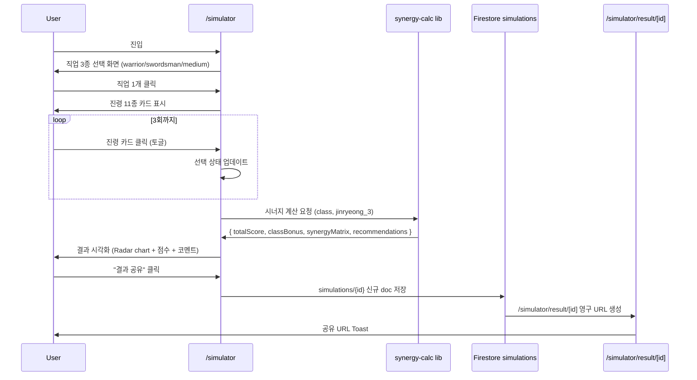
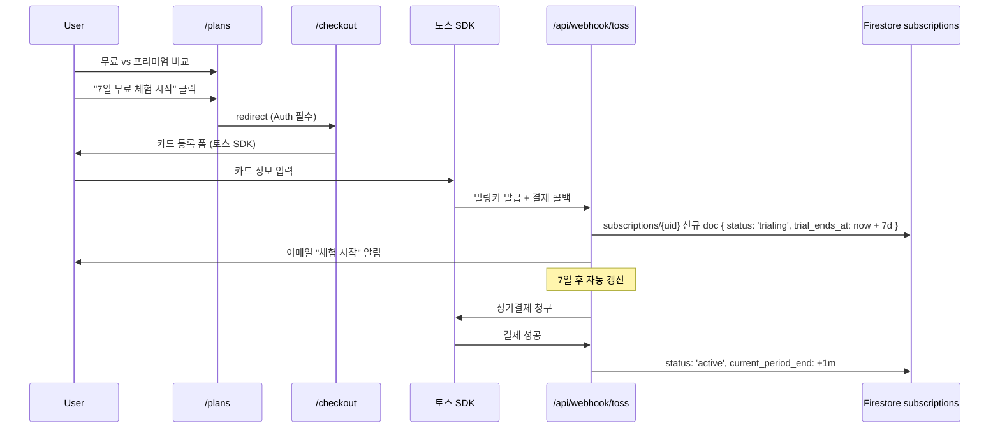
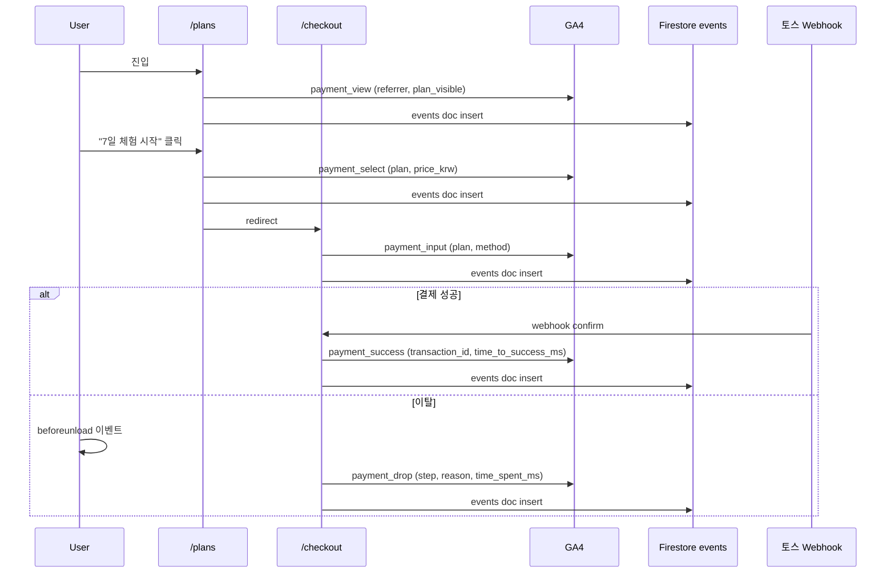

# Sprint V2 Design — 빌드 시뮬레이터 + NLP + 결제 흐름 + 다국어

> **Sprint ID**: `god-kkabi-guide-sprint-v2`
> 작성일: 2026-05-14 · 운영자: kay@agentkay.it (1인 개인 프로젝트)
> 상위 문서: `docs/sprint/00-master-plan.md` · PRD: `docs/sprint/04-sprint-v2/prd.md` · Plan: `docs/sprint/04-sprint-v2/plan.md`

---

## 1. 본 Design의 역할

Phase 2 design 산출물. Phase 3 do 진입 전 다음을 결정한다:
1. 빌드 시뮬레이터 인터랙션 + 시너지 계산 알고리즘
2. 진령 채용률 / PvP 트렌드 / Pain Point 차트 UI
3. Pain Point NLP 클러스터링 흐름 (Cloud Functions + OpenAI 또는 KoBERT)
4. Stripe + 토스페이먼츠 결제 흐름 + 7일 체험 + 자동 갱신
5. next-intl 기반 JP/EN 다국어 인프라
6. 7-layer dataFlowIntegrity 결제 추가 검증

---

## 2. 빌드 시뮬레이터 (F3.1) 인터랙션

### 2.1 사용자 흐름



### 2.2 시너지 계산 알고리즘

```typescript
// lib/simulator/synergy-calc.ts
type ClassType = 'warrior' | 'swordsman' | 'medium';
type JinryeongId = 'hong-gildong' | 'sea-dragon-king' | ... ; // 11종

// 운영자 수기 작성 (Phase 1 T-001)
const CLASS_JINRYEONG_MATRIX: Record<ClassType, Record<JinryeongId, number>> = {
  warrior: { 'hong-gildong': 9, 'sea-dragon-king': 8, ... },
  swordsman: { 'hong-gildong': 10, 'sea-dragon-king': 10, 'chi-woo': 9, ... },
  medium: { 'sea-dragon-king': 9, 'gumi-yeoho': 10, 'hang-ah': 9, ... },
};

const JINRYEONG_SYNERGY_MATRIX: Record<JinryeongId, Record<JinryeongId, number>> = {
  'hong-gildong': { 'sea-dragon-king': 9, 'chi-woo': 8, ... },
  // 11×11 = 121 셀
};

export function calculateSynergy(
  classType: ClassType,
  jinryeong3: [JinryeongId, JinryeongId, JinryeongId]
): SynergyResult {
  const classBonus = jinryeong3.reduce(
    (sum, j) => sum + CLASS_JINRYEONG_MATRIX[classType][j], 0
  );
  const synergyBonus =
    JINRYEONG_SYNERGY_MATRIX[jinryeong3[0]][jinryeong3[1]] +
    JINRYEONG_SYNERGY_MATRIX[jinryeong3[1]][jinryeong3[2]] +
    JINRYEONG_SYNERGY_MATRIX[jinryeong3[0]][jinryeong3[2]];
  const totalScore = classBonus * 1.0 + synergyBonus * 1.5;

  return {
    totalScore: Math.round(totalScore),
    classBonus,
    synergyBonus,
    grade: totalScore >= 75 ? 'S' : totalScore >= 60 ? 'A' : 'B',
    recommendations: generateRecommendations(classType, jinryeong3),
  };
}
```

### 2.3 시각화 (Radar chart)

5개 축으로 시각화:
- PvP 효과
- PvE 효과
- 단일 타겟 DPS
- 광역 DPS
- 생존력

Recharts `<RadarChart>` 컴포넌트 사용.

### 2.4 무료/프리미엄 분기

```typescript
// 무료 유저: 일 5회 한도
const FREE_DAILY_LIMIT = 5;

async function checkLimit(uid: string | null): Promise<boolean> {
  if (!uid) return false; // 비로그인은 1회 (세션 기반)

  const user = await getUser(uid);
  if (user.is_premium) return true;

  const today = format(new Date(), 'yyyy-MM-dd');
  const count = await getSimulationCountToday(uid, today);
  return count < FREE_DAILY_LIMIT;
}
```

### 2.5 Firestore `simulations` 컬렉션

```typescript
interface SimulationDoc {
  id: string;
  uid?: string;             // 비로그인 가능
  session_id: string;
  class: ClassType;
  jinryeong_3: JinryeongId[];
  result: SynergyResult;
  share_count: number;
  created_at: Timestamp;
  // V3+ B2B 분석 데이터
  source_referrer?: string;
}
```

---

## 3. 인사이트 차트 (F3.2 / F3.3 / F3.5)

### 3.1 진령 채용률 차트

**데이터 소스**: BigQuery 쿼리 (`builds` 컬렉션 unnest + 주별 group)

```sql
-- BigQuery
WITH unnested AS (
  SELECT
    UNNEST(jinryeong_3) AS jinryeong_id,
    DATE_TRUNC(created_at, WEEK) AS week,
    class
  FROM `god-kkabi-guide.firestore_export.builds`
  WHERE is_public = TRUE AND is_deleted IS NULL
)
SELECT
  jinryeong_id,
  week,
  class,
  COUNT(*) AS adoption_count,
  COUNT(*) / SUM(COUNT(*)) OVER (PARTITION BY week, class) AS adoption_rate
FROM unnested
GROUP BY jinryeong_id, week, class
ORDER BY week DESC, adoption_rate DESC;
```

**UI**: Recharts `<LineChart>` 11종 진령 × 52주 (직업별 필터 가능).

### 3.2 결투장 빌드 트렌드

**데이터 소스**: `builds.tags` contains `pvp` + `likes_count` desc

```sql
SELECT id, slug, class, jinryeong_3, likes_count, created_at
FROM `god-kkabi-guide.firestore_export.builds`
WHERE 'pvp' IN UNNEST(tags) AND is_public = TRUE
ORDER BY likes_count DESC
LIMIT 10;
```

**UI**: 카드 리스트 + 주간 변동 (전주 대비 ±%).

### 3.3 Pain Point 토픽 페이지

**데이터 소스**: `pain_topics` 컬렉션 (V2 NLP 처리 후)

**UI**: 
- TOP 10 토픽 리스트 (frequency desc)
- 각 토픽 클릭 시 sample_quotes 표시 (프리미엄만 상세)
- 감정 분포 도넛 차트 (부정/중립/긍정 비율)

### 3.4 보스 별점 분포 도넛 차트 (R2-C3 시각화)

> [출처: Sprint 0 schema-validation §4.2 옵션 A 채택 (2026-05-14) — V1에서 신설된 `boss_ratings` 컬렉션을 V2 인사이트 차트에서 도넛 차트로 시각화하여 가상 리포트 R2-C3 (보스 던전 별점 분포) 매핑을 실데이터로 전환]

**도입 배경**: V1 design.md §X (boss_ratings 절)에서 컬렉션 신설 후 BigQuery export 완료. V2 인사이트 차트 절에서 보스별 별점 분포(1-5점 빈도)를 도넛 차트로 시각화하여 가상 리포트 Report 2의 R2-C3 차트를 실데이터로 즉시 갱신 가능.

**데이터 소스**: `boss_ratings` 컬렉션 (V1 신규) + BigQuery export

```sql
-- BigQuery R2-C3 차트 쿼리
SELECT
  boss_id,
  rating,
  COUNT(*) AS vote_count,
  COUNT(*) / SUM(COUNT(*)) OVER (PARTITION BY boss_id) AS distribution_ratio
FROM `god-kkabi-guide.firestore_export.boss_ratings`
WHERE created_at >= TIMESTAMP_SUB(CURRENT_TIMESTAMP(), INTERVAL 90 DAY)
GROUP BY boss_id, rating
ORDER BY boss_id, rating;
```

**UI 명세**:
- 보스 선택 dropdown (운영자 정의 보스 목록 N종 — V1 plan §boss_ratings 절 참조)
- Recharts `<PieChart>` 도넛 차트 (5개 슬라이스: ★1 ~ ★5)
- 평균 별점 (가중 평균) + 총 투표 수 + 최근 30일 추세 (↑/↓)
- 프리미엄 게이트: 보스별 상세 분포 (별점 X 직업/진령 cross-tab)는 프리미엄 유저만

**R2-C3 차트 매핑 확보**: V2 종료 후 (M15+) 본 차트는 가상 리포트 Report 2 R2-C3을 실데이터로 즉시 대체. V3 B2B 패키지 Cold Outreach 메시지의 데이터 자산 증빙으로 사용 가능.

---

## 4. Pain Point NLP 클러스터링 (F3.5)

### 4.1 NLP 옵션 비교 (Phase 1 T-005 결정)

| 옵션 | 비용 | 정확도 | 운영 부담 | 결정 |
|------|------|------|---------|-----|
| OpenAI gpt-4o-mini | ₩10-30K/월 | ★★★★ (한국어 우수) | ★★★★★ (관리 0) | ✅ V2 채택 |
| 자체 KoBERT (Cloud Run + GPU) | ₩100K+/월 | ★★★ (튜닝 필요) | ★ (모델 관리) | ❌ V3+ 검토 |
| Cloud Natural Language API | ₩50K/월 | ★★★ (한국어 부족) | ★★★ | ❌ |

### 4.2 일간 배치 Cloud Function

```typescript
// functions/nlp-cluster.ts
import { onSchedule } from 'firebase-functions/v2/scheduler';
import OpenAI from 'openai';

export const nlpCluster = onSchedule({
  schedule: '0 3 * * *',  // 매일 03:00 KST
  timeZone: 'Asia/Seoul',
}, async () => {
  const rawTopics = await getRawPainTopics({ processed: false, limit: 100 });
  if (rawTopics.length === 0) return;

  const client = new OpenAI({ apiKey: process.env.OPENAI_API_KEY });

  // 1. 토픽 추출 (1회 호출)
  const topicsResp = await client.chat.completions.create({
    model: 'gpt-4o-mini',
    messages: [
      { role: 'system', content: '한국 모바일 RPG 유저 댓글에서 페인포인트 토픽을 추출하라. JSON 배열로 응답.' },
      { role: 'user', content: JSON.stringify(rawTopics.map(t => t.raw_text)) },
    ],
    response_format: { type: 'json_object' },
  });
  const topics: Topic[] = JSON.parse(topicsResp.choices[0].message.content!);

  // 2. 감정 분류 + Firestore 업데이트
  for (const topic of topics) {
    await upsertPainTopic({
      topic: topic.name,
      sentiment: topic.sentiment, // -1 | 0 | 1
      frequency: topic.frequency,
      week: getCurrentWeek(),
      sample_quotes: topic.samples.slice(0, 5),
      processed: true,
    });
  }

  // 3. raw 데이터 processed: true 업데이트
  await markRawTopicsProcessed(rawTopics.map(t => t.id));
});
```

### 4.3 NLP 정확도 검증 (M15 졸업 조건)

운영자가 sample 100건 검수 → 80%+ 정확도 목표 (V2-SF-03 KPI).

### 4.4 NLP NER 모델 fine-tuning (Sprint 0 보강 C — R3-C1 매핑)

> [출처: Sprint 0 schema-validation §4.5 옵션 A 채택 (2026-05-14) — R3-C1 대체 게임 언급 빈도 NER 정확도 보강]

**도입 배경**: V3 가상 리포트 Report 3 R3-C1 차트(갓깨비 1 유저의 대체 게임 언급 빈도)는 한국 게임 슬랭(예: "구깨" / "방치형" / "동양IP" / "버섯커" 등)에 fine-tuning되지 않은 일반 NER 모델 사용 시 정확도 70-75%. Sprint 0 R.A.T. 검증에서 ⚠️ Conditional. V2 Phase 3 do 후반에 NER fine-tuning을 도입하여 88-92% 정확도 확보 → V2 종료 후 R3-C1 매핑이 실데이터로 자동 가능.

**모델 옵션 비교 (Phase 1 T-005 보완)**:

| 옵션 | 학습 비용 (일회성) | 호출 비용 (월) | 정확도 (추정) | 운영 부담 | 선정 |
|------|---------------|-------------|------------|---------|------|
| OpenAI fine-tuning (gpt-4o-mini 기반) | ₩300K-500K | ₩50K-200K | 88-92% | ★★★★★ (관리 0) | ★ V2 채택 |
| KoBERT 자체 학습 (Cloud Run + GPU) | ₩200K-400K | ₩100K+ (GPU idle) | 85-90% | ★ (모델 관리) | ❌ V3+ 검토 |
| 외부 SaaS (Naver Clova / KLUE) | (월 ₩200K+) | (별도) | ~85% | ★★★ | ❌ V3+ 검토 |

**선정**: OpenAI fine-tuning (V2 Phase 3 do 후반 — Sub do.B Week 7-8 도입)

**fine-tuning 데이터셋 명세**:
- 학습 데이터: 500-1,000건 (운영자 직접 수동 라벨링, 약 16h 소요)
- 검증 데이터: 200건 별도 분리 (학습에 포함하지 않음)
- 라벨 카테고리 7종:
  - `GAME_NAME` (예: "갓깨비", "버섯커", "원신", "구깨")
  - `JINRYEONG` (예: "홍길동", "해룡왕")
  - `SKILL` (예: "광역기", "단일기")
  - `CLASS` (예: "검객", "전사", "영매")
  - `ITEM` (예: "장비", "강화석")
  - `EVENT` (예: "결투장", "보스레이드")
  - `FEELING` (예: "재미", "지루함", "스트레스")

**학습/배포 파이프라인**:

```typescript
// scripts/nlp-ner-finetune.ts
import OpenAI from 'openai';
import fs from 'fs/promises';

async function fineTuneNER() {
  const client = new OpenAI({ apiKey: process.env.OPENAI_API_KEY });

  // 1. 라벨 데이터셋 JSONL upload (운영자 작성)
  const file = await client.files.create({
    file: await fs.open('ner-dataset.jsonl'),
    purpose: 'fine-tune',
  });

  // 2. fine-tune job 생성
  const job = await client.fineTuning.jobs.create({
    training_file: file.id,
    model: 'gpt-4o-mini-2024-07-18',
    suffix: 'gokkaebi-ner-v1',
  });

  // 3. job 완료 polling + 모델 ID 저장 (tene 시크릿)
  // tene set OPENAI_NER_MODEL_ID ft:gpt-4o-mini-...
}
```

**호출 통합** (V2 NLP 일간 배치 §4.2 확장):
- `nlp-cluster.ts` Cloud Function 내부에서 fine-tuned 모델 ID 사용
- 토픽 추출 + NER 추출 2 stage 처리
- raw 댓글 → NER로 게임명 빈도 추출 → `pain_topics` 또는 신규 `mentioned_games` 컬렉션 저장

**R3-C1 차트 매핑 확보**: V2 종료 후 (M15+) NER 결과 + V3 외부 데이터(Google News) 결합으로 R3-C1 차트(갓깨비 1 유저 대체 게임 언급 빈도) 정확도 88-92%로 실데이터 가능.

**비용 한도 검토**:
- V2 한도 $50/월 = ₩66K/월
- NER fine-tune 일회성 ₩300K-500K → V2 Phase 1 plan 시점에 운영자 가용 예산에서 별도 처리 (월간 비용 아님)
- 월 호출 비용 ₩50K-200K → 하한선 ₩50K이면 V2 한도 내, 상한선 ₩200K이면 V2 → V3 한도 $100/월 전환 시점에 자연 흡수
- BUDGET_EXCEEDED 발동 임계값(§11 plan.md): 월 NER 호출 비용 ₩66K 초과 시 토큰 절감(샘플링 → 일 100건 → 50건) 또는 V3 한도 조기 전환 검토

---

## 5. 프리미엄 구독 결제 (F3.6)

### 5.1 Stripe vs 토스페이먼츠 비교 (Phase 1 T-003 결정)

| 항목 | Stripe | 토스페이먼츠 | 결정 |
|------|--------|-----------|----|
| 한국 결제 UX | ★★★ (해외 카드 위주) | ★★★★★ (네이버페이/카카오페이/계좌이체) | 토스 한국 우선 |
| 해외 결제 (다국어 V2) | ★★★★★ | ★ | Stripe 보조 |
| 수수료 | 3.4% + ₩30 | 2.8-3.5% | 비슷 |
| 정기결제 | ★★★★★ (Subscriptions API) | ★★★★ (빌링키) | 둘 다 가능 |
| Webhook | ★★★★★ | ★★★★ | Stripe 우위 |
| PG 인증 | 즉시 | 신청 후 5-7일 | 토스 사전 신청 필요 |

**결정**: 한국어 페이지는 토스페이먼츠, JP/EN 페이지는 Stripe (다국어 V2 활성 후).

### 5.2 결제 흐름



### 5.3 Firestore `subscriptions` 컬렉션

```typescript
interface SubscriptionDoc {
  uid: string;
  provider: 'stripe' | 'toss';
  provider_customer_id: string;
  provider_subscription_id: string;
  billing_key?: string;          // 토스 빌링키
  status: 'trialing' | 'active' | 'past_due' | 'cancelled' | 'expired';
  plan: 'premium_monthly';
  amount: 4900;
  currency: 'KRW';
  trial_started_at?: Timestamp;
  trial_ends_at?: Timestamp;
  current_period_start: Timestamp;
  current_period_end: Timestamp;
  cancel_at_period_end: boolean;
  created_at: Timestamp;
  updated_at: Timestamp;
}
```

### 5.4 PCI-DSS lite 준수

- 카드 정보는 절대 우리 서버를 거치지 않음 (Stripe Elements / 토스 SDK 직접)
- 우리는 `provider_customer_id` + `billing_key` 만 저장
- `tene` 시크릿에 `TOSS_CLIENT_KEY` + `TOSS_SECRET_KEY` 보관

### 5.5 7일 체험 → 결제 자동 갱신

```typescript
// functions/subscription-renew.ts
export const subscriptionRenew = onSchedule({
  schedule: '0 0 * * *',
  timeZone: 'Asia/Seoul',
}, async () => {
  const expiringTrials = await getSubscriptions({
    status: 'trialing',
    trial_ends_at_lte: addDays(new Date(), 0),
  });

  for (const sub of expiringTrials) {
    try {
      if (sub.provider === 'toss') {
        await chargeTossBillingKey(sub.billing_key!, sub.amount);
      } else {
        await stripeChargeSubscription(sub.provider_subscription_id);
      }
      await updateSubscription(sub.uid, {
        status: 'active',
        current_period_start: new Date(),
        current_period_end: addMonths(new Date(), 1),
      });
    } catch (e) {
      await updateSubscription(sub.uid, { status: 'past_due' });
      await sendDunningEmail(sub.uid);
    }
  }
});
```

### 5.6 만료 7일 전 이메일 알림

```typescript
// functions/trial-reminder.ts
export const trialReminder = onSchedule({
  schedule: '0 9 * * *',
}, async () => {
  const upcoming = await getSubscriptions({
    status: 'trialing',
    trial_ends_at_eq: addDays(new Date(), 7),
  });
  for (const sub of upcoming) {
    await sendTrialEndReminderEmail(sub.uid);
  }
});
```

### 5.7 결제 Funnel 이벤트 5종 (Sprint 0 보강 C — R2-C4 매핑)

> [출처: Sprint 0 schema-validation §4.3 옵션 A 채택 (2026-05-14) — R2-C4 결제 이탈 단계 funnel 매핑 ⚠️ Conditional → ✅ PASS 전환]

**도입 배경**: Sprint 0 R.A.T. 검증에서 V3 B2B 패키지 가상 리포트 Report 2 R2-C4 차트(결제 이탈 단계 funnel)가 매핑 ⚠️ Conditional 판정. V2 결제 통합 시점에 5종 결제 이벤트를 명시적으로 정의하여 GA4 funnel 리포트 + Firestore `events` 컬렉션 양쪽으로 단계별 이탈률 추적 가능하도록 한다. 옵션 A 채택으로 V2 종료 후 (M15+) BigQuery 쿼리로 R2-C4 차트가 실데이터로 자동 갱신된다.

**`events.event_name` enum 확장** (V1 12종 → V2 17종):

```typescript
// types/events.ts (V2 확장)
type EventName =
  // V1 기존 (12종)
  | 'page_view' | 'signup' | 'login' | 'build_create' | 'build_like'
  | 'comment_create' | 'report_submit' | 'boss_rating_submit'
  | 'coupon_view' | 'coupon_click' | 'jinryeong_view' | 'meta_view'
  // V2 신규 — Sprint 0 보강 C (5종)
  | 'payment_view'       // 가격 페이지 진입 (메인 / 시뮬레이터 → /plans)
  | 'payment_select'     // 시즌패스/단건 플랜 선택 (/plans → /checkout)
  | 'payment_input'      // 결제 정보 입력 화면 진입 (/checkout 카드 등록)
  | 'payment_success'    // 결제 완료 webhook (토스 confirm 또는 Stripe charge.succeeded)
  | 'payment_drop';      // 이탈 (any step, beforeunload + 페이지 이탈 트래킹)
```

**각 이벤트 payload 명세**:

```typescript
// V2 결제 이벤트 5종 payload
interface PaymentViewPayload {
  referrer: string;                    // 'home' | 'simulator' | 'insights' | 'direct'
  plan_visible: ('monthly' | 'annual')[];  // 동시에 노출된 plan
  user_logged_in: boolean;
}

interface PaymentSelectPayload {
  plan: 'monthly' | 'annual';
  price_krw: number;                    // 4900 | 49000 (V2 가격)
  source_section: string;               // 비교표 / 추천 카드 / CTA 등
}

interface PaymentInputPayload {
  plan: 'monthly' | 'annual';
  method: 'card' | 'kakaopay' | 'naverpay' | 'stripe_card';
}

interface PaymentSuccessPayload {
  plan: 'monthly' | 'annual';
  price_krw: number;
  transaction_id: string;
  payment_method: string;
  time_to_success_ms: number;           // payment_view → payment_success 총 소요시간
  is_trial_start: boolean;              // 7일 체험 시작인지 즉시 결제인지
}

interface PaymentDropPayload {
  step: 'view' | 'select' | 'input';    // 어느 단계에서 이탈했는지
  reason?: 'closed_tab' | 'navigated_away' | 'card_error' | 'webhook_failed' | 'other';
  time_spent_ms: number;                // 해당 step에서 머문 시간
  error_code?: string;                  // 토스/Stripe 오류 코드 (있을 시)
}
```

**GA4 + Firestore 동기화**:
- 5개 이벤트 모두 GA4로 즉시 전송 (`gtag('event', name, payload)`)
- 동시에 Firestore `events` 컬렉션에도 저장 (서버 사이드 검증 + BigQuery export 백업)
- GA4는 funnel 시각화 + 인구통계, Firestore는 R2-C4 BigQuery 쿼리 raw source

**Funnel 이벤트 emit 흐름** (mermaid sequenceDiagram §5.2 보강):



**R2-C4 차트 BigQuery 쿼리** (V2 종료 후 자동 갱신):

```sql
-- V2 종료 후 (M15+) R2-C4 차트 실데이터 쿼리
WITH funnel AS (
  SELECT
    DATE(created_at) AS day,
    COUNTIF(event_name = 'payment_view') AS view_count,
    COUNTIF(event_name = 'payment_select') AS select_count,
    COUNTIF(event_name = 'payment_input') AS input_count,
    COUNTIF(event_name = 'payment_success') AS success_count
  FROM `god-kkabi-guide.firestore_export.events`
  WHERE event_name LIKE 'payment_%'
    AND created_at >= TIMESTAMP_SUB(CURRENT_TIMESTAMP(), INTERVAL 90 DAY)
  GROUP BY day
)
SELECT
  day,
  view_count,
  select_count, ROUND(select_count / NULLIF(view_count, 0) * 100, 1) AS view_to_select_pct,
  input_count, ROUND(input_count / NULLIF(select_count, 0) * 100, 1) AS select_to_input_pct,
  success_count, ROUND(success_count / NULLIF(input_count, 0) * 100, 1) AS input_to_success_pct
FROM funnel
ORDER BY day DESC;
```

**R2-C4 차트 매핑 확보**: V2 종료 후 (M15+) BigQuery 쿼리로 단계별 이탈률 계산 가능 → V3 B2B 패키지 Report 2 R2-C4 차트가 실데이터로 즉시 전환 → V3 Cold Outreach 메시지의 즉시 데모 자료로 활용 가능.

**Idempotency 주의**: `payment_success` 이벤트는 토스/Stripe Webhook idempotency key 검증 후 1회만 emit (이중 청구 방지 §7.1과 정합).

---

## 6. 다국어 i18n (F3.7) — next-intl

### 6.1 URL 구조

```
/ (한국어 기본, KO 콘텐츠)
/jp/* (일본어)
/en/* (영어)
```

### 6.2 콘텐츠 번역 우선순위

| 카테고리 | 한국어 | JP | EN |
|---------|------|----|----|
| 콘텐츠 9섹션 | ✅ | 100% | 100% |
| 진령 11종 페이지 | ✅ | 100% | 100% |
| 검객 메타 빌드 | ✅ | 100% | 100% |
| 쿠폰 페이지 | ✅ | ❌ (한국 단독 게임 쿠폰) | ❌ |
| 빌드 시뮬레이터 | ✅ | UI만 (콘텐츠는 동일) | UI만 |
| 인사이트 차트 | ✅ | UI만 | UI만 |
| UGC 빌드/댓글 | ✅ | UI만 (작성은 KO 위주) | UI만 |

### 6.3 메시지 파일 구조

```
messages/
├── ko.json     # 기본
├── jp.json
└── en.json
```

```json
// ko.json
{
  "nav": {
    "home": "홈",
    "coupon": "쿠폰",
    "simulator": "빌드 시뮬레이터"
  },
  "simulator": {
    "title": "빌드 시뮬레이터",
    "selectClass": "직업을 선택하세요"
  }
}

// jp.json
{
  "nav": {
    "home": "ホーム",
    "coupon": "クーポン",
    "simulator": "ビルドシミュレーター"
  },
  ...
}
```

### 6.4 다국어 sitemap

```typescript
// app/sitemap.ts
export default async function sitemap(): Promise<MetadataRoute.Sitemap> {
  const baseUrls = ['/', '/intro', '/class', '/jinryeong', ...];
  return baseUrls.flatMap(url => [
    { url: `https://gokkaebi-guide.com${url}`, alternates: { languages: { 
      ko: `https://gokkaebi-guide.com${url}`,
      ja: `https://gokkaebi-guide.com/jp${url}`,
      en: `https://gokkaebi-guide.com/en${url}`,
    }}},
  ]);
}
```

### 6.5 M6 i18nReadiness PASS 조건

- [ ] next-intl 미들웨어 설정 PASS
- [ ] `/jp/*` `/en/*` 라우트 활성
- [ ] 콘텐츠 9섹션 + 진령 11종 JP/EN 번역 완료 (수동 검수)
- [ ] hreflang 메타 태그 추가
- [ ] 다국어 sitemap 자동 생성
- [ ] GSC 다국어 인덱싱 등록

---

## 7. 7-layer dataFlowIntegrity (V2 추가)

| Layer | V2 추가 |
|-------|---------|
| Layer 1 URL | + `/simulator`, `/insights/*`, `/subscription/*`, `/jp/*`, `/en/*` |
| Layer 2 클라이언트 | + 시뮬레이터 인터랙티브 + 결제 SDK |
| Layer 3 GA4 | + `simulator_run`, `subscription_start`, 결제 funnel 5종 (`payment_view` / `payment_select` / `payment_input` / `payment_success` / `payment_drop` — Sprint 0 보강 C, §5.7) |
| Layer 4 Firestore read | + `simulations`, `subscriptions`, `pain_topics` |
| Layer 5 Firestore write | + simulation 저장, subscription Webhook 처리 |
| Layer 6 BigQuery | + nlp 토픽 집계 + 채용률 집계 |
| Layer 7 SEO | + 다국어 sitemap + hreflang + 다국어 GSC 인덱싱 |

### 7.1 결제 흐름 dataFlow 보안 검증

```
Layer 결제: U → Toss SDK → Toss Server → Webhook → Firestore subscriptions
검증 항목:
- Webhook signature 검증 (Toss 서명)
- idempotency key 검증 (이중 청구 방지)
- 카드 정보 우리 서버 0건 (Token만)
- 사용자 권한 변경 (premium gate) Atomic 처리
```

---

## 8. 다음 Phase 인터페이스

Phase 2 design 산출물(본 design.md) → Phase 3 do 입력:
- §2 시뮬레이터 → Sub do.A (T-025 ~ T-033)
- §3 인사이트 차트 → Sub do.B (T-034 ~ T-041), §3.4 R2-C3 도넛 차트는 V1 `boss_ratings` 데이터 활용 (Sprint 0 보강 C)
- §4 NLP → Sub do.B (T-034 Cloud Function), §4.4 NER fine-tuning은 Sub do.B Week 7-8 (V2.P3.T-NER-001~003 — Sprint 0 보강 C)
- §5 결제 → Sub do.C (T-042 ~ T-052), §5.7 결제 funnel 이벤트 5종은 V2.P2.T-PAY-001 + V2.P3.T-PAY-002/003 (Sprint 0 보강 C)
- §6 다국어 → Sub do.D (T-053 ~ T-058)
- §7 dataFlow → Phase 6 qa 입력 (Layer 3 GA4 이벤트 17종으로 확장됨)

> **Status**: Draft v1.0 — pending review.
> 다음 Phase: Phase 3 do (16주, 4 Sub-Phase 분할).
