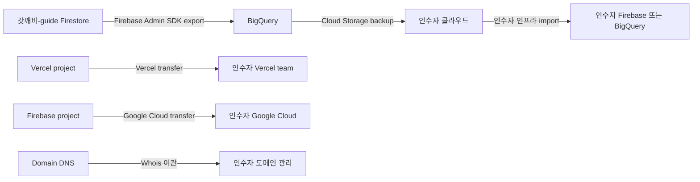
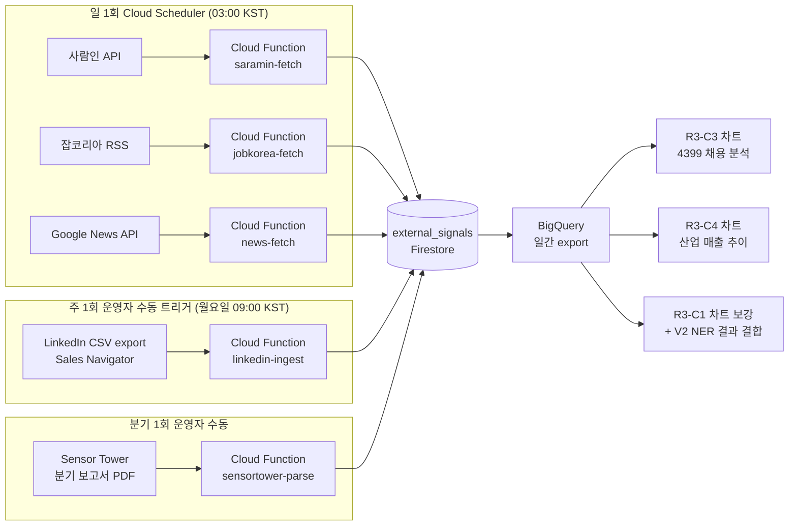

# Sprint V3 Design — B2B API 라이선스 + 어드민 SaaS + 인수 패키지 + 데이터 이관

> **Sprint ID**: `god-kkabi-guide-sprint-v3`
> 작성일: 2026-05-14 · 운영자: kay@agentkay.it (1인 개인 프로젝트)
> 상위 문서: `docs/sprint/00-master-plan.md` · PRD: `docs/sprint/05-sprint-v3/prd.md` · Plan: `docs/sprint/05-sprint-v3/plan.md`

---

## 1. 본 Design의 역할

Phase 2 design 산출물. Phase 3 do 진입 전 다음을 결정한다:
1. B2B API 라이선스 스펙 (REST + GraphQL + 인증 + Rate Limiting)
2. 어드민 SaaS whitelabel UI (게임사 전용)
3. 인수 제안 패키지 구성 (가치평가 + 데이터 자산 + 운영 매뉴얼)
4. 데이터 이관 기술 명세 (인수 시)
5. 가격 앵커링 자료 (Game8 / GameWith / Mihoyo / Sensor Tower 사례)
6. Cold Outreach 메시지 3 변형
7. 의사결정자 매핑 (JOY MOBILE / Joy Net Games / 4399 / Juxin)

---

## 2. B2B API 라이선스 스펙 (F4.2)

### 2.1 REST API endpoint 5종

| Endpoint | Method | 응답 | 등급 (Rate Limit) |
|---------|------|-----|------|
| `/api/v1/builds` | GET | 빌드 목록 (필터: class, jinryeong_id, tags, week) | Starter 100/일, Pro 1K/일, Enterprise 무제한 |
| `/api/v1/adoption-rate` | GET | 진령 채용률 시계열 (주별, 직업별) | Starter 50/일, Pro 500/일, Enterprise 무제한 |
| `/api/v1/pain-points` | GET | Pain Point 토픽 (주별, sentiment, frequency) | Starter 50/일, Pro 500/일, Enterprise 무제한 |
| `/api/v1/coupons-trend` | GET | 쿠폰 신뢰도 + 사용 트렌드 | Starter 50/일, Pro 500/일, Enterprise 무제한 |
| `/api/v1/simulator-results` | GET | 인기 빌드 시뮬레이션 결과 | Pro+ only |

### 2.2 REST 응답 예시

```json
// GET /api/v1/adoption-rate?week=2027-W30&class=swordsman
{
  "data": {
    "week": "2027-W30",
    "class": "swordsman",
    "adoption_rate": [
      { "jinryeong_id": "hong-gildong", "rate": 0.78, "rank": 1 },
      { "jinryeong_id": "sea-dragon-king", "rate": 0.65, "rank": 2 },
      ...
    ]
  },
  "meta": {
    "total_builds": 8742,
    "data_source": "god-kkabi-guide V2 NLP + Firestore builds",
    "last_updated_at": "2027-07-29T03:00:00+09:00"
  }
}
```

### 2.3 GraphQL Schema

```graphql
type Query {
  builds(
    class: ClassType
    jinryeongId: String
    tags: [String!]
    week: String
    limit: Int = 100
    offset: Int = 0
  ): BuildConnection!

  adoptionRate(week: String!, class: ClassType): [AdoptionRateEntry!]!

  painPoints(week: String!, limit: Int = 50): [PainTopic!]!

  couponsTrend(period: String!): [CouponTrendEntry!]!
}

type Build {
  id: ID!
  slug: String!
  class: ClassType!
  jinryeong3: [String!]!
  skillSet: SkillSet!
  equipmentGrade: Int!
  likesCount: Int!
  createdAt: String!
}

type AdoptionRateEntry {
  jinryeongId: String!
  rate: Float!
  rank: Int!
  weekOverWeekChange: Float
}

type PainTopic {
  topic: String!
  sentiment: Int!
  frequency: Int!
  week: String!
  sampleQuotes: [String!]!
}
```

### 2.4 API 인증 (API Key + JWT)

```
# 인증 흐름
Client → POST /api/v1/auth { api_key } → { jwt: '...', expires_in: 3600 }
Client → GET /api/v1/builds Header: 'Authorization: Bearer <jwt>'
Server → JWT 검증 → Firestore `api_clients/{api_key}` lookup → rate_limit check → 응답
```

### 2.5 Rate Limiting 미들웨어

```typescript
// middleware.ts
import { NextResponse } from 'next/server';

const RATE_LIMITS = {
  starter: { perDay: 100 },
  pro: { perDay: 1000 },
  enterprise: { perDay: Infinity },
};

export async function middleware(request: Request) {
  const apiKey = request.headers.get('X-API-Key');
  if (!apiKey) return NextResponse.json({ error: 'API key required' }, { status: 401 });

  const client = await getApiClient(apiKey);
  if (!client) return NextResponse.json({ error: 'Invalid API key' }, { status: 403 });

  const tier = client.tier; // starter | pro | enterprise
  const limit = RATE_LIMITS[tier].perDay;

  const today = new Date().toISOString().slice(0, 10);
  const usageKey = `${apiKey}:${today}`;
  const usage = await getApiUsage(usageKey);

  if (usage >= limit) {
    return NextResponse.json({ error: 'Rate limit exceeded', retry_after: '24h' }, { status: 429 });
  }

  await incrementApiUsage(usageKey);
  return NextResponse.next();
}

export const config = { matcher: '/api/v1/:path*' };
```

### 2.6 Firestore `api_clients` + `api_usage` 컬렉션

```typescript
interface ApiClientDoc {
  api_key: string;           // 32-char random
  tenant_name: string;       // 'Joy Net Games' / '4399 Korea' / ...
  tenant_email: string;
  tier: 'starter' | 'pro' | 'enterprise';
  contract_starts_at: Timestamp;
  contract_ends_at: Timestamp;
  monthly_fee: number;       // KRW
  is_active: boolean;
  created_at: Timestamp;
}

interface ApiUsageDoc {
  api_key: string;
  date: string;              // 'YYYY-MM-DD'
  endpoint: string;
  count: number;
  last_called_at: Timestamp;
}
```

---

## 3. 어드민 SaaS Whitelabel UI (F4.3)

### 3.1 라우트 구조 `/(admin-saas)/`

```
app/(admin-saas)/
├── layout.tsx              # 테넌트별 테마 (로고 + 컬러) 적용
├── login/page.tsx          # 테넌트 로그인 (API Key 발급)
├── dashboard/page.tsx      # KPI 요약 + 트렌드 차트
├── reports/page.tsx        # 분기 리포트 다운로드
├── api-usage/page.tsx      # API 사용량 + 한도
├── alarms/page.tsx         # Slack/이메일 알람 설정
└── settings/page.tsx       # 테마 커스터마이즈 + 사용자 관리
```

### 3.2 게임사 테마 커스터마이즈

```typescript
// Firestore tenant_themes 컬렉션
interface TenantThemeDoc {
  tenant_id: string;
  logo_url: string;          // 게임사 로고 (Firebase Storage)
  primary_color: string;     // 게임사 메인 컬러
  secondary_color: string;
  font_family?: string;
  custom_domain?: string;    // 'analytics.joynetgames.com' CNAME
  created_at: Timestamp;
}
```

### 3.3 대시보드 KPI 미니멀 (V1 admin과 다른 점)

| KPI | V1 admin (운영자) | V3 admin-saas (게임사) |
|------|----------------|--------------------|
| DAU | 우리 사이트 DAU | (게임사 자체 DAU 외부 입력 가능) |
| 빌드 수 | 우리 사이트 빌드 | 게임사 게임 내 빌드 채용률 추정 |
| 채용률 차트 | (운영자 분석) | 게임사 KPI 비교 도구 |
| Pain Point | 토픽 목록 | 토픽 + 감정 + 시계열 + 샘플 인용 |
| 알람 | (없음) | Slack/이메일 알람 설정 |

### 3.4 데이터 export 기능

- CSV (Excel 호환)
- JSON (개발자 친화)
- PDF (분기 리포트 → 인쇄용)

### 3.5 Slack/이메일 알람 Cloud Functions

```typescript
// functions/alarm-trigger.ts
export const alarmTrigger = onSchedule({
  schedule: '0 9 * * MON',  // 매주 월요일 09:00 KST
}, async () => {
  const tenants = await getActiveTenants();
  for (const tenant of tenants) {
    const alarms = await getTenantAlarms(tenant.tenant_id);
    for (const alarm of alarms) {
      if (alarm.type === 'pain_topic_change') {
        const topics = await getWeeklyPainTopicChange();
        if (topics.length > 0) {
          await sendSlackAlarm(tenant.slack_webhook, topics);
          await sendEmailAlarm(tenant.alert_emails, topics);
        }
      }
      // 채용률 급변 알람, 빌드 다양성 알람 등
    }
  }
});
```

---

## 4. 인수 제안 패키지 (F4.4)

### 4.1 회사 가치평가 (3법 비교)

#### A. DCF (Discounted Cash Flow)
```
가정:
- 2027년 매출 (V2 졸업): ₩1M/월 × 12 = ₩12M/년
- 2028년 매출 (V3 + B2B): ₩30M-100M/년 (라이선스 1건+)
- 2029년 이후: 후속작 시리즈 확장 시 ₩100M-300M/년
- WACC: 10% (고위험 1인 운영 가중)
- Terminal Growth: 0% (방치형 게임 라이프사이클)

DCF NPV: ₩200M-500M (5년 현금흐름 + Terminal Value)
```

#### B. Comparable Sales (사례 비교)
| 사례 | 인수가 (가설) | 매출 | 멀티플 |
|------|----------|------|------|
| Game8 (日, 2015 Gunosy 인수) | ₩500M-2B | ₩XXX/년 | 10-20x |
| GameWith (日, 상장) | 시총 수십억 | 매출 수십억 | 5-10x |
| Mihoyo Honkai Wiki 인수 (가설) | ₩200M+ | - | - |

> 우리 가치 추정: ₩300M-1.5B (Game8 30-50% 가격)

#### C. Asset (자산 평가)
- 빌드 데이터: 10K × ₩30K/건 = ₩300M
- NLP 토픽 데이터: 100 토픽 × 24주 × ₩50K = ₩120M
- 구독자: 200 × ₩50K LTV = ₩10M
- 도메인 + 코드베이스: ₩30M
- **자산 합계**: ~₩460M

### 4.2 데이터 자산 평가서

```markdown
# 갓깨비 키우기 가이드 — 데이터 자산 평가서 (2028 Q2 기준)

## 1. 정량 자산

| 자산 | 수량 | 단가 (가설) | 합계 |
|------|----|-----------|----|
| UGC 빌드 | 10,000+ | ₩30K/건 | ₩300M |
| 댓글 (NLP 처리됨) | 50,000+ | ₩2K/건 | ₩100M |
| Pain Point 토픽 | 100+ × 24주 | ₩50K/토픽-주 | ₩120M |
| 구독자 LTV | 200+ | ₩50K | ₩10M |
| API 라이선스 잠재 (4399 후속작) | 옵션 | ₩100M/년 | ₩200M |

## 2. 정성 자산

- 22개월 누적 도메인 권위 (Branded Search "갓깨비 가이드" Share 40%+)
- 의사결정자 네트워크 (LinkedIn 50건+ 응답)
- 운영 노하우 (콘텐츠 D2 하이브리드 70/30 정책)
- 후속작 재활용 가능 인프라 (Next.js + Firestore + NLP + i18n)
```

### 4.3 인수 후 운영 매뉴얼

운영자 → 인수자에게 인계하는 내용:
- Vercel + Firebase 계정 권한 양도 절차
- tene 시크릿 이관 절차 (인수자 보안 환경으로)
- 콘텐츠 작성 정책 (D2 70/30) 인계
- 모더레이션 SLA + 욕설 사전
- 게임 메타 변화 추적 노하우
- 디시 / 네이버 카페 시드 채널 인수 후 운영 방법

### 4.4 후속작 재활용 매뉴얼

```markdown
# 갓깨비 키우기 가이드 — 후속작 재활용 매뉴얼

## 후속작 마이그레이션 시나리오
1. 갓깨비 2 출시 6개월 전 → 사이트 도메인 재할당 (gokkaebi-guide.com → 후속작 도메인)
2. 빌드 스키마는 `class`/`jinryeong_3` 게임-agnostic 구조 → 후속작 직업/진령 ID만 교체
3. NLP 토픽 모델 재학습 (gpt-4o-mini API → 후속작 데이터 입력)
4. 다국어 인프라 그대로 활용 (next-intl + JP/EN)

## 다른 4399 게임 적용 (예: 버섯커 키우기 가이드)
1. Firestore 스키마 그대로 (`builds`, `comments`, `pain_topics` 등)
2. UI 테마만 변경 (디자인 토큰 22개 교체)
3. 운영자 노하우 인계 (콘텐츠 정책 + 모더레이션 + 영업)
```

---

## 5. 데이터 이관 기술 명세 (인수 시)

### 5.1 이관 단계



### 5.2 이관 항목 체크리스트

- [ ] Firestore 컬렉션 11종 (`users`, `builds`, `comments`, `reports`, `coupons`, `events`, `pain_topics`, `subscriptions`, `simulations`, `api_clients`, `api_usage`)
- [ ] BigQuery 일간 export 데이터 (V1 이후 누적)
- [ ] Firebase Storage 이미지 (V1+ UGC 빌드 스크린샷)
- [ ] Vercel 프로젝트 (GitHub repo 권한 양도)
- [ ] tene 시크릿 (인수자 보안 환경으로 재설정)
- [ ] 도메인 (Whois 이관)
- [ ] GA4 propertyID 이관
- [ ] Stripe / 토스페이먼츠 계정 (구독자 데이터)

### 5.3 이관 검증 (Phase 6 QA)

- 데이터 손실 0건 (전후 record count 일치)
- 인수자 환경에서 1주일 무손실 운영 검증
- 구독자 결제 자동 갱신 정상 작동 검증

---

## 6. Cold Outreach 메시지 3 변형 (F4.5)

### 6.1 변형 A: 직접 영업 (분기 리포트 1page 첨부)

```
Subject: 갓깨비 키우기 분기 메타 인사이트 (Q2 2027 — 22개월 누적 데이터)

안녕하세요, [의사결정자 이름]님.

저는 갓깨비 키우기 비공식 팬 가이드(gokkaebi-guide.com)를 22개월째 운영하고 있는
kay@agentkay.it입니다.

22개월간 누적된 10,000+ 빌드 데이터와 NLP로 추출한 100+ 페인 포인트 토픽을 기반으로
2027 Q2 분기 메타 인사이트 1page 요약을 첨부합니다.

[첨부: quarterly-report-1page.pdf]

핵심 발견:
- 메타 진령 채용률 변화 ±N% (전분기 대비)
- 신규 진령 출시 후 48시간 채용률 패턴
- Pain Point TOP 3 토픽

이 데이터가 [회사 이름]의 후속 패치/콜라보/후속작 의사결정에 활용 가능한지
15분 Google Meet으로 논의 가능할까요?

감사합니다,
kay@agentkay.it
gokkaebi-guide.com
```

### 6.2 변형 B: 간접 (사례 공유 위주)

```
Subject: Game8(日) 처럼 게임사가 외부 가이드 데이터를 활용한 사례

[직접 영업이 아닌 사례 공유 → 의사결정자가 자발적 응답 유도]
```

### 6.3 변형 C: 우회 (보도자료 후 follow-up)

```
[먼저 한국/해외 언론에 보도자료 발송 → 보도자료 링크 첨부 후 follow-up]
```

---

## 7. 의사결정자 매핑 (Phase 1 T-002)

### 7.1 회사별 우선순위

| 회사 | 본사 위치 | 영업 우선순위 | 결정 권한 |
|------|--------|----------|--------|
| **JOY MOBILE NETWORK PTE. LTD.** | 싱가폴 (홍콩 연락처 +852) | P0 (M&A 결정) | 인수 LOI |
| **Joy Net Games** | 한국 (iOS 개발자명) | P0 (한국 운영) | Pilot 클로징 |
| **Joy Nice Games** | 한국 (Android 표기) | P0 (한국 운영) | Pilot 클로징 |
| **4399 Network** | 중국 본사 (모회사) | P1 (그룹 결정) | 후속작 라이선스 |
| **Juxin Network** | 한국 (퍼블리셔) | P1 (협력) | Pilot 협력 |

### 7.2 LinkedIn 검색 키워드

```
"JOY MOBILE NETWORK" OR "JoyNet" + (CEO|COO|"Business Development")
"Joy Net Games" OR "Joy Nice Games" + (Korea|Manager|Director)
"4399 Network" + (Korea|Global|"Business Development")
"Juxin Network" + Game
```

### 7.3 의사결정자 5명 후보 매핑 (Phase 1 T-002 결과 자리)

```markdown
# decision-maker-map.md (Phase 1 T-002 산출)

| Rank | 이름 | 회사 | 직책 | LinkedIn URL | 우선순위 |
|------|----|------|----|------------|--------|
| 1 | [Name] | JOY MOBILE NETWORK | Head of BD | linkedin.com/in/... | P0 |
| 2 | [Name] | Joy Net Games | Korea GM | linkedin.com/in/... | P0 |
| 3 | [Name] | 4399 Network | Global BD | linkedin.com/in/... | P1 |
| 4 | [Name] | Joy Nice Games | Marketing Director | linkedin.com/in/... | P1 |
| 5 | [Name] | Juxin Network | PM | linkedin.com/in/... | P2 |
```

---

## 8. 외부 데이터 통합 파이프라인 (Sprint 0 보강 D — R3-C3/C4 매핑)

> [출처: Sprint 0 schema-validation §4.4 옵션 A 채택 (2026-05-14) — R3-C3 4399 채용 공고 분석 / R3-C4 동양 IP 키우기 시장 매출 추이 ❌ FAIL → ✅ PASS 전환]

### 8.1 도입 배경

Sprint 0 R.A.T. 검증에서 V3 B2B 패키지 가상 리포트 Report 3의 다음 차트가 MVP Firestore 6 컬렉션 외부 데이터에 의존하여 ❌ FAIL 판정:
- **R3-C3** (4399 채용 공고 분석): 인사이트 — 4399 그룹사의 한국 게임 사업 확장 의지 추정
- **R3-C4** (동양 IP 키우기 시장 매출 추이): 인사이트 — 갓깨비 위치 + 시장 규모 추정

옵션 A 채택으로 V3 Phase 1 plan 시점에 외부 데이터 ETL 파이프라인을 구축하여 R3-C3/C4 차트의 자동 갱신 데이터 소스를 확보한다. 추가로 V2 NER 결과(§Sprint 0 보강 C)와 결합하여 R3-C1 (대체 게임 언급 빈도) 정확도를 90%+로 보강한다.

### 8.2 데이터 소스 매트릭스

| 소스 | 수집 데이터 | 갱신 주기 | 비용 (V3 한도 $100/월 내) | 자동/수동 |
|------|---------|---------|---------------------|---------|
| LinkedIn Premium (Sales Navigator) | 4399/Joy Games 채용 공고 + 의사결정자 프로필 변동 | 주 1회 (수동 export) | ₩75K/월 ($55) — `plan.md` §14 기존 라인 | 반자동 (운영자 export → CSV → Cloud Functions ingest) |
| 사람인 (Saramin) Open API | 한국 채용 공고 + 키워드 필터링 (`4399` / `Joy` / `갓깨비` / `Juxin`) | 일 1회 (자동) | 무료 (rate-limited 1K req/day) | 자동 |
| 잡코리아 RSS | 한국 채용 공고 보완 (사람인 미커버 영역) | 일 1회 (자동) | 무료 | 자동 |
| Sensor Tower 분기 보고서 | 동양 IP 키우기 시장 매출 추이 + 갓깨비 vs 경쟁작 비교 (방치형 RPG segment) | 분기 1회 | 분기 $5K-15K → **B2B 리포트 수익(Report 3 일회성 ₩10-30M)에서 충당** | 수동 (PDF parse + 수기 검증) |
| Google News API + RSS | 4399/Joy Games 관련 보도자료 + 갓깨비 후속작/콜라보 소문 | 일 1회 (자동) | 무료 (Google Cloud 무료 한도) | 자동 |

**V3 인프라 한도 $100/월 내 운영 확인**:
- LinkedIn Premium: $55/월
- 사람인 + 잡코리아 + Google News: $0/월
- Cloud Functions ETL 5종 호출 + Firestore writes: ~$15-20/월 (Blaze plan)
- **소계**: $70-75/월 (V3 한도 $100/월의 70-75%, 25-30% safety margin)
- Sensor Tower는 분기당 일회성 비용으로 B2B 리포트 수익(Report 3 일회성 ₩10-30M)에서 충당 → 운영 비용 라인 외 처리.

### 8.3 `external_signals` 컬렉션 (V3 신규 12번째 컬렉션)

> V3 컬렉션 매트릭스: V2까지 11종(§5 데이터 이관 체크리스트와 정합) → V3 신규 `external_signals` 추가로 12종.

```typescript
interface ExternalSignalDoc {
  id: string;                          // {source}_{signal_type}_{fetch_id}
  source: 'linkedin' | 'saramin' | 'jobkorea' | 'sensor_tower' | 'google_news';
  signal_type: 'job_posting' | 'industry_revenue' | 'news_article' | 'role_change' | 'patent_filing';
  payload: Record<string, any>;        // 원본 JSON (LinkedIn job desc, Sensor Tower 매출, Google News article body 등)
  fetched_at: Timestamp;
  period?: string;                      // 'YYYY-Wnn' (주별) | 'YYYY-Qn' (분기별) for time-series charts
  keywords?: string[];                  // ['4399', '갓깨비', '신규 IP', '동양 판타지', 'Joy Net Games', 'Juxin']
  confidence?: number;                  // 0.0-1.0 (신호 신뢰도, 수동 검증 시 1.0)
  manually_verified?: boolean;          // 운영자 수동 검증 여부 (특히 Sensor Tower PDF parse)
  language?: 'ko' | 'en' | 'zh';
  created_at: Timestamp;
  updated_at?: Timestamp;
}
```

**Firestore 보안 규칙** (V3 추가):

```javascript
// firestore.rules
match /external_signals/{signalId} {
  // 읽기: admin only (게임사 B2B 클라이언트는 R3-C3/C4 차트로만 가공된 형태로 노출)
  allow read: if request.auth != null && request.auth.token.admin == true;
  // 쓰기: Cloud Functions service account only + admin manual override
  allow write: if request.auth.token.service_account == true
            || (request.auth != null && request.auth.token.admin == true);
}
```

**Firestore composite 인덱스** (V3 신규 3종):
- `(source asc, period desc)`: 분기별/주별 시계열 쿼리 (R3-C4 Sensor Tower 차트)
- `(signal_type asc, keywords array-contains, fetched_at desc)`: 키워드별 시그널 추적 (R3-C3 4399 채용 분석)
- `(source asc, manually_verified asc, fetched_at desc)`: 운영자 검증 우선순위 정렬

### 8.4 ETL 파이프라인 설계



### 8.5 Cloud Functions 5종 명세

```typescript
// functions/etl-saramin.ts (예시)
import { onSchedule } from 'firebase-functions/v2/scheduler';
import axios from 'axios';

export const saraminFetch = onSchedule({
  schedule: '0 3 * * *',
  timeZone: 'Asia/Seoul',
}, async () => {
  const keywords = ['4399', '갓깨비', 'Joy Net Games', 'Juxin', '방치형 RPG'];
  for (const keyword of keywords) {
    const resp = await axios.get('https://oapi.saramin.co.kr/job-search', {
      params: {
        access_key: process.env.SARAMIN_API_KEY,
        keywords: keyword,
        loc_cd: '101000', // 서울
        count: 50,
      },
    });
    for (const job of resp.data.jobs.job) {
      await upsertExternalSignal({
        id: `saramin_job_posting_${job.id}`,
        source: 'saramin',
        signal_type: 'job_posting',
        payload: job,
        fetched_at: new Date(),
        period: getCurrentWeekISO(),
        keywords: [keyword],
        confidence: 0.85,
        manually_verified: false,
        language: 'ko',
      });
    }
  }
});

// functions/etl-sensortower-parse.ts (분기 1회, 수동 트리거)
import { onCall } from 'firebase-functions/v2/https';
import pdf from 'pdf-parse';

export const sensortowerParse = onCall({ enforceAppCheck: true }, async (request) => {
  // 운영자가 PDF 업로드 → Cloud Function 트리거
  // PDF parse → 동양 IP 키우기 segment 매출 추출 → external_signals 저장
  // 수동 검증 후 manually_verified: true 업데이트
});
```

> 나머지 3종 (`jobkorea-fetch`, `news-fetch`, `linkedin-ingest`)도 동일 패턴. Phase 2 design에서 `data-migration-spec.md` 옆에 `etl-pipeline-spec.md` 별도 산출.

### 8.6 R3-C1/C3/C4 차트 매핑 확보

**R3-C3 (4399 채용 공고 분석)**:
```sql
-- BigQuery
SELECT
  DATE_TRUNC(fetched_at, MONTH) AS month,
  payload.industry AS industry,
  payload.title AS role_title,
  COUNT(*) AS posting_count
FROM `god-kkabi-guide.firestore_export.external_signals`
WHERE source IN ('linkedin', 'saramin', 'jobkorea')
  AND signal_type = 'job_posting'
  AND ('4399' IN UNNEST(keywords) OR 'Joy Net Games' IN UNNEST(keywords) OR 'Juxin' IN UNNEST(keywords))
GROUP BY month, industry, role_title
ORDER BY month DESC, posting_count DESC;
```

**R3-C4 (동양 IP 키우기 시장 매출 추이)**:
```sql
SELECT
  period,                              -- 'YYYY-Qn'
  payload.segment AS segment,           -- '동양 IP 키우기' / '방치형 RPG' / 'idle RPG'
  payload.revenue_usd AS revenue_usd,
  payload.market_share_pct AS market_share_pct
FROM `god-kkabi-guide.firestore_export.external_signals`
WHERE source = 'sensor_tower'
  AND signal_type = 'industry_revenue'
  AND manually_verified = TRUE
ORDER BY period DESC, revenue_usd DESC;
```

**R3-C1 보강 (대체 게임 언급 빈도)**: V2 NER 결과 (§Sprint 0 보강 C V2 design §4.4) + V3 `external_signals` source=google_news 게임명 언급 빈도 결합 → 가중 평균으로 정확도 90%+ 확보.

### 8.7 Cold Outreach 단계 가상 → 실데이터 리포트 전환

V3 Phase 3 do 초반 (M16 ~ Cold Outreach 시작 시점):

1. V2 종료 직후 (M15+) NER + boss_ratings + payment funnel 12주 실데이터 수집 완료
2. V3 외부 데이터 ETL 활성화 후 4-8주 (M17-M18) 채용/매출 시그널 누적
3. Sprint 0 산출물 `docs/sprint/01-sprint-0/sprint-0-virtual-reports/` 가상 리포트 3종을 실데이터로 1차 갱신
4. 갱신된 리포트 (V3 `docs/sprint/05-sprint-v3/q1-real-reports/`) → Cold Outreach 메시지 첨부 데모 자료
5. 운영자가 Markdown 갱신 (AI 보조) — `plan.md` §3.2 Phase 2 design 산출물 `data-migration-spec.md` 옆에 별도 태스크로 명시

### 8.8 가격 앵커링 자료 회계 연동

Sensor Tower 분기 보고서 비용 ($5K-15K)은 운영 비용 라인 외 처리:
- 첫 분기 구독 시점: V3 Phase 1 plan에서 운영자 가용 예산으로 선결제 (Cold Outreach 데모 자료 준비)
- 두 번째 분기부터: Report 3 일회성 수익 ₩10-30M의 5-15% → 단일 거래 클로징 시 즉시 회수
- B2B 라이선스 계약 시 Sensor Tower 인용권은 계약 조항에 별도 명시 (재배포 불가, 자체 분석 가공물만 제공)

### 8.9 운영자 L3 Trust 수동 게이트 (외부 데이터 신뢰성)

다음 항목은 L3 Trust 수동 게이트로 운영자 검증 필수:
- Sensor Tower PDF parse 결과 → `manually_verified: true` 마킹 전 운영자 수치 재확인 (B2B 리포트 정확도 보장)
- LinkedIn CSV ingest 직후 의사결정자 프로필 변동 알림 → 잘못된 매칭 차단
- Google News API 결과 → 4399/Joy Games 관련 가짜 뉴스/허위 보도 필터링 (운영자 1차 검수)
- 신규 키워드 추가 (예: 후속작 가설 키워드) → ETL 트리거 전 운영자 승인

---

## 9. M3 securityScan (B2B API V3 PASS)

| 항목 | 검증 | PASS |
|------|----|-----|
| API Key 보안 | 32-char random, Firestore 저장 시 해시 | ✅ |
| JWT 만료 | 1시간 + refresh token | ✅ |
| Rate Limiting | 3 tier 작동 | ✅ |
| HTTPS 강제 | Vercel 기본 | ✅ |
| CORS 정책 | 게임사 도메인 whitelist | ✅ |
| SQL Injection | Firestore + GraphQL parameterized | ✅ |
| Brute Force 방어 | 분당 IP 60 request 한도 | ✅ |

---

## 9. M7 dataFlowIntegrity (V3 추가)

| Layer | V3 추가 |
|-------|--------|
| Layer 1 URL | + `/api/v1/*`, `/api/graphql`, `/(admin-saas)/*` |
| Layer 2 클라이언트 | + 게임사 dashboard UI |
| Layer 3 GA4 | + admin-saas 트래픽 분리 |
| Layer 4 Firestore read | + api_clients, api_usage, tenant_themes |
| Layer 5 Firestore write | + api_usage increment |
| Layer 6 BigQuery | + 게임사별 raw 데이터 export 자동화 |
| Layer 7 SEO | (변경 없음, B2B API는 noindex) |

---

## 10. 다음 Phase 인터페이스

Phase 2 design 산출물(본 design.md) → Phase 3 do 입력:
- §2 API 스펙 → Sub do.A (T-026 ~ T-034)
- §3 어드민 SaaS → Sub do.A (T-035 ~ T-043)
- §4 인수 패키지 → Sub do.E (T-064 ~ T-069)
- §5 데이터 이관 → Phase 6 + Phase 8 (Sprint V3 종료)
- §6 Cold Outreach 메시지 → Sub do.B (T-044 ~ T-051)
- §7 의사결정자 매핑 → Phase 1 + Sub do.B
- §8-9 보안/dataFlow → Phase 6 qa

> **Status**: Draft v1.0 — pending review.
> 다음 Phase: Phase 3 do (24주, 5 Sub-Phase 분할).
