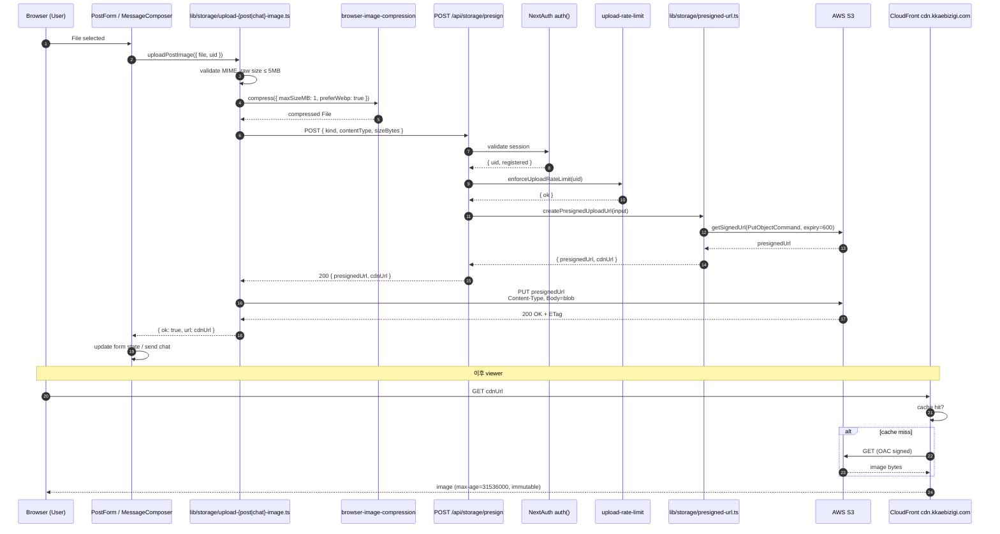
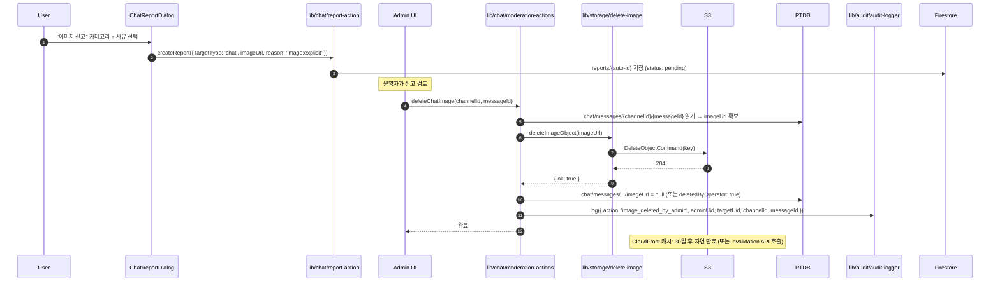

# Sprint 11 — System Design

**Sprint**: `sprint-11-images`
**상위 문서**: [prd.md](./prd.md), [plan.md](./plan.md)
**작성일**: 2026-05-17

---

## 1. Architectural Principles (불변 원칙)

### 1.1 Clean Architecture (Ports & Adapters) — Sprint 10 R1-R5 + Sprint 11 R6

Sprint 10에서 정의한 R1-R5는 그대로 유지하고, Sprint 11에서 **R6** 추가:

```
┌────────────────────────────────────────────────────────────┐
│                     UI Layer (React)                       │
│  app/**/page.tsx, components/feature/**                    │
│                                                            │
│  - 직접 Firebase SDK import 금지                          (R1) │
│  - 직접 @aws-sdk/* import 금지                            (R6) │
│  - Server Action 또는 hook을 통해서만 데이터/스토리지 접근  │
└──────────────────────────────┬─────────────────────────────┘
                               │
                               ▼  (Server Action / Route Handler)
┌────────────────────────────────────────────────────────────┐
│                Application / Domain Layer                  │
│  lib/post/*, lib/chat/*, lib/auth/*, lib/storage/* (신규)  │
│                                                            │
│  - 비즈니스 규칙 + 검증 + 워크플로우                       │
│  - Adapter를 통해서만 외부 시스템 접근                     │
└──────────────────────────────┬─────────────────────────────┘
                               │
                               ▼
┌────────────────────────────────────────────────────────────┐
│             Adapter / Infrastructure Layer                 │
│  lib/firebase/* (Sprint 10)                                │
│  lib/storage/s3-adapter.ts (Sprint 11 신규)                │
│                                                            │
│  - 외부 시스템 (Firebase, AWS S3) 격리                     │
│  - SDK / API call의 유일한 진입점                          │
└──────────────────────────────┬─────────────────────────────┘
                               │
                               ▼  (Firebase / AWS / Google / Toss API)
                          External Systems
```

**R6 (Sprint 11 신규)**: `lib/storage/*` 외부에서 `from '@aws-sdk/*'` import 금지. `scripts/audit-clean-arch.sh`로 자동 검증.

근거:
- AWS SDK는 server-only — 클라이언트 번들에 들어가면 ~500KB 증가 (deal breaker)
- presigned URL 발급은 server에서만 가능 (IAM secret 노출 방지)
- 향후 인프라 swap (예: Cloudflare R2, Vercel Blob) 시 `lib/storage/*`만 교체

### 1.2 디자인 시스템 (Sprint MVP-v2 + Sprint 10 유지)

- 22 디자인 토큰 (`app/globals.css` CSS variables + `tailwind.config.ts`)
- 이미지 컴포넌트는 동일 토큰만 사용 (`rounded-lg`, `border-ink-line`, `bg-ink-elev` 등)
- 신규 컴포넌트 0개 토큰 추가 (이미 충분)

### 1.3 컴포넌트 계층

```
components/
├── ui/                        ← shadcn/ui (불변)
├── magic-ui/                  ← (불변)
├── feature/
│   ├── post/
│   │   ├── youtube-embed.tsx
│   │   ├── link-preview.tsx
│   │   └── markdown-image.tsx     ← Sprint 11 신규 (선택, Phase C.5)
│   ├── chat/
│   │   ├── message-composer.tsx   ← Sprint 11 수정 (ImageAttach 추가)
│   │   ├── message-item.tsx       ← Sprint 11 수정 (image variant)
│   │   └── image-lightbox.tsx     ← Sprint 11 신규
│   └── post-form.tsx              ← Sprint 11 수정 (adapter 교체)
└── domain/                    ← (불변)
```

---

## 2. AWS Infrastructure Design

### 2.1 리소스 토폴로지

```
                 ┌────────────────────────┐
                 │ DNS (cdn.kkaebizigi.com)│
                 └────────────┬───────────┘
                              │ CNAME
                              ▼
                 ┌────────────────────────┐         ┌────────────────────────┐
                 │  CloudFront Distribution│        │  CloudFront Distribution│
                 │  cdn.kkaebizigi.com    │        │  cdn-staging.kkaebizigi│
                 │  (prod)                │        │  .com (staging)        │
                 └────────────┬───────────┘         └────────────┬───────────┘
                              │  OAC                              │  OAC
                              ▼                                   ▼
                 ┌────────────────────────┐         ┌────────────────────────┐
                 │  S3 bucket             │         │  S3 bucket             │
                 │  kkaebizigi-images-prod │        │  kkaebizigi-images-    │
                 │  (ap-northeast-2)      │         │  staging               │
                 │                        │         │                        │
                 │  chat/{uid}/...        │         │  (동일 prefix 구조)    │
                 │  posts/{uid}/...       │         │                        │
                 │  tmp/{uid}/...         │         │                        │
                 └────────────────────────┘         └────────────────────────┘
                              ▲                                   ▲
                              │  PUT (presigned)                  │
                              │                                   │
                 ┌────────────┴───────────┐         ┌────────────┴───────────┐
                 │  IAM user              │         │  IAM user (선택 분리)  │
                 │  kkaebizigi-app        │         │  kkaebizigi-app-stg    │
                 │  (programmatic only)   │         │                        │
                 └────────────────────────┘         └────────────────────────┘
                              ▲                                   ▲
                              │  (env)                            │
                              │                                   │
                 ┌────────────┴───────────────────────────────────┴────────┐
                 │  Vercel project — env per environment                  │
                 │  Production / Preview / Development                    │
                 └────────────────────────────────────────────────────────┘
```

### 2.2 S3 bucket 구조

```
kkaebizigi-images-{env}/
├── chat/
│   └── {uid}/
│       └── {yyyymmdd}/
│           └── {ulid}.{ext}      ← 채팅 이미지
├── posts/
│   └── {uid}/
│       └── {yyyymmdd}/
│           └── {ulid}.{ext}      ← 게시글 이미지
└── tmp/
    └── {uid}/
        └── {ulid}.{ext}          ← (선택) 업로드 실패 잔여물, 1일 lifecycle
```

**경로 설계 근거**:
- `{uid}` prefix: IAM 정책에서 사용자 격리 (현재는 단일 app user지만 향후 per-user STS 가능)
- `{yyyymmdd}`: list 효율 + 디버깅 (특정 날짜 객체 빠른 조회)
- `{ulid}.{ext}`: 충돌 방지 + 시간순 정렬 (timestamp 26자 string)
- `{ext}`: contentType에서 매핑 (`image/jpeg` → `jpg`, `image/png` → `png`, `image/webp` → `webp`, `image/gif` → `gif`)

### 2.3 IAM 정책 (최종)

```json
{
  "Version": "2012-10-17",
  "Statement": [
    {
      "Sid": "PutImageObjects",
      "Effect": "Allow",
      "Action": "s3:PutObject",
      "Resource": [
        "arn:aws:s3:::kkaebizigi-images-prod/chat/*",
        "arn:aws:s3:::kkaebizigi-images-prod/posts/*",
        "arn:aws:s3:::kkaebizigi-images-prod/tmp/*",
        "arn:aws:s3:::kkaebizigi-images-staging/chat/*",
        "arn:aws:s3:::kkaebizigi-images-staging/posts/*",
        "arn:aws:s3:::kkaebizigi-images-staging/tmp/*"
      ],
      "Condition": {
        "StringEquals": {
          "s3:x-amz-server-side-encryption": "AES256"
        }
      }
    },
    {
      "Sid": "GetDeleteImageObjects",
      "Effect": "Allow",
      "Action": ["s3:GetObject", "s3:DeleteObject"],
      "Resource": [
        "arn:aws:s3:::kkaebizigi-images-prod/chat/*",
        "arn:aws:s3:::kkaebizigi-images-prod/posts/*",
        "arn:aws:s3:::kkaebizigi-images-staging/chat/*",
        "arn:aws:s3:::kkaebizigi-images-staging/posts/*"
      ]
    }
  ]
}
```

**보안 강화**:
- `s3:x-amz-server-side-encryption=AES256` 조건 — 모든 PUT은 서버측 암호화 강제 (S3-managed key)
- bucket list 권한 없음 — 객체 enumeration 차단
- prefix-bound — 다른 prefix (예: `system/`) 접근 차단

### 2.4 Bucket Policy (CloudFront OAC만 허용)

```json
{
  "Version": "2012-10-17",
  "Statement": [
    {
      "Sid": "AllowCloudFrontServicePrincipal",
      "Effect": "Allow",
      "Principal": { "Service": "cloudfront.amazonaws.com" },
      "Action": "s3:GetObject",
      "Resource": "arn:aws:s3:::kkaebizigi-images-prod/*",
      "Condition": {
        "StringEquals": {
          "AWS:SourceArn": "arn:aws:cloudfront::<ACCOUNT_ID>:distribution/<DIST_ID_PROD>"
        }
      }
    },
    {
      "Sid": "DenyDirectS3Read",
      "Effect": "Deny",
      "Principal": "*",
      "Action": "s3:GetObject",
      "Resource": "arn:aws:s3:::kkaebizigi-images-prod/*",
      "Condition": {
        "StringNotEquals": {
          "AWS:SourceArn": "arn:aws:cloudfront::<ACCOUNT_ID>:distribution/<DIST_ID_PROD>"
        }
      }
    }
  ]
}
```

직접 S3 URL (`https://kkaebizigi-images-prod.s3.ap-northeast-2.amazonaws.com/...`)은 모두 deny — CloudFront만 GET 가능.

### 2.5 CloudFront 설정

| 항목 | prod | staging |
|---|---|---|
| Distribution ID | (생성 후 기록) | (생성 후 기록) |
| Domain | `cdn.kkaebizigi.com` | `cdn-staging.kkaebizigi.com` |
| Origin | `kkaebizigi-images-prod.s3.ap-northeast-2.amazonaws.com` | `kkaebizigi-images-staging...` |
| OAC | `kkaebizigi-images-prod-oac` | `kkaebizigi-images-staging-oac` |
| Allowed methods | GET, HEAD | 동일 |
| Viewer protocol | Redirect HTTP → HTTPS | 동일 |
| Cache policy | Managed-CachingOptimized | 동일 |
| Response headers policy | Managed-CORS-With-Preflight + custom `Cache-Control: public, max-age=31536000, immutable` | 동일 |
| Compression | Auto (gzip, brotli) | 동일 |
| WAF | None (Phase E 이후 검토) | None |
| SSL | ACM us-east-1 cert (`*.kkaebizigi.com` 와일드카드 또는 SAN) | 동일 cert |
| Price class | PriceClass_200 (asia + EU + US) | PriceClass_100 (US/EU only — 비용 절감) |

### 2.6 Lifecycle Policy

```json
{
  "Rules": [
    {
      "ID": "expire-tmp-1d",
      "Status": "Enabled",
      "Filter": { "Prefix": "tmp/" },
      "Expiration": { "Days": 1 },
      "AbortIncompleteMultipartUpload": { "DaysAfterInitiation": 1 }
    },
    {
      "ID": "ia-30d-chat",
      "Status": "Enabled",
      "Filter": { "Prefix": "chat/" },
      "Transitions": [
        { "Days": 30, "StorageClass": "STANDARD_IA" },
        { "Days": 180, "StorageClass": "GLACIER_IR" }
      ]
    },
    {
      "ID": "ia-30d-posts",
      "Status": "Enabled",
      "Filter": { "Prefix": "posts/" },
      "Transitions": [
        { "Days": 30, "StorageClass": "STANDARD_IA" }
      ]
    }
  ]
}
```

**근거**:
- `tmp/` 1일: 업로드 실패 또는 abandoned multi-part 자동 정리 → 비용 누출 방지
- `chat/` 30일 IA / 180일 Glacier IR: 채팅 이미지는 시간 경과 후 거의 재요청 안 됨
- `posts/` 30일 IA: 인기 게시글은 30일 이전 자주 조회 (Standard 유지), 30일 후 IA (50% 비용 절감)

---

## 3. Presigned URL Flow (Sequence Diagram)



### 3.1 Error 케이스 시퀀스

```
User → presign API → 401 (no session)            → toast "로그인 필요"
User → presign API → 403 (not registered)        → toast "등록 완료 후 이용"
User → presign API → 429 (rate limit)            → toast "잠시 후 다시 시도"
User → presign API → 400 (MIME 거부)             → toast "JPG/PNG/WebP/GIF만 허용"
User → presign API → 500 (S3 SDK error)          → Sentry capture + toast "일시적 오류"
User → S3 PUT → 403 (presigned 만료)             → 1회 자동 retry (새 presign)
User → S3 PUT → 5xx                              → 1회 자동 retry + 실패 시 사용자 retry
```

---

## 4. Storage Adapter Design

### 4.1 모듈 구조

```
lib/storage/
├── s3-adapter.ts                    ← S3Client singleton + env reader (server-only)
├── presigned-url.ts                 ← createPresignedUploadUrl (server-only)
├── upload-rate-limit.ts             ← Firestore counter (server-only)
├── upload-post-image.ts             ← client wrapper (post)
├── upload-chat-image.ts             ← client wrapper (chat)
├── delete-image.ts                  ← admin moderation (server-only)
├── types.ts                         ← 공통 타입
└── __tests__/
    ├── presigned-url.test.ts
    ├── upload-rate-limit.test.ts
    └── adapter.test.ts
```

### 4.2 핵심 타입 (`lib/storage/types.ts`)

```typescript
export type ImageKind = 'post' | 'chat';

export type AllowedMime =
  | 'image/jpeg'
  | 'image/png'
  | 'image/webp'
  | 'image/gif';

export interface PresignRequestInput {
  readonly kind: ImageKind;
  readonly uid: string;
  readonly contentType: AllowedMime;
  readonly sizeBytes: number;
  /** chat일 때만 — 권한 검증용 */
  readonly channelId?: string;
}

export interface PresignResult {
  readonly presignedUrl: string;   // S3 PUT URL (10분 만료)
  readonly cdnUrl: string;         // CloudFront viewer URL (영구)
  readonly objectKey: string;      // S3 key (audit log용)
  readonly expiresInSeconds: 600;
  readonly headers: Readonly<{
    'Content-Type': AllowedMime;
  }>;
}

export type UploadError =
  | 'UNSUPPORTED_TYPE'
  | 'TOO_LARGE_BEFORE_COMPRESS'
  | 'COMPRESS_FAILED'
  | 'PRESIGN_FAILED'
  | 'RATE_LIMIT_EXCEEDED'
  | 'UNAUTHENTICATED'
  | 'NOT_REGISTERED'
  | 'S3_PUT_FAILED';

export type UploadResult<TOk extends object = { url: string }> =
  | ({ readonly ok: true } & TOk)
  | { readonly ok: false; readonly error: UploadError; readonly message?: string };
```

### 4.3 `lib/storage/s3-adapter.ts` (요지)

```typescript
import 'server-only';
import { S3Client } from '@aws-sdk/client-s3';

let cachedClient: S3Client | null = null;

export function getS3Client(): S3Client {
  if (cachedClient) return cachedClient;
  const region = process.env.AWS_S3_REGION;
  const accessKeyId = process.env.AWS_S3_ACCESS_KEY_ID;
  const secretAccessKey = process.env.AWS_S3_SECRET_ACCESS_KEY;
  if (!region || !accessKeyId || !secretAccessKey) {
    throw new Error('AWS_S3_* env not configured');
  }
  cachedClient = new S3Client({
    region,
    credentials: { accessKeyId, secretAccessKey },
    // forcePathStyle false (default) — virtual-hosted style
  });
  return cachedClient;
}

export function getBucket(): string {
  const b = process.env.AWS_S3_BUCKET;
  if (!b) throw new Error('AWS_S3_BUCKET env not configured');
  return b;
}

export function getCdnBaseUrl(): string {
  const u = process.env.NEXT_PUBLIC_CDN_URL;
  if (!u) throw new Error('NEXT_PUBLIC_CDN_URL env not configured');
  return u.replace(/\/$/, '');
}
```

### 4.4 `lib/storage/presigned-url.ts` (요지)

```typescript
import 'server-only';
import crypto from 'node:crypto';
import { PutObjectCommand } from '@aws-sdk/client-s3';
import { getSignedUrl } from '@aws-sdk/s3-request-presigner';
import { getS3Client, getBucket, getCdnBaseUrl } from './s3-adapter';
import type { PresignRequestInput, PresignResult, AllowedMime } from './types';

const ALLOWED_MIME = new Set<AllowedMime>([
  'image/jpeg',
  'image/png',
  'image/webp',
  'image/gif',
]);

const MIME_TO_EXT: Record<AllowedMime, string> = {
  'image/jpeg': 'jpg',
  'image/png': 'png',
  'image/webp': 'webp',
  'image/gif': 'gif',
};

const MAX_SIZE_BYTES = 5 * 1024 * 1024;  // 5MB
const EXPIRES_IN = 600;                  // 10분

export async function createPresignedUploadUrl(
  input: PresignRequestInput,
): Promise<PresignResult> {
  // 1. 입력 검증
  if (!ALLOWED_MIME.has(input.contentType)) {
    throw new Error(`UNSUPPORTED_TYPE: ${input.contentType}`);
  }
  if (input.sizeBytes > MAX_SIZE_BYTES) {
    throw new Error(`SIZE_EXCEEDED: ${input.sizeBytes}`);
  }
  if (!/^[a-zA-Z0-9_-]{1,128}$/.test(input.uid)) {
    throw new Error(`INVALID_UID`);
  }

  // 2. 경로 생성
  const ext = MIME_TO_EXT[input.contentType];
  const now = new Date();
  const yyyymmdd =
    `${now.getUTCFullYear()}` +
    `${String(now.getUTCMonth() + 1).padStart(2, '0')}` +
    `${String(now.getUTCDate()).padStart(2, '0')}`;
  const id = ulidLite();  // 26자 ULID
  const objectKey = `${input.kind}/${input.uid}/${yyyymmdd}/${id}.${ext}`;

  // 3. presign
  const client = getS3Client();
  const command = new PutObjectCommand({
    Bucket: getBucket(),
    Key: objectKey,
    ContentType: input.contentType,
    ServerSideEncryption: 'AES256',
    Metadata: { uid: input.uid, kind: input.kind },
  });
  const presignedUrl = await getSignedUrl(client, command, { expiresIn: EXPIRES_IN });

  // 4. CDN URL 조합
  const cdnUrl = `${getCdnBaseUrl()}/${objectKey}`;

  return {
    presignedUrl,
    cdnUrl,
    objectKey,
    expiresInSeconds: EXPIRES_IN,
    headers: { 'Content-Type': input.contentType },
  };
}

function ulidLite(): string {
  // 단순 ULID 생성 (timestamp + 16 random hex)
  // 외부 라이브러리 회피 — 시간 정렬 가능 ID만 보장
  const ts = Date.now().toString(36).padStart(10, '0');
  const rand = crypto.randomBytes(8).toString('hex');
  return `${ts}${rand}`;
}
```

### 4.5 `app/api/storage/presign/route.ts` (요지)

```typescript
import { NextResponse } from 'next/server';
import { z } from 'zod';
import { auth } from '@/lib/auth/auth';
import { createPresignedUploadUrl } from '@/lib/storage/presigned-url';
import { enforceUploadRateLimit } from '@/lib/storage/upload-rate-limit';

const BodySchema = z.object({
  kind: z.enum(['post', 'chat']),
  contentType: z.enum(['image/jpeg', 'image/png', 'image/webp', 'image/gif']),
  sizeBytes: z.number().int().positive().max(5 * 1024 * 1024),
  channelId: z.string().min(1).max(64).optional(),
});

export async function POST(req: Request): Promise<NextResponse> {
  // 1. auth
  const session = await auth();
  if (!session?.user?.id) {
    return NextResponse.json({ error: 'UNAUTHENTICATED' }, { status: 401 });
  }
  if (!session.user.registered) {
    return NextResponse.json({ error: 'NOT_REGISTERED' }, { status: 403 });
  }
  if (session.user.role === 'banned') {
    return NextResponse.json({ error: 'BANNED' }, { status: 403 });
  }

  // 2. body parse
  let body: unknown;
  try {
    body = await req.json();
  } catch {
    return NextResponse.json({ error: 'INVALID_JSON' }, { status: 400 });
  }
  const parsed = BodySchema.safeParse(body);
  if (!parsed.success) {
    return NextResponse.json(
      { error: 'VALIDATION_FAILED', issues: parsed.error.issues },
      { status: 400 },
    );
  }

  // 3. rate limit
  const rate = await enforceUploadRateLimit(session.user.id);
  if (!rate.ok) {
    return NextResponse.json(
      { error: 'RATE_LIMIT_EXCEEDED', retryAfterMs: rate.retryAfterMs },
      { status: 429 },
    );
  }

  // 4. (chat) channel 권한 검증 — Sprint 10 canAccessChannel 재사용
  if (parsed.data.kind === 'chat' && parsed.data.channelId) {
    const { canAccessChannel } = await import('@/lib/chat/channel-permission');
    const allowed = canAccessChannel(parsed.data.channelId, {
      role: session.user.role ?? 'user',
      serverId: session.user.serverId,
      munpaId: session.user.munpaId,
    });
    if (!allowed) {
      return NextResponse.json({ error: 'CHANNEL_FORBIDDEN' }, { status: 403 });
    }
  }

  // 5. presign
  try {
    const result = await createPresignedUploadUrl({
      kind: parsed.data.kind,
      uid: session.user.id,
      contentType: parsed.data.contentType,
      sizeBytes: parsed.data.sizeBytes,
      ...(parsed.data.channelId ? { channelId: parsed.data.channelId } : {}),
    });
    return NextResponse.json({
      presignedUrl: result.presignedUrl,
      cdnUrl: result.cdnUrl,
      expiresInSeconds: result.expiresInSeconds,
    });
  } catch (err) {
    return NextResponse.json(
      { error: 'PRESIGN_FAILED', message: err instanceof Error ? err.message : 'unknown' },
      { status: 500 },
    );
  }
}
```

### 4.6 `lib/storage/upload-post-image.ts` (요지 — 클라이언트)

```typescript
'use client';

import imageCompression from 'browser-image-compression';
import type { UploadResult, AllowedMime } from './types';

const ALLOWED: ReadonlySet<AllowedMime> = new Set([
  'image/jpeg', 'image/png', 'image/webp', 'image/gif',
]);
const MAX_RAW = 5 * 1024 * 1024;  // 5MB

export interface UploadPostImageInput {
  readonly file: File;
  readonly uid: string;
  readonly index: number;
  readonly onProgress?: (pct: number) => void;
}

export async function uploadPostImage(
  input: UploadPostImageInput,
): Promise<UploadResult> {
  if (!ALLOWED.has(input.file.type as AllowedMime)) {
    return { ok: false, error: 'UNSUPPORTED_TYPE' };
  }
  if (input.file.size > MAX_RAW) {
    return { ok: false, error: 'TOO_LARGE_BEFORE_COMPRESS' };
  }

  // 1. 압축 (GIF는 원본 유지)
  let compressed: File;
  try {
    if (input.file.type === 'image/gif') {
      compressed = input.file;
    } else {
      compressed = await imageCompression(input.file, {
        maxSizeMB: 1,
        maxWidthOrHeight: 1920,
        useWebWorker: true,
        fileType: 'image/webp',   // Sprint 11: WebP 우선
        initialQuality: 0.8,
      });
    }
  } catch (err) {
    return {
      ok: false,
      error: 'COMPRESS_FAILED',
      message: err instanceof Error ? err.message : 'unknown',
    };
  }

  input.onProgress?.(20);

  // 2. presign 요청
  let presignBody: { presignedUrl: string; cdnUrl: string };
  try {
    const presignRes = await fetch('/api/storage/presign', {
      method: 'POST',
      headers: { 'Content-Type': 'application/json' },
      body: JSON.stringify({
        kind: 'post',
        contentType: compressed.type,
        sizeBytes: compressed.size,
      }),
    });
    if (!presignRes.ok) {
      const err = await presignRes.json().catch(() => ({}));
      const code = err.error as string | undefined;
      if (code === 'UNAUTHENTICATED') return { ok: false, error: 'UNAUTHENTICATED' };
      if (code === 'NOT_REGISTERED') return { ok: false, error: 'NOT_REGISTERED' };
      if (code === 'RATE_LIMIT_EXCEEDED') return { ok: false, error: 'RATE_LIMIT_EXCEEDED' };
      return { ok: false, error: 'PRESIGN_FAILED', message: code };
    }
    presignBody = await presignRes.json();
  } catch (err) {
    return { ok: false, error: 'PRESIGN_FAILED', message: err instanceof Error ? err.message : 'unknown' };
  }

  input.onProgress?.(40);

  // 3. S3 PUT
  try {
    const putRes = await fetch(presignBody.presignedUrl, {
      method: 'PUT',
      headers: { 'Content-Type': compressed.type },
      body: compressed,
    });
    if (!putRes.ok) {
      return { ok: false, error: 'S3_PUT_FAILED', message: `HTTP ${putRes.status}` };
    }
  } catch (err) {
    return { ok: false, error: 'S3_PUT_FAILED', message: err instanceof Error ? err.message : 'unknown' };
  }

  input.onProgress?.(100);
  return { ok: true, url: presignBody.cdnUrl };
}
```

`upload-chat-image.ts`는 거의 동일 — input에 `channelId` 추가 + `kind: 'chat'` 전송. 압축은 `maxWidthOrHeight: 1600` (채팅은 약간 작은 크기).

### 4.7 `lib/storage/delete-image.ts` (admin moderation)

```typescript
import 'server-only';
import { DeleteObjectCommand } from '@aws-sdk/client-s3';
import { getS3Client, getBucket } from './s3-adapter';

/** CDN URL에서 S3 key 추출. */
export function extractObjectKey(cdnUrl: string): string | null {
  const base = process.env.NEXT_PUBLIC_CDN_URL ?? '';
  if (!cdnUrl.startsWith(base)) return null;
  return cdnUrl.slice(base.length + 1);  // base + '/' 제거
}

export async function deleteImageObject(cdnUrl: string): Promise<{ ok: boolean }> {
  const key = extractObjectKey(cdnUrl);
  if (!key) return { ok: false };
  const client = getS3Client();
  await client.send(new DeleteObjectCommand({ Bucket: getBucket(), Key: key }));
  return { ok: true };
}
```

---

## 5. Post Image Upload Component Design

### 5.1 PostForm `handleImageAdd` 흐름 (수정 후)

```
[User] 파일 선택 (input[type=file])
   │
   ▼
[PostForm.handleImageAdd]
   ├─ POST_LIMITS.images.max(3) 검사 → 초과 시 toast 에러 + return
   ├─ setUploadingIndex(currentCount) → progress UI 활성
   │
   ├─ uploadPostImage({ file, uid: authorUid, index, onProgress })
   │     │
   │     ▼
   │   (lib/storage/upload-post-image.ts 흐름 — §4.6 시퀀스)
   │     │
   │     ▼
   ├─ result.ok ? 
   │     ├─ form.setValue('imageUrls', [...imageUrls, result.url])
   │     ├─ (옵션) 본문 caret 위치에  삽입
   │     └─ toast "이미지가 추가되었습니다"
   │   : 에러 매핑 toast
   │
   └─ setUploadingIndex(null) + file input reset
```

### 5.2 PostForm state machine

```
        ┌──────────┐
        │   idle   │
        └────┬─────┘
             │ user picks file
             ▼
        ┌──────────┐
        │ validating │  (MIME / size check)
        └────┬─────┘
             │ valid
             ▼
        ┌──────────┐
        │ compressing │  (browser-image-compression, ~1.5s)
        └────┬─────┘
             │
             ▼
        ┌──────────┐
        │ presigning │  (POST /api/storage/presign, ~200ms)
        └────┬─────┘
             │
             ▼
        ┌──────────┐
        │ uploading │  (PUT to S3, ~2~3s on 4G)
        └────┬─────┘
             │
       ┌─────┴──────┐
       ▼            ▼
   ┌────────┐  ┌──────────┐
   │ success │  │ error    │
   └────┬───┘  └────┬─────┘
        │           │ retry / cancel
        ▼           │
   imageUrls       idle
   updated
```

### 5.3 모바일 vs 데스크탑

| viewport | 첨부 영역 | 카메라 capture |
|---|---|---|
| < 640px (mobile) | 1열 grid, 썸네일 96×96, 진행 bar 가로 100% | `capture="environment"` (후면 카메라 우선) |
| 640~768px | 2열 grid | 동일 |
| ≥ 768px | 3열 grid | capture 무시 (브라우저 파일 picker) |

### 5.4 markdown 자동 삽입 (선택, AC3.7)

```typescript
function insertMarkdownAtCaret(
  textarea: HTMLTextAreaElement,
  url: string,
): void {
  const start = textarea.selectionStart;
  const end = textarea.selectionEnd;
  const before = textarea.value.slice(0, start);
  const after = textarea.value.slice(end);
  // 줄 시작에 들어가도록 보장 — 현재 줄 비어있지 않으면 줄바꿈 prepend
  const needsLineBreakBefore = start > 0 && before[before.length - 1] !== '\n';
  const insertion = `${needsLineBreakBefore ? '\n' : ''}\n`;
  textarea.value = before + insertion + after;
  // dispatch input event for react-hook-form
  const event = new Event('input', { bubbles: true });
  textarea.dispatchEvent(event);
  // caret 위치 복구
  const newPos = start + insertion.length;
  textarea.setSelectionRange(newPos, newPos);
}
```

---

## 6. Chat Image Upload Component Design

### 6.1 MessageComposer 수정 후 구조

```
┌────────────────────────────────────────────────────┐
│ MessageComposer                                    │
│                                                    │
│ [pending link preview row]                         │
│                                                    │
│ [attached image preview row]   ← Sprint 11 신규    │
│  ┌──────────────┐  X                               │
│  │ thumb h-16   │  progress 100%                   │
│  └──────────────┘                                  │
│                                                    │
│ ┌──┬───────────────────────────────────┬──┐        │
│ │📎│ textarea (auto-resize)             │▶ │        │
│ └──┴───────────────────────────────────┴──┘        │
│  ↑                                                 │
│  ImagePlus 버튼 (Sprint 11 신규)                   │
│                                                    │
│ [rate limit hint]                  [char count]    │
└────────────────────────────────────────────────────┘
```

### 6.2 state 확장

```typescript
const [text, setText] = useState('');
const [pendingLinkPreview, setPendingLinkPreview] = useState<LinkPreviewMeta | null>(null);
const [previewFetching, setPreviewFetching] = useState(false);
// Sprint 11 신규:
const [attachedImage, setAttachedImage] = useState<{
  cdnUrl: string;
  uploading: boolean;
  progress: number;
} | null>(null);
const imageInputRef = useRef<HTMLInputElement>(null);
```

### 6.3 ImageAttach 핸들러

```typescript
async function handleImagePick(file: File) {
  if (attachedImage) return;  // 1회 1장 정책
  setAttachedImage({ cdnUrl: '', uploading: true, progress: 0 });
  const result = await uploadChatImage({
    file,
    channelId,
    uid: author.uid,
    onProgress: (pct) =>
      setAttachedImage((prev) => prev ? { ...prev, progress: pct } : prev),
  });
  if (result.ok) {
    setAttachedImage({ cdnUrl: result.url, uploading: false, progress: 100 });
  } else {
    const msg = ERROR_MESSAGES[result.error] ?? '업로드 실패';
    toast.error(msg);
    setAttachedImage(null);
  }
}

function handleImageRemove() {
  setAttachedImage(null);
}
```

### 6.4 handleSend 확장

```typescript
function handleSend() {
  if (disabled) return;
  const trimmed = text.trim();
  // text 또는 image 중 하나는 있어야 전송
  if (!trimmed && !attachedImage?.cdnUrl) return;
  // ... (rate limit, masking 등 기존 흐름)

  startTransition(async () => {
    // server-side rate limit
    const limit = await enforceChatRateLimit();
    if (!limit.ok) {
      // ... 에러 처리
      return;
    }

    const result = await sendChatMessage({
      channelId,
      content: trimmed,
      ...(attachedImage?.cdnUrl ? { imageUrl: attachedImage.cdnUrl } : {}),
      ...(payloadPreview ? { linkPreview: payloadPreview } : {}),
      author,
    });
    if (result.ok) {
      rateLimit.markSent();
      setText('');
      setPendingLinkPreview(null);
      setAttachedImage(null);   // Sprint 11 신규
      void logEvent('chat_send', {
        channel_kind: channelKindOf(channelId),
        has_image: attachedImage?.cdnUrl ? 1 : 0,   // Sprint 11 — 활성화
        masked_count: containsBadWord(trimmed) ? 1 : 0,
        has_link_preview: payloadPreview ? 1 : 0,
      });
    } else {
      // 에러 처리
    }
  });
}
```

### 6.5 MessageItem image variant

```tsx
{variant.type === 'image' ? (
  <button
    type="button"
    onClick={() => setLightboxOpen(true)}
    className={cn(
      'overflow-hidden rounded-2xl border border-ink-line',
      'max-w-xs sm:max-w-sm',
      isOwn && 'self-end',
    )}
    aria-label={`${message.authorNickname}님이 보낸 이미지 — 클릭하여 크게 보기`}
  >
    <Image
      src={variant.imageUrl}
      alt={`${message.authorNickname}님이 보낸 이미지`}
      width={400}
      height={400}
      className="max-h-64 w-auto object-contain"
      sizes="(max-width: 640px) 80vw, 400px"
      loading="lazy"
    />
  </button>
) : variant.type === 'link' ? (
  // 기존 link 분기
) : ...}
{variant.type === 'image' && variant.content ? (
  <p className="mt-1 whitespace-pre-wrap break-words text-sm">{variant.content}</p>
) : null}

<ImageLightbox
  open={lightboxOpen}
  onOpenChange={setLightboxOpen}
  imageUrl={variant.type === 'image' ? variant.imageUrl : null}
  alt={`${message.authorNickname}님이 보낸 이미지`}
/>
```

### 6.6 ImageLightbox 컴포넌트

```tsx
'use client';
import * as Dialog from '@radix-ui/react-dialog';
import { X } from 'lucide-react';

interface ImageLightboxProps {
  readonly open: boolean;
  readonly onOpenChange: (v: boolean) => void;
  readonly imageUrl: string | null;
  readonly alt: string;
}

export function ImageLightbox({ open, onOpenChange, imageUrl, alt }: ImageLightboxProps) {
  return (
    <Dialog.Root open={open} onOpenChange={onOpenChange}>
      <Dialog.Portal>
        <Dialog.Overlay className="fixed inset-0 z-50 bg-black/80 backdrop-blur-sm" />
        <Dialog.Content
          className={cn(
            'fixed left-1/2 top-1/2 z-50 -translate-x-1/2 -translate-y-1/2',
            'max-h-[90vh] max-w-[95vw] outline-none',
            'animate-in fade-in zoom-in-95',
          )}
          aria-describedby={undefined}
        >
          <Dialog.Title className="sr-only">이미지 크게 보기</Dialog.Title>
          {imageUrl ? (
            
          ) : null}
          <Dialog.Close
            className={cn(
              'absolute right-2 top-2 rounded-full bg-ink-card-strong/80 p-2',
              'text-text-soft hover:text-text focus:outline-none focus:ring-2 focus:ring-bronze',
            )}
            aria-label="닫기"
          >
            <X className="h-5 w-5" />
          </Dialog.Close>
        </Dialog.Content>
      </Dialog.Portal>
    </Dialog.Root>
  );
}
```

### 6.7 message-variant resolver — image 케이스 (`lib/chat/message-variant.ts`)

```typescript
export type MessageVariant =
  | { type: 'text'; content: string }
  | { type: 'link'; content: string; linkPreview: LinkPreviewMeta }
  | { type: 'image'; imageUrl: string; content?: string }     // Sprint 11 신규
  | { type: 'deleted'; reason: 'self' | 'operator' | 'hidden' };

export function resolveMessageVariant(m: ChatMessage): MessageVariant {
  // 우선순위: deleted > image > link > text
  if (m.deletedByOperator) return { type: 'deleted', reason: 'operator' };
  if (m.hidden && !m.keptByOperator) return { type: 'deleted', reason: 'hidden' };
  if (m.imageUrl) {
    return {
      type: 'image',
      imageUrl: m.imageUrl,
      ...(m.content ? { content: m.content } : {}),
    };
  }
  if (m.linkPreview) {
    return { type: 'link', content: m.content, linkPreview: m.linkPreview };
  }
  return { type: 'text', content: m.content };
}
```

회귀 테스트 케이스 (`message-variant.test.ts`):
1. text only → text variant
2. text + linkPreview → link variant
3. imageUrl only → image variant (content undefined)
4. imageUrl + content → image variant (content present)
5. deletedByOperator → deleted/operator (image 무시)
6. hidden + !keptByOperator → deleted/hidden
7. hidden + keptByOperator → text/image/link variant (deleted 아님)

---

## 7. Image Optimization Strategy

### 7.1 클라이언트 측 — `browser-image-compression`

| 입력 | 변환 | 출력 |
|---|---|---|
| JPEG (5MB, 4000×3000) | WebP, maxSizeMB=1, maxWidthOrHeight=1920 | WebP ~600KB, 1920×1440 |
| PNG (10MB, 3000×2000) | WebP, 동일 옵션 | WebP ~400KB |
| WebP (이미 작음) | 재인코딩 (EXIF strip 보장) | WebP ~동일 크기 |
| GIF (애니메이션) | 원본 유지 (압축 시 첫 프레임만 — 손실) | 원본 ≤ 5MB |

옵션:
- `useWebWorker: true` — main thread 차단 방지
- `initialQuality: 0.8` — 시각적 손실 최소화
- `alwaysKeepResolution: false` — 1920px 초과 시 축소

### 7.2 EXIF 자동 제거

`browser-image-compression`이 canvas로 re-encode하면 EXIF가 자연스럽게 제거된다. 다만 옵션 의존성 회피를 위해 명시 검증:

```typescript
// L1 unit test
test('GPS EXIF removed after compression', async () => {
  const fileWithExif = await loadFixture('with-gps.jpg');
  const compressed = await imageCompression(fileWithExif, { /* ... */ });
  const exif = await readExif(compressed);
  expect(exif.GPSLatitude).toBeUndefined();
  expect(exif.GPSLongitude).toBeUndefined();
});
```

### 7.3 서버 측 — CloudFront response transform (선택)

**1차 launch에서 제외** (클라이언트 압축으로 충분). 다음 Sprint 검토:
- Lambda@Edge `viewer-response` trigger
- `Accept: image/avif` 헤더 감지 → Sharp로 AVIF 변환 + 캐시
- 비용 trade-off: Lambda 호출 비용 vs storage 절감

### 7.4 `next/image` 적용

```tsx
<Image
  src={imageUrl}
  alt={alt}
  width={400}
  height={300}
  sizes="(max-width: 640px) 80vw, 400px"
  loading="lazy"
  // CSP에 cdn.kkaebizigi.com 포함됨
/>
```

`next.config.ts`:
```typescript
images: {
  remotePatterns: [
    { protocol: 'https', hostname: 'cdn.kkaebizigi.com' },
    { protocol: 'https', hostname: 'cdn-staging.kkaebizigi.com' },
    { protocol: 'https', hostname: 'lh3.googleusercontent.com' },
    { protocol: 'https', hostname: 'i.ytimg.com' },
    // firebasestorage는 phase-out 기간 유지 (다음 Sprint에서 제거)
    { protocol: 'https', hostname: 'firebasestorage.googleapis.com' },
  ],
  formats: ['image/avif', 'image/webp'],  // next/image 자동 변환
},
```

---

## 8. Security Design

### 8.1 위협 모델 + 대응

| Threat | Vector | Mitigation |
|---|---|---|
| T1. IAM key 노출 | env leak / git accident | Vercel encrypted env. `.env.example` placeholder only. `.gitignore`에 `.env*` (Sprint 10 적용). 3개월 rotation |
| T2. Presigned URL re-use | URL을 공유받은 타인의 PUT | presigned URL은 1회 PUT만 의미 있음 (S3가 ETag 차이로 식별 가능). path에 uid 포함 → 다른 uid는 본인 경로 못 봄. expiry 10분 |
| T3. MIME spoofing | "image/jpeg" header + 악성 JS payload | (a) 클라이언트 Magic number 검증 (옵션) (b) S3는 Content-Type만 신뢰. CSP `script-src 'self'` 이미 적용 → CDN 스크립트 실행 불가 (c) 신고/모더레이션 시스템으로 사후 대응 |
| T4. Path traversal | uid 또는 filename 조작 | uid는 NextAuth session에서만 (사용자 입력 0). filename은 ULID 자동 생성. 정규식 `/^[a-zA-Z0-9_-]+$/` 강제 |
| T5. 무한 업로드 (비용 DoS) | bot 가입 → 대량 PUT | rate limit (분 10 / 시 50) + Sprint 10 sign-up 단계의 reCAPTCHA + AWS Budget cutoff |
| T6. Public bucket 노출 | bucket policy 오설정 | block public access ON + bucket policy: CloudFront OAC 외 deny |
| T7. EXIF GPS 누출 | 사용자가 위치 정보 포함 사진 업로드 | 클라이언트 압축 단계 canvas re-encode → EXIF 자동 제거. L1 test 보장 |
| T8. CSRF — presign endpoint | 타 도메인에서 POST | NextAuth session cookie SameSite=Lax + presign endpoint Content-Type=application/json (cors preflight) |
| T9. DDoS | 대량 인증 요청 → 비용 폭증 | Vercel rate limit (built-in) + 향후 CloudFront WAF rule |
| T10. CloudFront cache poisoning | 잘못된 응답 캐싱 | path 자체가 unique (ULID) — same URL 다른 응답 불가. immutable Cache-Control |

### 8.2 RTDB rules — imageUrl regex 업데이트

`database.rules.json` 수정 부분 (Phase D.6):

```json
"imageUrl": {
  ".validate": "!newData.exists() || (newData.isString() && newData.val().matches(/^https:\\/\\/cdn(-staging)?\\.kkaebizigi\\.com\\//))"
}
```

**검증**:
- 정상: `https://cdn.kkaebizigi.com/chat/uid/20260517/abc.webp` → PASS
- 정상: `https://cdn-staging.kkaebizigi.com/...` → PASS (staging)
- 거부: `https://attacker.com/x.jpg` → DENIED
- 거부: `https://firebasestorage.googleapis.com/...` → DENIED (마이그레이션 완료 후 — 그러나 Sprint 10 사용자 데이터 0건 가정)

### 8.3 Firestore rules — posts.imageUrls

기존 `firestore.rules`의 `posts` create/update에 별도 imageUrl regex 없음 — `lib/post/schema.ts`의 Zod schema(`STORAGE_URL_RE`)가 진실원. Server Action `createPost` / `updatePost`가 parse 단계에서 거부.

**개선 (선택)**: `firestore.rules`에도 정규식 추가 → 클라이언트 SDK 직접 쓰기 차단 (현재 Server Action만 사용하므로 불필요).

### 8.4 CSP `img-src` 업데이트

`next.config.ts` headers():

```typescript
{
  key: 'Content-Security-Policy',
  value: [
    "default-src 'self'",
    "img-src 'self' " +
      "https://lh3.googleusercontent.com " +
      "https://i.ytimg.com " +
      "https://cdn.kkaebizigi.com " +
      "https://cdn-staging.kkaebizigi.com " +
      "https://firebasestorage.googleapis.com " +  // phase-out
      "data: blob:",
    "connect-src 'self' " +
      "https://*.firebasedatabase.app " +
      "https://firestore.googleapis.com " +
      "https://identitytoolkit.googleapis.com " +
      "https://securetoken.googleapis.com " +
      "https://*.s3.ap-northeast-2.amazonaws.com " +  // PUT (presigned)
      "https://cdn.kkaebizigi.com " +
      "https://cdn-staging.kkaebizigi.com",
    // ... 나머지 directive 유지
  ].join('; '),
}
```

### 8.5 신고 + 강제 삭제 흐름



### 8.6 CloudFront Invalidation 의사결정

| 시나리오 | invalidation | 근거 |
|---|---|---|
| 정상 게시글 수정 (이미지 교체) | ✗ 안 함 | 새 URL이 새 path (ULID 변경) — 자동 |
| 사용자 본인 삭제 | ✗ 안 함 | DB URL nullify로 충분. S3 객체는 30일 후 lifecycle cleanup |
| 운영자 신고 처리 (긴급) | ✓ 함 | CDN 캐시 30일 잔존은 위험. invalidation 비용 $0.005/path |
| 일괄 cleanup (Phase E orphan) | ✗ 안 함 | DB 참조 없으므로 viewer 도달 불가 |

운영자 강제 삭제 시 `CreateInvalidationCommand` 호출:

```typescript
// lib/storage/delete-image.ts (확장)
import { CloudFrontClient, CreateInvalidationCommand } from '@aws-sdk/client-cloudfront';

export async function invalidateCdnPath(objectKey: string): Promise<void> {
  const cf = new CloudFrontClient({ region: 'us-east-1' /* CloudFront는 global */ });
  await cf.send(new CreateInvalidationCommand({
    DistributionId: process.env.AWS_CLOUDFRONT_DISTRIBUTION_ID!,
    InvalidationBatch: {
      CallerReference: `mod-${Date.now()}`,
      Paths: { Quantity: 1, Items: [`/${objectKey}`] },
    },
  }));
}
```

추가 env: `AWS_CLOUDFRONT_DISTRIBUTION_ID` (선택 — 운영자 삭제만 사용) + IAM 정책에 `cloudfront:CreateInvalidation` 추가.

---

## 9. RTDB + Firestore Rules — 변경 사항

### 9.1 `database.rules.json` diff

```diff
-"imageUrl": { ".validate": "!newData.exists() || (newData.isString() && newData.val().matches(/^https:\\/\\/firebasestorage\\.googleapis\\.com\\//))" },
+"imageUrl": { ".validate": "!newData.exists() || (newData.isString() && newData.val().matches(/^https:\\/\\/cdn(-staging)?\\.kkaebizigi\\.com\\//))" },
```

### 9.2 `firestore.rules` (Sprint 10 + 보강 검토)

현재 Server Action만 게시글 create/update — Zod schema가 진실원. Firestore rules에 imageUrls 정규식 명시 보강(선택):

```
match /posts/{id} {
  // 기존 흐름 유지
  allow create: if request.auth.token.registered == true
              && request.auth.token.role != 'banned'
              && request.resource.data.imageUrls is list
              && request.resource.data.imageUrls.size() <= 3
              // 정규식 검증은 Firestore rules로 불가능 → Server Action에서 처리
              ;
}
```

### 9.3 Firebase Storage rules → 비활성 (`storage.rules`)

기존 `storage.rules`는 Firebase Storage 전용 — Sprint 11에서 Firebase Storage 사용 안 함. 다만 다음 Sprint까지 phase-out 기간으로 **rules는 유지**, deploy도 유지 (write attempt가 0건이므로 effectively no-op).

다음 Sprint에서 완전 제거:
- `firebase.json`의 `storage.rules` 항목 삭제
- Firebase 콘솔에서 Storage 비활성 (또는 read-only)

---

## 10. Performance Budget

| 페이지/시나리오 | 지표 | 목표 | 측정 도구 |
|---|---|---|---|
| 게시글 상세 (이미지 1장) | LCP (mobile) | ≤ 2.5s | Lighthouse mobile slow-4G |
| 게시글 상세 (이미지 3장) | LCP | ≤ 3.0s | Lighthouse |
| 채팅 viewport 첫 이미지 | LCP | ≤ 1.5s (lazy load) | Lighthouse + Sentry |
| 클라이언트 압축 (1920×1080, 5MB) | duration | P95 ≤ 1.5s | 직접 측정 (Sentry transaction) |
| presigned URL 발급 | latency | P95 ≤ 300ms | Sentry transaction |
| S3 PUT (1MB) | latency | P95 ≤ 3s on 4G | Sentry transaction |
| CloudFront cache hit | latency | P95 ≤ 200ms | CloudFront access log |
| CloudFront cache miss → S3 origin | latency | P95 ≤ 800ms | CloudFront access log |
| JS bundle 증가 (client) | size | ≤ 0KB (server-only) | `next build` 결과 |

**최적화 기법**:
- `next/image` 자동 srcset + WebP/AVIF 변환 + lazy loading
- 클라이언트 압축 (이미 적용)
- CloudFront edge cache 1년 + immutable Cache-Control
- HTTP/2 multiplexing (CloudFront 기본)
- gzip/brotli auto-compression

---

## 11. Mobile Responsive Strategy

### 11.1 Tailwind breakpoints (기존 유지)

- sm: 640px, md: 768px, lg: 1024px, xl: 1280px, 2xl: 1536px
- 컨텐츠 폭 `max-w-screen-2xl` (Sprint 10에서 표준화)

### 11.2 컴포넌트별 모바일 적용

| 컴포넌트 | 모바일 (< 640px) | 태블릿 (640~1024) | 데스크탑 (≥ 1024) |
|---|---|---|---|
| PostForm 이미지 grid | 1열, 썸네일 96×96 | 2열 | 3열 |
| PostForm progress bar | 100% width | 동일 | 동일 |
| PostForm 카메라 capture | `capture="environment"` | 동일 | (무시) |
| MessageComposer ImageAttach | ImagePlus 버튼 hit area 44×44 | 동일 | 동일 |
| MessageComposer 첨부 미리보기 | thumb h-16, 진행 가로 | 동일 | 동일 |
| MessageItem image variant | `max-w-[80vw]` `max-h-64` | `max-w-sm` | `max-w-sm` |
| ImageLightbox | `max-w-[95vw]` `max-h-[90vh]` + native pinch zoom | 동일 | 동일 |

### 11.3 Touch target 검증

- ImageAttach 버튼: `size="icon-sm"` (32px) — 양옆 padding으로 hit area 44×44 확보
- ImageRemove (썸네일 X 버튼): hit area 32×32 (작은 영역) — viewport 안전 거리 확보
- Lightbox close: 44×44

---

## 12. Environment Matrix (Vercel)

| Key | Production | Preview (staging) | Development (localhost) |
|---|---|---|---|
| `AWS_S3_REGION` | `ap-northeast-2` | `ap-northeast-2` | `ap-northeast-2` |
| `AWS_S3_BUCKET` | `kkaebizigi-images-prod` | `kkaebizigi-images-staging` | `kkaebizigi-images-staging` |
| `AWS_S3_ACCESS_KEY_ID` | (prod IAM key) | (preview IAM key) | (동일 preview) |
| `AWS_S3_SECRET_ACCESS_KEY` | (prod secret) | (preview secret) | (동일 preview) |
| `NEXT_PUBLIC_CDN_URL` | `https://cdn.kkaebizigi.com` | `https://cdn-staging.kkaebizigi.com` | `https://cdn-staging.kkaebizigi.com` |
| `AWS_CLOUDFRONT_DISTRIBUTION_ID` | (prod dist ID) | (staging dist ID) | (staging dist ID) |
| `AWS_S3_TMP_PREFIX` | `tmp` | `tmp` | `tmp` |

**보안 운영**:
- prod IAM key는 본인(Owner)만 access
- staging IAM key는 개발 협력자도 access 가능
- 3개월 단위 rotation (캘린더 reminder)

---

## 13. Observability — Sentry + Analytics

### 13.1 Sentry transactions (신규)

| Transaction | 측정 단계 | 메트릭 |
|---|---|---|
| `image_upload` | 압축 → presign → PUT 전체 | duration, file_size_before, file_size_after, kind |
| `image_compress` | 압축 단독 | duration, input_size, output_size, format_in, format_out |
| `presign_request` | API 호출 단독 | duration, status |
| `s3_put` | PUT 단독 | duration, file_size, status |

설정 (lib/storage/upload-*.ts):

```typescript
import * as Sentry from '@sentry/nextjs';

const txn = Sentry.startTransaction({ name: 'image_upload', op: 'upload' });
txn.setTag('kind', 'post');
try {
  const compressSpan = txn.startChild({ op: 'compress' });
  // ... compress
  compressSpan.finish();
  // ... presign
  // ... PUT
} finally {
  txn.finish();
}
```

### 13.2 GA4 events

| Event | 발생 시점 | properties |
|---|---|---|
| `image_upload_attempt` | 사용자가 첨부 버튼 클릭 | `kind: post\|chat`, `mime`, `size_bytes` |
| `image_upload_success` | PUT 성공 후 | `kind`, `compressed_size_bytes`, `duration_ms` |
| `image_upload_failed` | 에러 발생 | `kind`, `error_code` (UNSUPPORTED_TYPE 등) |
| `post_create` (보강) | 게시글 생성 시 | `has_image: 0/1`, `image_count: 0~3` |
| `chat_send` (보강) | 채팅 전송 시 | `has_image: 0/1` |

### 13.3 AWS CloudWatch (선택)

- S3 metric: `BucketSizeBytes`, `NumberOfObjects` (일별)
- CloudFront metric: `Requests`, `BytesDownloaded`, `CacheHitRate`, `4xxErrorRate`, `5xxErrorRate`
- Budget 알림: $20/월 prod, $5/월 staging

---

## 14. Test Plan Matrix (L1-L5)

| 레벨 | 범위 | 도구 | Sprint 11 신규 |
|---|---|---|---|
| L1 unit | 순수 함수 — presigned-url 입력 검증, ULID 생성, MIME 매핑, message-variant resolver image case, extractObjectKey | vitest | 22+ tests |
| L2 integration | Server Action + AWS (localstack 또는 staging bucket) — presign → PUT → GET 전체 | vitest + AWS SDK | 3 tests (presign success, MIME 거부, rate limit) |
| L3 component | UI — PostForm handleImageAdd, MessageComposer ImageAttach, MessageItem image variant, ImageLightbox | vitest + @testing-library/react | 8+ tests |
| L4 e2e | Playwright — 사진 첨부 후 게시 / 채팅 전송 / 신고 + 강제 삭제 | @playwright/test | 6 scenarios (post 3 + chat 3) |
| L5 사용자 | 수동 — 모바일 카메라 직접 촬영, lightbox 핀치 줌, 가로/세로 모드 | 수동 검증 | launch checklist 12 항목 |

### 14.1 L1 unit test 상세 (`lib/storage/__tests__/`)

| File | Cases |
|---|---|
| `presigned-url.test.ts` | 6: 성공 경로 / MIME 거부 (4개 화이트리스트 외) / size 초과 5MB+1 / uid 정규식 거부 / ULID 시간순 정렬 / cdnUrl 조합 |
| `upload-rate-limit.test.ts` | 4: 정상 / 분당 11번째 거부 / 시간당 51번째 거부 / banned 거부 |
| `s3-adapter.test.ts` | 4: env 누락 throw / region 정상 / bucket 정상 / cdnUrl trailing slash 제거 |
| `delete-image.test.ts` | 4: extractObjectKey 정상 / mismatch return null / DeleteObjectCommand 호출 검증 / invalidation 호출 (mock) |

`__tests__/lib/chat/`:
| File | Cases |
|---|---|
| `message-variant.test.ts` (확장) | 6: text only / link / image only / image+content / deleted operator / deleted hidden |

### 14.2 L2 integration

```typescript
// __tests__/integration/storage-presign.spec.ts
describe('storage presign integration', () => {
  beforeAll(() => {
    if (process.env.STAGING_AWS_TEST !== 'true') {
      return; // skip
    }
  });

  it('presign → PUT 1KB image → GET via CDN succeeds', async () => {
    // 1. presign 요청 (인증된 staging session)
    // 2. PUT 1KB image to S3
    // 3. GET via CloudFront URL
    // 4. content match
    // 5. cleanup (delete via admin)
  }, { timeout: 30000 });

  it('rate limit blocks 11th request within minute', async () => {
    // 10 successful + 1 rejected (429)
  });

  it('MIME blacklist rejects application/pdf', async () => {
    // expect 400 from presign endpoint
  });
});
```

### 14.3 L4 E2E scenarios

**Post (`__tests__/e2e/image-upload-post.spec.ts`)**:
1. 로그인 → /post/new → fixture jpeg 첨부 → 게시 → 상세에서 이미지 노출
2. 3장 첨부 후 4번째 시도 → toast 에러 + 4번째 미반영
3. 11MB 파일 시도 → 거부 toast

**Chat (`__tests__/e2e/image-upload-chat.spec.ts`)**:
1. 로그인 → /chat/global → fixture jpeg 첨부 → 전송 → MessageItem image variant 노출
2. lightbox 열기 (썸네일 클릭) → ESC 닫기
3. 신고 → admin이 강제 삭제 → 메시지 deleted variant + (mock) S3 객체 deleted

**부하 (선택)**: 10 동시 사용자 × 5장 첨부 → 평균 latency 측정

---

## 15. Migration Plan — Sprint 10 코드 호환

### 15.1 deprecate 단계

```
Phase B 완료 시점:
  lib/post/image-upload.ts          → re-export from lib/storage/upload-post-image.ts (deprecated)
  lib/chat/image-upload.ts          → re-export from lib/storage/upload-chat-image.ts (deprecated)
  database.rules.json imageUrl regex → CloudFront domains (firebasestorage deprecated)
  next.config.ts CSP/remotePatterns  → CloudFront 추가, firebasestorage 유지

Sprint 12 (다음):
  lib/post/image-upload.ts 삭제
  lib/chat/image-upload.ts 삭제
  next.config.ts firebasestorage 제거
  storage.rules 비활성
  Firebase 콘솔 Storage read-only
```

### 15.2 호환성 — 기존 코드 import

```typescript
// Sprint 10 코드 (그대로 동작):
import { uploadPostImage } from '@/lib/post/image-upload';
// → 내부적으로 lib/storage/upload-post-image.ts 호출

// Sprint 11 신규 권장:
import { uploadPostImage } from '@/lib/storage/upload-post-image';
```

UI 컴포넌트는 Phase C에서 신규 path로 import 변경. 다른 호출자는 다음 Sprint에서 일괄 grep + 교체.

---

## 16. Deployment Sequence

```
1. feature/sprint-11-a-aws → staging (PR 1)
   - infra/ 파일 추가 + Vercel env 추가 + DNS + AWS 콘솔
   - staging 배포: CDN 도메인 검증 (curl 403 정상)

2. feature/sprint-11-b-adapter → staging (PR 2)
   - lib/storage/* + /api/storage/presign + tests
   - staging 배포: presign endpoint manual curl 테스트

3. feature/sprint-11-c-post-ui → staging (PR 3) — Phase C와 D 병렬 가능
   - PostForm 수정
   - staging 검증: 사진 첨부 → 게시 → 상세 노출

4. feature/sprint-11-d-chat-ui → staging (PR 4)
   - MessageComposer + MessageItem + image-lightbox + RTDB rules deploy
   - staging 검증: 채팅 이미지 전송 + lightbox

5. feature/sprint-11-e-opt → staging (PR 5)
   - clean-arch R6 + cleanup-orphan-images.ts + Sentry tracing

6. feature/sprint-11-f-quality → staging (PR 6)
   - Lighthouse + E2E + security audit

7. PR (main ← staging) — production 배포
   - DNS cdn.kkaebizigi.com prod 활성
   - 24h KPI 모니터링
   - Budget 알림 active

8. /sprint archive sprint-11-images
```

---

## 17. 변경 이력

| 일자 | 변경 | 작성자 |
|---|---|---|
| 2026-05-17 | Design 초안 — AWS Infra 토폴로지 + Adapter 설계 + Presigned URL 시퀀스 + Post/Chat UI + Security 위협 모델 + Performance Budget + Test Matrix | Claude Opus + kay |

---

> **Next Phase**: Phase A 실행 (`docs/sprint/11-sprint-images/aws-setup.md` 생성 + AWS 콘솔 작업)
